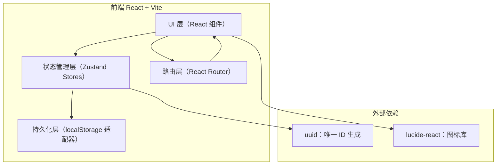
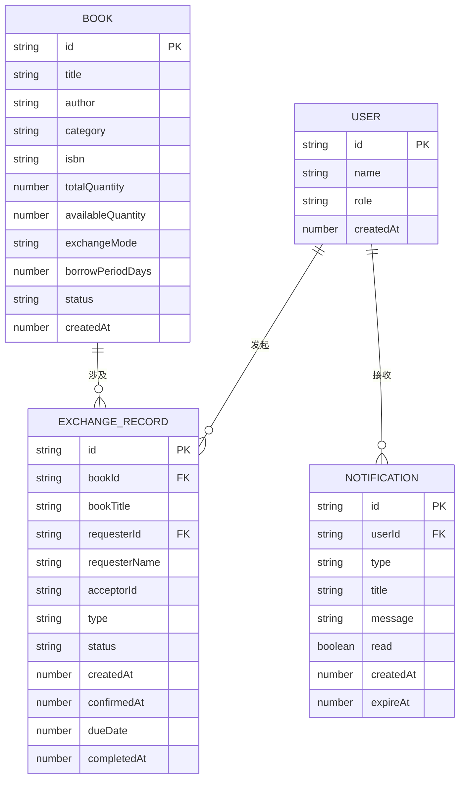

## 1. 架构设计



## 2. 技术描述
- **前端框架**：React 18 + TypeScript（严格模式，target ES2020，jsx: react-jsx）
- **构建工具**：Vite 5 + @vitejs/plugin-react
- **状态管理**：Zustand（轻量级 store，支持跨模块依赖）
- **路由**：React Router DOM 6
- **唯一 ID**：uuid
- **持久化方案**：localStorage（封装适配器，自动序列化/反序列化，版本迁移）
- **样式方案**：原生 CSS + CSS Variables（无 CSS 框架，手写暖木色主题）
- **图标**：lucide-react
- **后端**：无，纯前端模拟

## 3. 路由定义
| 路由 | 页面组件 | 权限 | 用途 |
|------|----------|------|------|
| `/` | BookList | 公开 | 图书浏览首页，搜索筛选 |
| `/books` | BookList | 公开 | 同上（别名） |
| `/admin/books` | AdminBookManager | 管理员 | 图书上架管理，增删改查 |
| `/exchange/history` | ExchangeHistory | 登录用户 | 交换与借阅历史全记录 |
| `/profile` | UserProfile | 读者 | 个人中心，我的借阅记录 |
| `/login` | LoginPanel | 公开 | 登录入口面板 |

## 4. Store 模块定义

### 4.1 useAuthStore（用户与认证）
```typescript
interface AuthState {
  currentUser: User | null;
  users: User[];
  loginAsAdmin: (password: string) => boolean;
  loginAsReader: (name: string) => void;
  logout: () => void;
  isAdmin: () => boolean;
}
interface User {
  id: string;
  name: string;
  role: 'admin' | 'reader';
  createdAt: number;
}
```

### 4.2 useNotificationStore（通知）
```typescript
interface NotificationState {
  notifications: Notification[];
  addNotification: (n: Omit<Notification, 'id' | 'createdAt' | 'read'>) => void;
  markAsRead: (id: string) => void;
  clearOld: (days?: number) => void;
}
interface Notification {
  id: string;
  type: 'info' | 'warning' | 'error' | 'success';
  title: string;
  message: string;
  userId: string; // target user or 'admin'
  read: boolean;
  createdAt: number;
  expireAt?: number;
}
```

### 4.3 useBookStore（图书管理）
```typescript
interface BookState {
  books: Book[];
  addBook: (data: BookFormData) => Book;
  updateBook: (id: string, data: Partial<BookFormData>) => void;
  deleteBook: (id: string) => void;
  updateBookQuantity: (id: string, delta: number) => void;
  getBook: (id: string) => Book | undefined;
}
interface Book {
  id: string;
  title: string;
  author: string;
  category: '小说' | '非小说' | '技术' | '艺术';
  isbn: string;
  totalQuantity: number;
  availableQuantity: number;
  exchangeMode: 'exchange_only' | 'borrow_only' | 'both';
  borrowPeriodDays: number;
  status: 'available' | 'low_stock' | 'out_of_stock' | 'lost';
  createdAt: number;
}
type BookFormData = Omit<Book, 'id' | 'availableQuantity' | 'status' | 'createdAt'>;
```

### 4.4 useExchangeStore（交换与借阅引擎）
```typescript
interface ExchangeState {
  records: ExchangeRecord[];
  createRequest: (bookId: string, type: 'exchange' | 'borrow') => ExchangeRecord | null;
  confirmRequest: (recordId: string) => void;
  rejectRequest: (recordId: string) => void;
  completeRecord: (recordId: string) => void;
  checkOverdue: () => void; // 定时调用：逾期检查 + 自动提醒 + 丢失标记
  getRecordsByUser: (userId: string) => ExchangeRecord[];
}
interface ExchangeRecord {
  id: string;
  bookId: string;
  bookTitle: string;
  requesterId: string;
  requesterName: string;
  acceptorId: string; // 'admin'
  acceptorName: string;
  type: 'exchange' | 'borrow';
  status: 'pending' | 'active' | 'completed' | 'rejected' | 'overdue' | 'lost';
  createdAt: number;
  confirmedAt?: number;
  dueDate?: number; // 借阅到期日
  completedAt?: number;
  daysRemaining?: number; // 缓存倒计时
}
```

## 5. 数据模型 ER 图



## 6. localStorage 持久化设计

### 6.1 存储键
```
book_exchange_app_v1 = {
  auth: { users, currentUserId },
  books: Book[],
  records: ExchangeRecord[],
  notifications: Notification[],
  meta: { version, lastOverdueCheck }
}
```

### 6.2 初始化策略
- 应用启动时从 localStorage 读取
- 若不存在，写入默认数据（内置管理员账号 admin/admin123，示例图书若干）
- 每次 Store 变化时，通过 subscribe 自动持久化

## 7. 目录结构
```
src/
├── main.tsx                    # 入口：渲染根组件，包裹 Provider
├── App.tsx                     # 根组件：路由 + 导航 + 页面过渡
├── styles/
│   └── index.css               # 全局样式、CSS 变量、动画关键帧
├── modules/
│   ├── user/
│   │   ├── UserManager.ts      # useAuthStore + useNotificationStore
│   │   ├── LoginPanel.tsx      # 登录面板组件
│   │   ├── UserProfile.tsx     # 个人中心页面
│   │   └── NotificationCenter.tsx # 通知中心组件
│   ├── book/
│   │   ├── BookManager.ts      # useBookStore
│   │   ├── BookList.tsx        # 图书浏览列表页
│   │   ├── BookCard.tsx        # 图书卡片组件
│   │   ├── BookForm.tsx        # 图书上架/编辑表单
│   │   └── AdminBookManager.tsx # 图书管理页面
│   └── exchange/
│       ├── ExchangeEngine.ts   # useExchangeStore
│       ├── ExchangeHistory.tsx # 历史记录页面
│       └── RecordItem.tsx      # 记录行组件
└── shared/
    ├── types.ts                # 全局类型定义
    ├── storage.ts              # localStorage 适配器
    ├── hooks.ts                # 自定义 hooks（useDebounce, useCountdown 等）
    └── utils.ts                # 工具函数（日期、动画辅助等）
```
