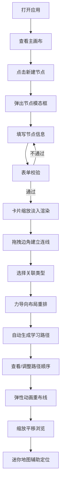

## 1. 产品概述
知识卡片学习路径系统是一款将零散笔记碎片转化为结构化知识网络的可视化工具，解决知识点碎片化、缺乏关联、难以系统复习的核心痛点。
- 面向学习者、知识工作者，帮助其构建个人知识图谱，生成可执行的学习路径
- 产品价值：将混乱的笔记转化为有序的知识地图，让复习和学习变得高效可追踪

## 2. 核心功能

### 2.1 用户角色
| 角色 | 注册方式 | 核心权限 |
|------|----------|----------|
| 普通用户 | 无需注册，纯前端使用 | 创建/编辑/删除知识节点、建立关联、生成学习路径、导出卡片 |

### 2.2 功能模块
1. **主画布模块**：无限画布、节点渲染、连线渲染、力导向布局、缩放平移、迷你地图、边缘指示器
2. **节点管理模块**：节点创建/编辑/删除模态框、节点卡片列表预览、表单校验
3. **关联管理模块**：连线创建（拖拽边角）、关联类型编辑、关联列表、贝塞尔曲线渲染
4. **学习路径模块**：自动路径生成、路径高亮、完成度显示、拖拽排序调整、弹性动画重布线
5. **工具栏模块**：新建节点、删除选中、自动布局、导出卡片、响应式折叠

### 2.3 页面详情
| 页面名称 | 模块名称 | 功能描述 |
|----------|----------|----------|
| 主画布页 | 功能工具栏 | 新建/删除/布局/导出功能按钮，响应式折叠为汉堡菜单 |
| 主画布页 | 无限画布 | 点阵网格背景、滚轮缩放（0.3~3x）、拖拽平移、边缘渐变遮罩 |
| 主画布页 | 知识节点卡片 | 标题/摘要/标签/正文、标签自动配色、缩放淡入动画、拖拽交互 |
| 主画布页 | 关联连线 | 贝塞尔曲线箭头、关联类型标签、双击编辑删除 |
| 主画布页 | 学习路径高亮 | 路径连线高亮、节点完成百分比显示 |
| 主画布页 | 迷你地图 | 右下角悬浮、视口框拖拽平移、透明度随悬停变化 |
| 主画布页 | 边缘指示器 | 橙色脉冲动画、节点越界时提示方向 |
| 节点面板 | 节点列表 | 卡片缩小预览、单选多选删除 |
| 节点模态框 | 表单编辑 | 标题/摘要(200字)/标签(最多3个)/Markdown正文、输入框光晕动画 |
| 关联面板 | 关联列表 | 所有关联展示、编辑关联类型、删除 |
| 学习路径面板 | 路径管理 | 推荐路径展示、拖拽排序、弹性重布线动画 |

## 3. 核心流程
用户打开应用 → 在主画布或工具栏点击"新建节点" → 弹出模态框填写节点信息（标题/摘要/标签/正文） → 提交后卡片以缩放淡入动画出现 → 通过拖拽卡片边角连线建立节点关系 → 系统自动运行力导向布局优化节点位置 → 在学习路径面板查看自动生成的推荐路径 → 可拖拽调整路径节点顺序 → 路径连线以弹性动画重布线 → 使用缩放/平移浏览全局知识网络 → 迷你地图辅助定位 → 导出卡片数据

## 4. 用户界面设计

### 4.1 设计风格
- **主色调**：深蓝灰 #2c3e50，卡片背景柔和米白 #f8f9fa，关联线浅蓝 #4a9eff，边缘指示器橙色 #ff6b6b
- **按钮风格**：圆角图标+文字布局，悬停浅蓝灰色背景填充 0.2s 淡入，点击下沉弹起微交互
- **字体**：标题采用思源黑体 Bold，正文采用思源黑体 Regular，等宽代码区域使用 JetBrains Mono
- **布局风格**：左侧工具栏（响应式折叠），中央占屏80%+主画布，右下角迷你地图，侧边可展开面板
- **动画风格**：模态框模糊背景浮动、输入框缩放蓝色光晕、卡片缩放淡入、连线弹性重布线、边缘脉冲指示器

### 4.2 页面设计概览
| 页面名称 | 模块名称 | UI 元素 |
|----------|----------|----------|
| 主画布页 | 功能工具栏 | 圆角按钮、图标+文字、悬停淡入过渡、点击下沉弹起、≤1024px折叠汉堡菜单 |
| 主画布页 | 无限画布 | 灰色点阵网格（随缩放调密度）、半透明渐变边缘遮罩、0.3~3x滚轮缩放、拖拽平移 |
| 主画布页 | 知识节点卡片 | 柔和米白卡片、标签色块自动配色、缩放淡入动画、边角拖拽连接点 |
| 主画布页 | 关联连线 | 贝塞尔曲线带箭头、浅蓝 #4a9eff、关联类型标签、双击编辑删除 |
| 主画布页 | 迷你地图 | 15%透明度、悬停60%、视口框可拖拽、右下角固定悬浮 |
| 主画布页 | 边缘指示器 | 橙色 #ff6b6b、脉冲动画、节点越界方向提示 |
| 节点模态框 | 表单 | 模糊背景浮动、输入框获焦缩放+蓝色光晕、200字摘要计数、标签最多3个、Markdown编辑器 |
| 学习路径面板 | 路径展示 | 高亮路径连线、完成百分比进度环、拖拽排序、弹性重布线 |

### 4.3 响应式设计
- 桌面优先设计，适配 1280px 以上分辨率
- 1024px 宽度断点：功能工具栏折叠为汉堡菜单，面板改为抽屉式展开
- 画布缩放和平移在所有尺寸下正常响应
- 迷你地图尺寸随窗口宽度自适应缩放

### 4.4 动效与微交互
- 模态框打开：背景模糊 + 居中缩放淡入（250ms cubic-bezier(0.34, 1.56, 0.64, 1)）
- 输入框获焦：scale(1.01) + box-shadow 蓝色光晕扩散（200ms ease-out）
- 新建卡片：从中心点 scale(0) opacity(0) → scale(1) opacity(1)（300ms）
- 节点拖拽：cursor grab → grabbing，轻微阴影加深
- 连线建立：贝塞尔曲线跟随鼠标，松开后弹性吸附（spring damping）
- 力导向布局：节点弹性动画重新排列，相关节点靠近，无关节点远离
- 边缘指示器：橙色脉冲（scale 1→1.3→1，opacity 0.6→1→0.6，1.5s 循环）
- 按钮交互：悬停背景淡入（0.2s），点击 translateY(1px) 再弹起（150ms）
