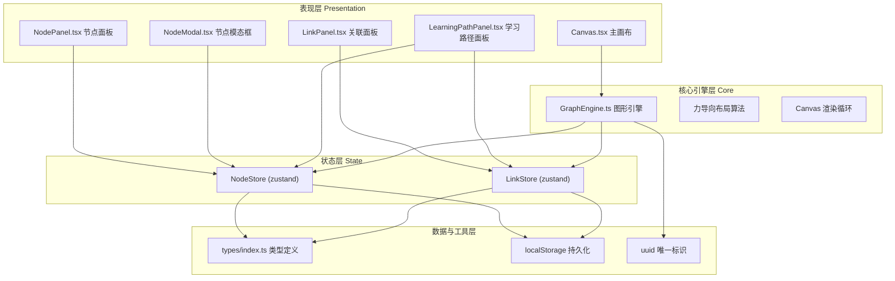

## 1. 架构设计


## 2. 技术描述
- **前端框架**：React@18 + TypeScript@5
- **构建工具**：Vite@5 + @vitejs/plugin-react@4
- **状态管理**：zustand@4（轻量级、支持订阅选择、内置中间件 persist）
- **图形渲染**：HTML5 Canvas 2D API + 自研力导向布局引擎
- **唯一标识**：uuid@9
- **持久化**：localStorage（zustand persist 中间件）
- **性能目标**：100 节点 + 150 连线时帧率 ≥ 40fps，交互延迟 ≤ 60ms

## 3. 路由定义
| 路由 | 用途 |
|------|------|
| / | 单页应用主界面，包含画布、工具栏、所有面板 |

本项目为单页应用，无多路由切换。

## 4. 状态模型与数据接口

### 4.1 核心类型定义
```typescript
export type LinkType = 'prerequisite' | 'subsequent' | 'related';
export type NodeStatus = 'pending' | 'in-progress' | 'completed';

export interface KnowledgeNode {
  id: string;
  title: string;
  summary: string;
  tags: string[];
  content: string;
  x: number;
  y: number;
  vx: number;
  vy: number;
  color: string;
  progress: number;
  status: NodeStatus;
  createdAt: number;
  updatedAt: number;
}

export interface KnowledgeLink {
  id: string;
  sourceId: string;
  targetId: string;
  type: LinkType;
  label: string;
  createdAt: number;
}

export interface LearningPath {
  id: string;
  name: string;
  nodeIds: string[];
  progress: number;
}

export interface CanvasViewport {
  offsetX: number;
  offsetY: number;
  scale: number;
}
```

### 4.2 Store 接口
```typescript
// NodeStore
interface NodeStore {
  nodes: KnowledgeNode[];
  selectedIds: string[];
  addNode: (data: Omit<KnowledgeNode, 'id' | 'x' | 'y' | 'vx' | 'vy' | 'color' | 'progress' | 'status' | 'createdAt' | 'updatedAt'>) => void;
  updateNode: (id: string, data: Partial<KnowledgeNode>) => void;
  deleteNode: (id: string) => void;
  deleteNodes: (ids: string[]) => void;
  selectNode: (id: string, multi?: boolean) => void;
  clearSelection: () => void;
  setNodePosition: (id: string, x: number, y: number) => void;
  getNode: (id: string) => KnowledgeNode | undefined;
}

// LinkStore
interface LinkStore {
  links: KnowledgeLink[];
  addLink: (data: Omit<KnowledgeLink, 'id' | 'createdAt'>) => void;
  updateLink: (id: string, data: Partial<KnowledgeLink>) => void;
  deleteLink: (id: string) => void;
  getLinksByNode: (nodeId: string) => KnowledgeLink[];
}
```

## 5. 性能优化方案
- **Canvas 分层渲染**：背景网格层、连线层、节点层分离，局部脏区重绘
- **requestAnimationFrame 循环**：力导向布局计算与渲染解耦，空闲时降频
- **空间索引**：节点使用四叉树/网格索引加速碰撞与拾取检测
- **批量状态更新**：zustand 减少通知频率，组件使用 selector 精准订阅
- **渲染节流**：mousemove/wheel 事件 rAF 节流，避免过度重绘
- **离屏缓存**：静态卡片内容预渲染为 ImageBitmap，拖拽时直接贴图
- **MiniMap 降采样**：迷你地图使用 0.15x 缩放渲染，独立 canvas 缓存

## 6. 目录结构
```
auto55/
├── package.json
├── index.html
├── tsconfig.json
├── vite.config.js
└── src/
    ├── main.tsx
    ├── App.tsx
    ├── types/
    │   └── index.ts
    ├── stores/
    │   ├── NodeStore.ts
    │   └── LinkStore.ts
    └── modules/
        ├── canvas/
        │   ├── components/
        │   │   └── Canvas.tsx
        │   └── core/
        │       └── GraphEngine.ts
        ├── nodes/
        │   └── components/
        │       ├── NodePanel.tsx
        │       └── NodeModal.tsx
        ├── links/
        │   └── components/
        │       └── LinkPanel.tsx
        └── path/
            └── components/
                └── LearningPathPanel.tsx
```

## 7. 关键算法说明

### 7.1 力导向布局（Force-Directed Layout）
- **斥力**：节点间库仑斥力 F_rep = k² / d，k 为理想间距
- **引力**：连线节点间胡克引力 F_spr = -k × (d - L)，L 为理想边长
- **中心力**：所有节点受向心拉力，防止发散
- **阻尼**：速度 × 0.85，保证收敛
- **迭代**：每帧更新位置 x += vx × dt，vx/vy 衰减至阈值以下停止

### 7.2 学习路径生成
- 使用拓扑排序（基于 prerequisite 类型边）找出起点集合（入度为 0）
- 从起点执行 BFS/DFS，记录最长路径（权值为节点 progress 差或深度）
- 输出节点序列 + 高亮边集合，作为推荐学习路径

### 7.3 贝塞尔连线与箭头
- 使用二次贝塞尔曲线：控制点为起点终点中点 + 法向偏移
- 箭头在终点沿切向绘制三角形，使用 fill 填充
- 标签位置取曲线参数 t=0.5 处的坐标，白色半透明圆角底衬

### 7.4 视口变换与缩放焦点
- 世界坐标 → 屏幕坐标：screen = (world × scale) + offset
- 缩放中心：以鼠标位置 world_p 为锚点，Δscale 后重算 offset：offset' = mouse - world_p × scale'
- 缩放范围 clamp(0.3, 3)，边缘使用 CSS mask 做半透明渐变遮罩
