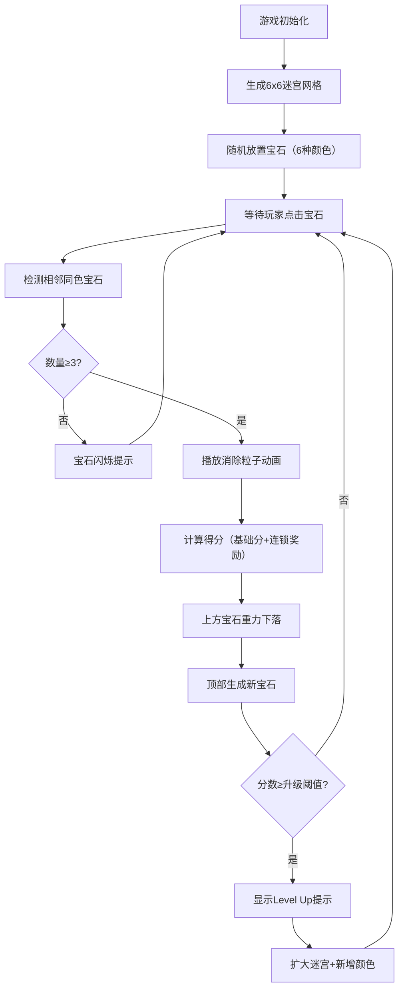

## 1. 产品概述

宝石迷宫消除是一款基于程序化生成迷宫的3D宝石消除游戏。玩家通过点击相邻同色宝石触发连锁消除，获取分数并解锁新区域。游戏融合了经典三消玩法与迷宫探索元素，通过关卡升级机制逐步增加难度和新鲜感。

- **核心玩法**：点击宝石触发连锁消除，利用重力下落补充新宝石
- **目标用户**：休闲游戏玩家，喜欢三消和益智类游戏的用户
- **产品价值**：通过3D视觉效果和迷宫生成机制，为传统三消玩法带来全新体验

## 2. 核心功能

### 2.1 功能模块

1. **迷宫生成系统**：程序化生成迷宫网格，包含可通行格子和墙壁格子
2. **宝石消除系统**：点击检测、相邻同色判定、连锁消除、得分计算
3. **重力下落系统**：消除后宝石按列下落，顶部生成新宝石补充
4. **关卡升级系统**：分数达到阈值后升级，扩大迷宫尺寸、增加颜色种类
5. **3D渲染系统**：Three.js场景渲染、宝石模型、粒子特效、相机控制
6. **UI交互系统**：分数显示、关卡进度、重置功能、提示信息

### 2.2 页面详情

| 页面名称 | 模块名称 | 功能描述 |
|---------|---------|----------|
| 主游戏页面 | 3D游戏场景 | 展示迷宫网格和宝石，支持鼠标交互 |
| 主游戏页面 | 分数面板 | 显示当前分数和最高分，毛玻璃风格 |
| 主游戏页面 | 关卡进度条 | 显示当前关卡进度，渐变色填充 |
| 主游戏页面 | 升级提示 | 关卡升级时显示"Level Up!"动画 |
| 主游戏页面 | 控制说明 | 鼠标右键旋转视角、滚轮缩放 |

## 3. 核心流程

玩家进入游戏后，看到程序化生成的6x6迷宫网格，每个可通行格子上悬浮着一颗彩色宝石。玩家点击任意宝石，系统检测其上下左右四个方向的相邻同色宝石，若相连同色宝石数量≥3，则全部消除并获得分数。消除后上方宝石按重力下落填补空位，顶部生成新宝石。当总分达到100分时触发关卡升级，迷宫扩大并增加新颜色。

## 4. 用户界面设计

### 4.1 设计风格

- **设计方向**：神秘宝石主题，深色背景配合发光宝石，营造魔法迷宫氛围
- **主色调**：深蓝色渐变背景，升级后过渡为紫红色
- **宝石颜色**：红、绿、蓝、黄、紫、橙（初始6色），第7关增加粉色
- **格子颜色**：墙壁为深灰色，可通行格子按高度从浅绿到深绿渐变
- **UI风格**：半透明毛玻璃面板，白色文字，圆角设计
- **动效风格**：平滑过渡、缩放动画、粒子爆炸效果

### 4.2 页面设计概览

| 页面名称 | 模块名称 | UI元素 |
|---------|---------|--------|
| 主游戏页面 | 3D场景 | 透视视角、45度俯视角、可旋转缩放 |
| 主游戏页面 | 分数面板 | 左上角悬浮、毛玻璃背景、当前分/最高分 |
| 主游戏页面 | 进度条 | 右上角细长横条、蓝紫渐变填充 |
| 主游戏页面 | 升级提示 | 中央缩放动画、"Level Up!"文字、2秒持续 |
| 主游戏页面 | 宝石特效 | 消除粒子爆炸、颜色匹配、1秒淡出 |
| 主游戏页面 | 入场动画 | UI元素淡入、宝石逐个出现 |

### 4.3 响应式设计

- 桌面端优先设计，自适应窗口大小
- 3D场景随窗口尺寸自动调整
- UI元素使用像素定位，保持在固定屏幕位置

### 4.4 3D场景指南

- **环境与氛围**：深色渐变背景，营造神秘宝石洞穴氛围；升级时背景色温和过渡
- **光照设置**：环境光+方向光组合，宝石带有轻微发光效果，高光反射增强质感
- **相机设置**：初始位于迷宫正前方上方45度角，距离中心8单位；右键拖拽旋转，滚轮缩放（4-15单位范围）
- **构图与焦点**：迷宫位于场景中心，宝石为主要视觉焦点；UI元素悬浮于画面边缘
- **交互与动画**：宝石悬浮上下浮动、点击高亮闪烁、消除粒子爆炸飘散、重力下落平滑移动
- **后处理效果**：轻微辉光效果增强宝石发光感，色彩分级提升整体氛围
- **性能预算**：保持30FPS以上，单帧宝石数量不超过50个，粒子总数控制在合理范围
