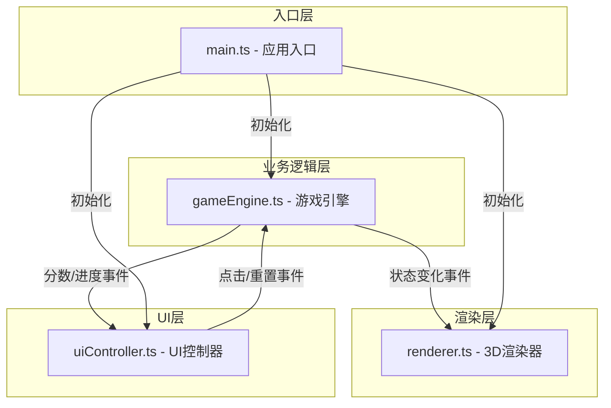

## 1. 架构设计

本项目采用模块化架构，基于事件总线实现各模块间的解耦通信。整体分为三层：业务逻辑层（游戏引擎）、渲染层（Three.js）、UI控制层。



## 2. 技术选型

- **前端框架**：原生 TypeScript（无框架），按用户指定的模块化架构
- **3D引擎**：Three.js（three + @types/three）
- **构建工具**：Vite（vite）
- **语言**：TypeScript（严格模式）
- **样式**：原生 CSS（内联在 index.html 或单独 CSS 文件）
- **事件系统**：自定义 EventBus 事件总线
- **粒子系统**：Three.js Points + 自定义 SVG 纹理

## 3. 模块定义

### 3.1 文件结构

| 文件路径 | 职责 |
|---------|------|
| `package.json` | 项目依赖和脚本配置 |
| `index.html` | 入口页面，包含根节点和meta viewport |
| `vite.config.js` | Vite 构建配置 |
| `tsconfig.json` | TypeScript 配置（严格模式） |
| `src/main.ts` | 应用入口，初始化各模块并建立事件总线 |
| `src/gameEngine.ts` | 游戏引擎，迷宫生成、宝石布局、消除逻辑、连锁判定 |
| `src/renderer.ts` | 3D渲染器，Three.js场景、迷宫可视化、宝石动画、相机控制 |
| `src/uiController.ts` | UI控制器，分数显示、进度条、重置按钮、提示信息 |

### 3.2 核心数据结构

```typescript
// 格子类型
interface Cell {
    x: number;
    y: number;
    height: number;
    isWall: boolean;
    gem: Gem | null;
}

// 宝石类型
interface Gem {
    color: GemColor;
    id: string;
    isEliminating: boolean;
    isFalling: boolean;
    targetY: number;
}

// 宝石颜色枚举
enum GemColor {
    Red = 'red',
    Green = 'green',
    Blue = 'blue',
    Yellow = 'yellow',
    Purple = 'purple',
    Orange = 'orange',
    Pink = 'pink',
}

// 游戏状态
interface GameState {
    gridSize: number;
    cells: Cell[][];
    score: number;
    highScore: number;
    level: number;
    wallRatio: number;
    gemColors: GemColor[];
    isAnimating: boolean;
}
```

### 3.3 事件总线定义

| 事件名称 | 触发方 | 接收方 | 数据 |
|---------|-------|-------|------|
| `gem-clicked` | uiController | gameEngine | `{ x: number, y: number }` |
| `score-updated` | gameEngine | uiController | `{ score: number, highScore: number }` |
| `level-up` | gameEngine | uiController, renderer | `{ level: number, gridSize: number }` |
| `grid-updated` | gameEngine | renderer | `{ cells: Cell[][] }` |
| `gems-eliminated` | gameEngine | renderer | `{ gems: GemPosition[] }` |
| `gems-falling` | gameEngine | renderer | `{ gems: FallingGem[] }` |
| `game-reset` | uiController | gameEngine | `void` |
| `camera-changed` | renderer | - | 内部状态 |

## 4. 核心算法

### 4.1 迷宫生成算法
1. 创建 gridSize × gridSize 的二维网格
2. 每个格子随机高度（0.3 ~ 1.5），墙壁格子高度为0
3. 墙壁占比：初始10%，升级后15%
4. 确保至少存在一组3个以上相邻同色宝石
5. 非墙壁格子随机放置宝石，颜色从可用颜色中随机选择

### 4.2 消除判定算法（BFS/DFS连通分量）
1. 获取点击位置的宝石颜色
2. 使用BFS遍历上下左右四个方向
3. 收集所有相连的同色宝石
4. 数量≥3则标记为消除组
5. 计算得分：宝石数×10 + 连锁奖励×20

### 4.3 重力下落算法
1. 按列遍历，从底部向上扫描
2. 收集每列的空位和上方的宝石
3. 计算每个宝石的目标下落位置
4. 顶部生成新宝石补充（颜色随机，避免连续4个同色）

### 4.4 新宝石颜色生成规则
1. 随机从可用颜色中选择
2. 检查是否与下方连续3个同色
3. 若会造成连续4同色则重新随机
4. 最多重试次数保证性能

## 5. 渲染架构

### 5.1 Three.js 场景组成
- **Scene**：主场景容器
- **PerspectiveCamera**：透视相机，45度俯视角
- **WebGLRenderer**：WebGL渲染器，抗锯齿开启
- **AmbientLight + DirectionalLight**：环境光+方向光
- **OrbitControls**：轨道控制器（右键旋转、滚轮缩放）

### 5.2 游戏对象
- **格子网格**：BoxGeometry，高度变化，顶面半透明
- **宝石网格**：OctahedronGeometry（八面体）或 IcosahedronGeometry，发光材质
- **粒子系统**：Points + SVG 纹理，消除爆炸效果
- **关卡文字**：Sprite + Canvas 纹理，Level Up 提示

### 5.3 动画系统
- 使用 `requestAnimationFrame` 游戏循环
- 宝石消除动画：缩放0 + 向上位移 + 淡出（600ms）
- 下落动画：每帧0.5单位速度，平滑移动
- 粒子动画：扩散 + 淡出（1秒）
- Level Up 文字：缩放动画 + 淡出（2秒）
- 背景色过渡：颜色插值，温和渐变

## 6. 性能优化策略

- **对象池**：粒子和宝石网格复用，避免频繁创建销毁
- **批量渲染**：相同材质的宝石使用 InstancedMesh 减少 draw call
- **帧率控制**：保持30FPS以上，动画使用 deltaTime 保证速度一致
- **事件节流**：鼠标事件适当节流，避免频繁触发
- **内存管理**：移除的对象及时 dispose 材质和几何体
