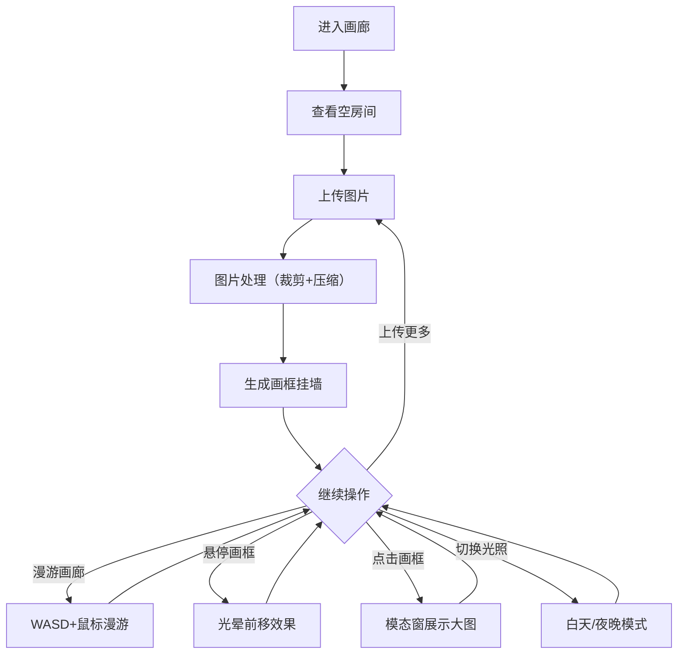

## 1. 产品概述

微缩画廊是一个基于浏览器的3D虚拟画廊应用，用户可以上传图片生成画作挂在墙上，并在3D空间中自由漫游欣赏。目标用户为艺术爱好者、摄影师和任何想要展示图片的用户，提供一个沉浸式的线上观展体验。

## 2. 核心功能

### 2.1 用户角色

| 角色 | 注册方式 | 核心权限 |
|------|----------|----------|
| 普通用户 | 无需注册 | 上传图片、漫游画廊、切换光照、查看画作详情 |

### 2.2 功能模块

1. **3D画廊主页**: 3D画廊房间、画框展示、漫游控制、光照切换、画作详情弹窗

### 2.3 页面详情

| 页面名称 | 模块名称 | 功能描述 |
|----------|----------|----------|
| 3D画廊主页 | 3D画廊房间 | 使用Three.js构建包含四面墙、天花板、地板的3D房间，每面墙最多挂6幅带木质边框的画框 |
| 3D画廊主页 | 图片上传 | 用户点击上传按钮选择图片，图片自动等比例裁剪为正方形并生成画框纹理 |
| 3D画廊主页 | 画框交互 | 悬停画框微幅前移+柔和光晕，点击弹出模态窗展示高清大图和描述 |
| 3D画廊主页 | 相机漫游 | WASD移动、鼠标拖拽旋转视角、Shift加速、C键重置位置、碰撞检测防穿墙 |
| 3D画廊主页 | 光照切换 | 白天模式（环境光+平行光，暖色）和夜晚模式（点光源+聚光灯，冷色暗调），1.5秒渐变过渡 |
| 3D画廊主页 | 导航栏 | 半透明毛玻璃导航栏，包含上传按钮、光照切换按钮、重置视角按钮 |

## 3. 核心流程

1. 用户进入画廊，看到空房间
2. 用户点击上传按钮选择图片
3. 图片处理后生成画框自动挂到墙上
4. 用户通过WASD+鼠标在画廊中漫游
5. 用户悬停画框查看光晕效果，点击查看详情
6. 用户可切换白天/夜晚模式改变氛围

## 4. 用户界面设计

### 4.1 设计风格

- 主色调：暖白色墙壁 + 浅灰色木纹地板 + 木质棕色画框
- 辅助色：暖金色光照（白天）/ 冷蓝色光照（夜晚）
- 按钮风格：圆角图标按钮，悬停渐变浅灰背景（300ms过渡），点击缩放动画（scale 0.95弹回）
- 字体：极简无衬线体，标题16px，正文14px
- 布局风格：全屏3D画布 + 顶部浮动导航栏
- 图标风格：线性图标（灯泡、上传、重置）

### 4.2 页面设计概述

| 页面名称 | 模块名称 | UI元素 |
|----------|----------|--------|
| 3D画廊主页 | 导航栏 | 毛玻璃背景、上传按钮、灯泡图标、重置按钮，按钮hover渐变+点击缩放 |
| 3D画廊主页 | 3D画廊房间 | 暖白墙壁、浅灰木纹地板、木质画框、悬停光晕、点击高亮 |
| 3D画廊主页 | 模态弹窗 | 缩放淡入动画、半透明毛玻璃背景、高清大图、图片描述 |

### 4.3 响应式

- 桌面优先设计，最小宽度1024px
- 自适应屏幕宽度
- 3D画布占满可用空间

### 4.4 3D场景指引

- 环境：室内画廊房间，封闭空间营造沉浸感
- 光照：双模式（白天暖色环境光+平行光 / 夜晚冷色点光源+聚光灯）
- 相机：第一人称视角，WASD移动+鼠标旋转，平滑插值，碰撞检测
- 构图：画框均匀分布在四面墙上，每面墙最多6幅
- 交互：画框悬停前移+光晕，点击弹出详情
- 后处理：画框悬停光晕效果
- 性能：目标45+FPS，图片超2048px自动压缩，渐进式纹理加载
