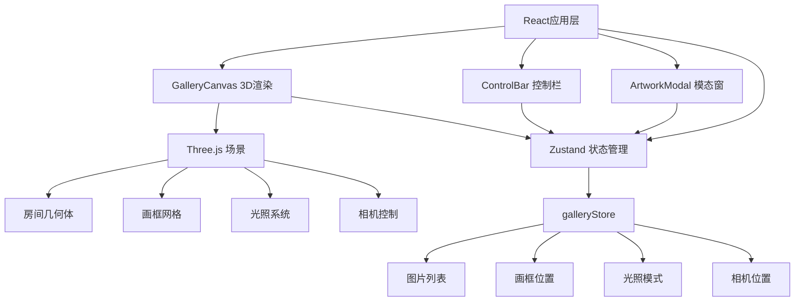

## 1. 架构设计



## 2. 技术说明

- 前端：React@18 + TypeScript + Three.js + Zustand + Vite
- 初始化工具：vite-init (react-ts模板)
- 后端：无
- 数据库：无（纯前端，状态保存在内存中）

### 核心依赖

| 依赖 | 版本 | 用途 |
|------|------|------|
| three | latest | 3D渲染引擎 |
| @types/three | latest | Three.js类型定义 |
| react | ^18 | UI框架 |
| react-dom | ^18 | React DOM渲染 |
| @types/react | latest | React类型定义 |
| @types/react-dom | latest | React DOM类型定义 |
| typescript | latest | 类型安全 |
| vite | latest | 构建工具 |
| @vitejs/plugin-react | latest | Vite React插件 |
| zustand | latest | 状态管理 |
| uuid | latest | 画框唯一ID生成 |

## 3. 路由定义

| 路由 | 用途 |
|------|------|
| / | 3D画廊主页面 |

## 4. 文件结构

```
├── package.json
├── index.html
├── vite.config.js
├── tsconfig.json
├── src/
│   ├── main.tsx                    # React根组件
│   ├── store/
│   │   └── galleryStore.ts         # Zustand状态管理
│   ├── components/
│   │   ├── GalleryCanvas.tsx        # Three.js 3D渲染组件
│   │   ├── ControlBar.tsx           # 顶部导航栏
│   │   └── ArtworkModal.tsx         # 画作详情模态窗
│   └── utils/
│       └── imageProcessor.ts        # 图片处理工具
```

## 5. 状态模型

### galleryStore (Zustand)

```typescript
interface Artwork {
  id: string;
  imageUrl: string;
  originalUrl: string;
  description: string;
  wallIndex: number;
  slotIndex: number;
}

interface GalleryState {
  artworks: Artwork[];
  lightingMode: 'day' | 'night';
  cameraPosition: { x: number; y: number; z: number };
  selectedArtwork: Artwork | null;
  addArtwork: (file: File) => void;
  removeArtwork: (id: string) => void;
  setLightingMode: (mode: 'day' | 'night') => void;
  setCameraPosition: (pos: { x: number; y: number; z: number }) => void;
  setSelectedArtwork: (artwork: Artwork | null) => void;
}
```

## 6. 3D场景架构

### 房间尺寸
- 宽度：20单位
- 高度：6单位
- 深度：20单位
- 墙壁颜色：暖白色 (#F5F0EB)
- 地板：浅灰色木纹

### 画框布局
- 4面墙，每面墙最多6个画框槽位（3列×2行）
- 画框尺寸：约1.5×1.5单位
- 木质边框：棕色材质，边框宽度0.1单位

### 相机控制
- 第一人称视角，高度1.6单位
- 移动速度：5单位/秒，Shift加速至10单位/秒
- 鼠标灵敏度：0.002
- 碰撞检测：射线检测，距墙0.5单位停止

### 光照系统
- 白天：AmbientLight(0xFFF5E6, 0.6) + DirectionalLight(0xFFE8CC, 0.8)
- 夜晚：PointLight(0x8899CC, 1.0) × 4 + SpotLight(0xAABBEE, 1.5) × 4
- 过渡：1.5秒lerp渐变
