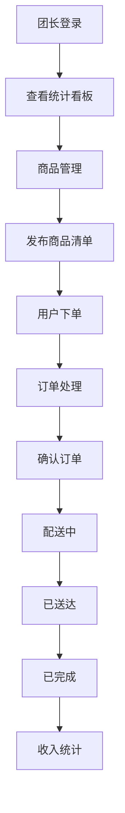

## 1. 产品概述
社区团购团长专用的订单管理与配送追踪工具，帮助团长高效管理商品、处理订单、跟踪配送并统计收入。
- 核心用户：社区团购团长
- 解决痛点：手工记账繁琐、配送进度不透明、收入统计困难
- 目标价值：提升团长运营效率50%，减少错单漏单率

## 2. 核心功能

### 2.1 用户角色
| 角色 | 注册方式 | 核心权限 |
|------|----------|----------|
| 团长 | 本地存储模拟 | 商品管理、订单处理、配送追踪、收入统计 |

### 2.2 功能模块
1. **商品管理模块**：商品列表展示、添加/编辑/删除商品、表单验证、动画效果
2. **订单处理模块**：订单列表展示、状态筛选、状态流转、动画过渡
3. **配送追踪模块**：模拟地图展示、配送标记动画、路径移动、拖尾效果
4. **统计看板模块**：实时数据统计、数字滚动动画、同期对比指示器

### 2.3 页面详情
| 页面名称 | 模块名称 | 功能描述 |
|----------|----------|----------|
| 商品管理页面 | 商品列表 | 展示商品卡片，支持添加、编辑、删除操作，表单验证 |
| 订单处理页面 | 订单列表 | 展示订单卡片，支持状态筛选，点击切换下一状态 |
| 配送追踪页面 | 配送地图 | CSS网格模拟地图，标记点沿路径移动动画 |
| 顶部统计栏 | 统计看板 | 今日订单数、总金额、待处理数、已送达数，数字滚动动画 |

## 3. 核心流程

团长每日工作流程：
1. 团长登录系统 → 查看统计看板了解今日运营状况
2. 进入商品管理页面 → 添加/编辑今日团购商品清单
3. 用户下单（模拟数据）→ 系统自动汇总订单
4. 进入订单处理页面 → 确认订单、更新配送状态
5. 进入配送追踪页面 → 实时查看配送进度
6. 订单完成 → 系统自动统计收入

## 4. 用户界面设计

### 4.1 设计风格
- **主色调**：蓝绿色 #2A9D8F（清新、信任）
- **强调色**：暖橙色 #E76F51（活力、行动按钮）
- **背景色**：浅灰色 #F1FAEE（干净、舒适）
- **文字色**：深灰色 #1D3557（专业、可读）
- **按钮风格**：圆角8px，点击缩放反馈（0.95→1.0，100ms）
- **卡片风格**：圆角8px，浅阴影，悬停上浮加深阴影
- **字体**：现代无衬线字体，标题加粗，正文清晰易读
- **整体感觉**：清爽专业、温暖亲和、操作流畅

### 4.2 页面设计概述
| 页面名称 | 模块名称 | UI元素 |
|----------|----------|--------|
| 商品管理 | 商品卡片 | 缩放淡入动画，悬停上浮，编辑模态窗，表单聚焦光晕 |
| 订单处理 | 订单卡片 | 状态标签颜色渐变，背景闪烁提示，状态按钮 |
| 配送追踪 | 模拟地图 | CSS网格背景，标记点移动动画，拖尾效果 |
| 统计看板 | 数字指标 | 数字滚动动画，绿色向上箭头 |

### 4.3 响应式设计
- **桌面优先**：最大宽度1200px，多列布局
- **移动适配**：最小宽度320px，单列布局，触控优化
- **断点设计**：768px切换为移动端布局
- **触控优化**：按钮最小高度44px，间距适中

### 4.4 动画与交互
- **路由切换**：淡入淡出 300ms
- **商品添加**：缩放淡入 300ms
- **状态切换**：颜色渐变 300ms，背景闪烁 200ms
- **数字滚动**：平滑滚动 500ms
- **标记移动**：匀速移动 2s/步，拖尾效果
- **按钮反馈**：缩放 0.95→1.0 100ms
- **输入聚焦**：蓝色光晕动画 200ms
