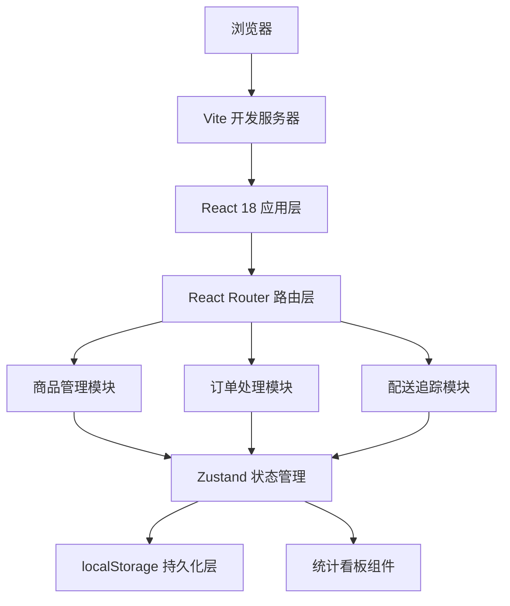
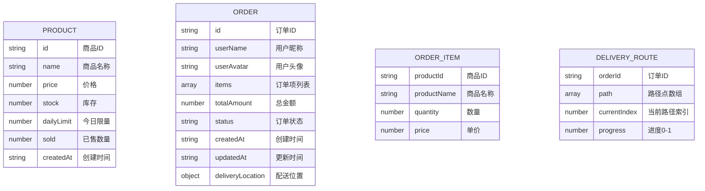

## 1. 架构设计



## 2. 技术描述

- **前端框架**：React@18 + TypeScript@5
- **构建工具**：Vite@5 + @vitejs/plugin-react@4
- **状态管理**：Zustand@4（轻量级，开箱即用）
- **路由管理**：React Router@6
- **唯一ID生成**：uuid@9
- **数据存储**：localStorage（模拟后端）
- **样式方案**：CSS Modules / 原生CSS（CSS变量主题）
- **代码分割**：React.lazy + Suspense

## 3. 路由定义

| 路由 | 页面组件 | 用途 |
|------|----------|------|
| `/` | 重定向到 `/products` | 默认首页 |
| `/products` | ProductList 商品管理 | 管理团购商品清单 |
| `/orders` | OrderList 订单处理 | 处理订单状态流转 |
| `/delivery` | DeliveryMap 配送追踪 | 实时查看配送进度 |

## 4. 数据模型

### 4.1 数据实体关系



### 4.2 数据定义

```typescript
// 订单状态枚举
type OrderStatus = 'pending' | 'confirmed' | 'delivering' | 'delivered' | 'completed';

// 商品接口
interface Product {
  id: string;
  name: string;
  price: number;
  stock: number;
  dailyLimit: number;
  sold: number;
  createdAt: string;
}

// 订单项接口
interface OrderItem {
  productId: string;
  productName: string;
  quantity: number;
  price: number;
}

// 订单接口
interface Order {
  id: string;
  userName: string;
  userAvatar: string;
  items: OrderItem[];
  totalAmount: number;
  status: OrderStatus;
  createdAt: string;
  updatedAt: string;
  deliveryLocation: { x: number; y: number };
}

// 配送路线接口
interface DeliveryRoute {
  orderId: string;
  path: { x: number; y: number }[];
  currentIndex: number;
  progress: number;
}

// 统计数据接口
interface Statistics {
  todayOrders: number;
  todayRevenue: number;
  pendingOrders: number;
  deliveredOrders: number;
  yesterdayOrders: number;
  yesterdayRevenue: number;
}

// Store 状态接口
interface AppState {
  products: Product[];
  orders: Order[];
  deliveryRoutes: DeliveryRoute[];
  statistics: Statistics;
  addProduct: (product: Omit<Product, 'id' | 'sold' | 'createdAt'>) => void;
  updateProduct: (id: string, product: Partial<Product>) => void;
  deleteProduct: (id: string) => void;
  updateOrderStatus: (id: string, status: OrderStatus) => void;
  updateDeliveryLocation: (orderId: string, location: { x: number; y: number }) => void;
  calculateStatistics: () => void;
  initializeMockData: () => void;
}
```

## 5. 文件结构与调用关系

```
src/
├── app.tsx                    # 根组件（路由配置、统计栏）
├── main.tsx                   # 应用入口
├── index.css                  # 全局样式、CSS变量、动画
├── stores/
│   └── useStore.ts           # Zustand状态管理（核心）
├── modules/
│   ├── products/
│   │   ├── productList.tsx   # 商品管理页面
│   │   ├── productCard.tsx   # 商品卡片组件
│   │   └── productModal.tsx  # 商品编辑模态窗
│   ├── orders/
│   │   ├── orderList.tsx     # 订单处理页面
│   │   ├── orderCard.tsx     # 订单卡片组件
│   │   └── statusBadge.tsx   # 状态标签组件
│   └── delivery/
│       ├── deliveryMap.tsx   # 配送追踪页面
│       └── deliveryMarker.tsx # 配送标记组件
├── components/
│   ├── layout/
│   │   ├── header.tsx        # 顶部导航
│   │   └── statisticsBar.tsx # 统计看板
│   └── common/
│       ├── animatedNumber.tsx # 数字滚动组件
│       └── modal.tsx          # 通用模态窗
├── types/
│   └── index.ts              # TypeScript类型定义
└── utils/
    ├── mockData.ts           # 模拟数据生成
    ├── storage.ts            # localStorage封装
    └── animation.ts          # 动画工具函数
```

### 调用关系说明

1. **数据流方向**：`localStorage` → `useStore` → `页面组件` → `子组件`
2. **状态更新**：`用户操作` → `页面组件` → `useStore方法` → `localStorage持久化` → `组件重新渲染`
3. **模块依赖**：
   - 所有页面组件依赖 `useStore` 获取状态和方法
   - `statisticsBar.tsx` 依赖 `useStore` 的 `statistics` 数据
   - `deliveryMap.tsx` 依赖 `useStore` 的 `orders` 和 `deliveryRoutes` 数据
4. **工具依赖**：
   - `useStore` 依赖 `storage.ts` 进行持久化
   - `useStore` 初始化时调用 `mockData.ts` 生成初始数据

## 6. 性能优化策略

### 6.1 代码分割
- 使用 `React.lazy` 对三个主页面进行代码分割
- `Suspense` 包裹路由出口，显示加载状态

### 6.2 渲染优化
- 使用 `React.memo` 包装纯展示组件（ProductCard、OrderCard、DeliveryMarker）
- 使用 `useMemo` 缓存计算属性（过滤后的订单列表、统计数据）
- 使用 `useCallback` 缓存事件处理函数

### 6.3 动画优化
- CSS动画优先使用 `transform` 和 `opacity`，避免触发布局重排
- 配送标记动画使用 `requestAnimationFrame` 确保30FPS以上
- 动画元素添加 `will-change` 提示浏览器优化

### 6.4 存储优化
- localStorage操作使用防抖，避免频繁写入
- 数据变更后批量更新，减少重渲染次数

## 7. 初始化流程

1. 应用启动 → 检查localStorage是否有数据
2. 无数据 → 调用 `initializeMockData()` 生成10个商品和20个历史订单
3. 有数据 → 从localStorage加载数据到Store
4. 计算统计数据 → 渲染页面
