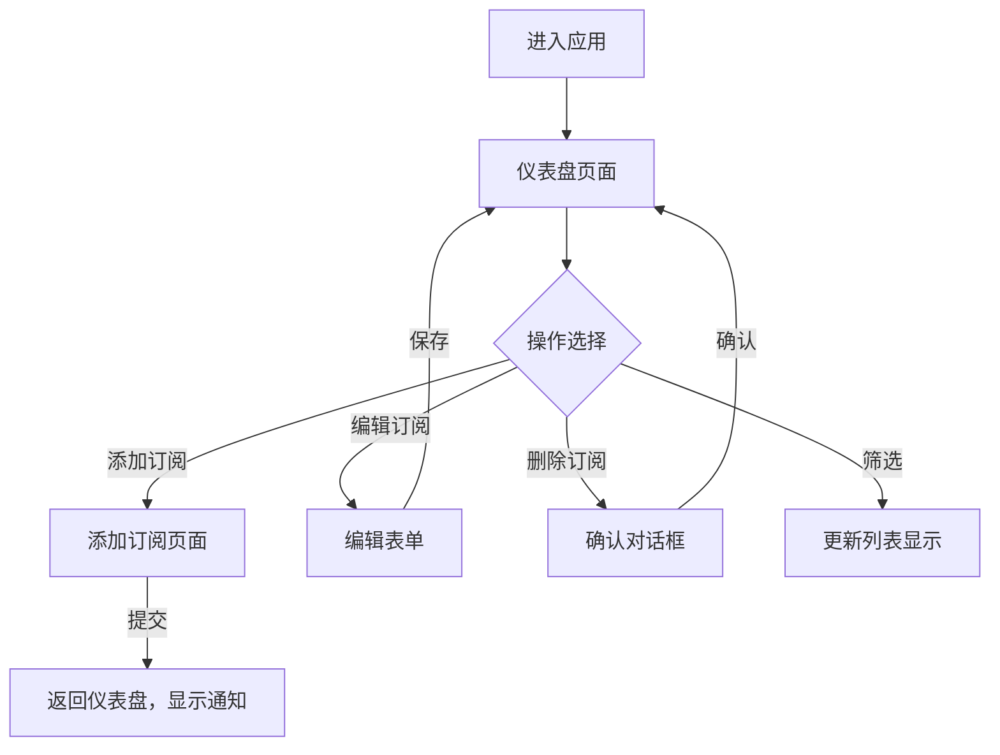

## 1. 产品概述
个人订阅服务管理应用，帮助用户统一管理各类订阅服务（视频会员、云存储、音乐等），提供到期提醒和预算分析功能。
- 核心目标：让用户清晰掌握订阅支出情况，及时续费或取消不必要的订阅
- 目标用户：拥有多个数字订阅服务的个人用户
- 产品价值：避免订阅过期中断服务，有效控制月度/年度订阅预算

## 2. 核心特性

### 2.1 功能模块
1. **仪表盘页面**：订阅列表展示、统计概览、支出趋势图表
2. **添加订阅页面**：服务信息录入表单
3. **订阅卡片组件**：单条订阅详情展示、编辑和删除操作

### 2.2 页面详情
| 页面名称 | 模块名称 | 功能描述 |
|---------|---------|----------|
| 仪表盘 | 统计区域 | 显示活跃订阅总数、下月预计支出、同比变化百分比 |
| 仪表盘 | 筛选器 | 按状态筛选订阅（全部/临近到期/已过期） |
| 仪表盘 | 订阅列表 | 卡片式展示所有订阅，支持动画和状态高亮 |
| 仪表盘 | 趋势图表 | 折线图展示6个月支出趋势，饼图展示类别占比 |
| 添加订阅 | 表单 | 服务名称、类别、月费、开始日期、续费周期输入 |
| 订阅卡片 | 操作区 | 编辑费用和到期日、删除订阅（含确认对话框） |

## 3. 核心流程
用户打开应用后在仪表盘查看所有订阅和统计数据，可通过筛选器查看特定状态的订阅，点击右下角添加按钮进入表单页面填写新订阅信息，或对已有订阅进行编辑和删除操作。

## 4. 用户界面设计

### 4.1 设计风格
- **主色调**：淡灰蓝色（#f0f4f8 背景，#2563eb 主色）
- **卡片背景**：白色（#ffffff），柔和阴影
- **类别渐变**：娱乐类粉紫渐变、办公类蓝青渐变、云服务类绿蓝渐变
- **按钮风格**：圆角（8px），悬浮有阴影加深效果
- **字体**：系统无衬线字体（system-ui, -apple-system, sans-serif）
- **布局风格**：卡片式网格布局，最大宽度1200px居中

### 4.2 页面设计概览
| 页面名称 | 模块名称 | UI元素 |
|---------|---------|--------|
| 仪表盘 | 统计区域 | 3个统计卡片，数字计数动画，箭头指示趋势 |
| 仪表盘 | 订阅卡片 | emoji图标、名称、费用、到期日、剩余天数、左侧脉冲边框（临近到期） |
| 仪表盘 | 图表区域 | Recharts折线图和饼图，扇区悬浮弹出效果 |
| 添加订阅 | 表单 | 标签+输入框布局，错误提示抖动动画，下拉选择器 |

### 4.3 响应式
- 桌面端：多列卡片网格布局
- 移动端（<768px）：单列全宽卡片，添加按钮固定右下角悬浮圆形按钮（FAB）
