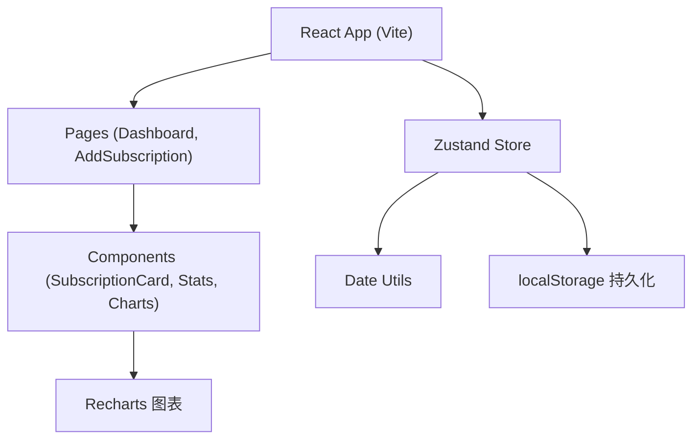
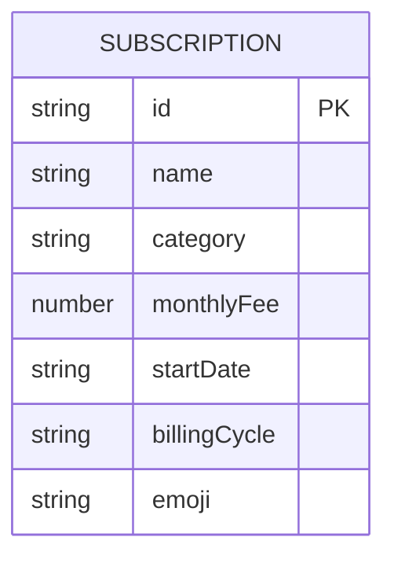

## 1. 架构设计



## 2. 技术描述
- **前端框架**：React 18 + TypeScript
- **构建工具**：Vite 5
- **状态管理**：Zustand 4
- **图表库**：Recharts 2
- **路由**：React Router DOM 6
- **唯一ID**：uuid 9
- **数据持久化**：localStorage
- **样式方案**：原生 CSS + CSS 变量

## 3. 路由定义
| 路由 | 用途 |
|-----|------|
| / | 仪表盘页面，展示订阅列表和统计图表 |
| /add | 添加订阅表单页面 |

## 4. 数据模型

### 4.1 数据模型定义



### 4.2 TypeScript 类型定义

```typescript
type Category = 'entertainment' | 'office' | 'cloud' | 'music' | 'other';
type BillingCycle = 'monthly' | 'yearly';

interface Subscription {
  id: string;
  name: string;
  category: Category;
  monthlyFee: number;
  startDate: string; // YYYY-MM-DD
  billingCycle: BillingCycle;
  emoji: string;
}

interface SubscriptionStore {
  subscriptions: Subscription[];
  filter: 'all' | 'expiring' | 'expired';
  addSubscription: (sub: Omit<Subscription, 'id'>) => void;
  updateSubscription: (id: string, updates: Partial<Subscription>) => void;
  deleteSubscription: (id: string) => void;
  setFilter: (filter: 'all' | 'expiring' | 'expired') => void;
  getFilteredSubscriptions: () => Subscription[];
}
```

## 5. 文件结构

```
├── package.json
├── index.html
├── vite.config.js
├── tsconfig.json
└── src/
    ├── App.tsx              # 根组件，路由和全局样式
    ├── main.tsx             # 入口文件
    ├── pages/
    │   ├── Dashboard.tsx    # 仪表盘页面
    │   └── AddSubscription.tsx  # 添加订阅页面
    ├── components/
    │   └── SubscriptionCard.tsx  # 订阅卡片组件
    ├── store/
    │   └── subscriptionStore.ts   # Zustand 状态管理
    └── utils/
        └── dateUtils.ts     # 日期计算工具函数
```

## 6. 性能优化策略
- 使用 React.memo 包裹订阅卡片组件，避免不必要的重渲染
- 使用 useMemo 缓存筛选结果、统计计算和图表数据
- 列表动画使用 CSS transform 和 opacity，确保 GPU 加速
- localStorage 读写操作使用节流优化
