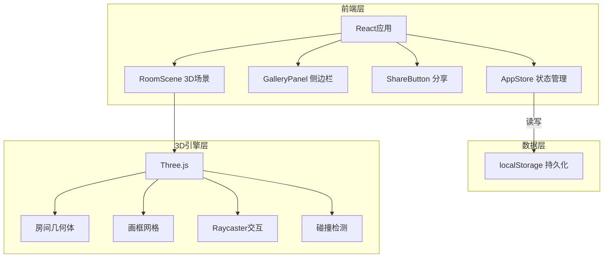
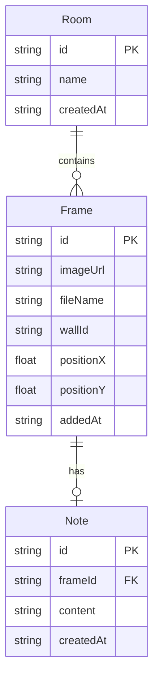

## 1. 架构设计



## 2. 技术说明

- 前端：React@18 + TypeScript + Vite
- 3D引擎：Three.js（直接使用，非@react-three/fiber，以便更精细控制场景和性能）
- 状态管理：Zustand
- 样式：Tailwind CSS 3
- 持久化：localStorage模拟后端
- 初始化工具：vite-init（react-ts模板）
- 包管理：npm

## 3. 路由定义

| 路由 | 用途 |
|------|------|
| / | 主场景页面，包含3D房间、侧边栏、分享按钮等所有功能 |

单页应用，无需多路由。

## 4. API定义

无后端API，所有数据通过localStorage持久化。

## 5. 数据模型

### 5.1 数据模型定义



### 5.2 数据定义

```typescript
interface Room {
  id: string;
  name: string;
  createdAt: string;
}

interface Frame {
  id: string;
  imageUrl: string;
  fileName: string;
  wallId: 'north' | 'south' | 'east' | 'west';
  positionX: number;
  positionY: number;
  addedAt: string;
}

interface Note {
  id: string;
  frameId: string;
  content: string;
  createdAt: string;
}

interface AppState {
  images: ImageItem[];
  frames: Frame[];
  notes: Note[];
  addImage: (image: ImageItem) => void;
  removeImage: (id: string) => void;
  addFrame: (frame: Frame) => void;
  removeFrame: (id: string) => void;
  updateFramePosition: (id: string, x: number, y: number) => void;
  addNote: (note: Note) => void;
  removeNote: (id: string) => void;
  updateNote: (id: string, content: string) => void;
}

interface ImageItem {
  id: string;
  imageUrl: string;
  fileName: string;
  addedAt: string;
}
```

## 6. 文件结构

```
├── package.json
├── index.html
├── vite.config.js
├── tsconfig.json
├── src/
│   ├── main.tsx
│   ├── App.tsx
│   ├── index.css
│   ├── modules/
│   │   ├── room/
│   │   │   └── RoomScene.tsx    # 3D场景管理：房间创建、相机控制、碰撞检测、挂画/删画接口
│   │   ├── gallery/
│   │   │   └── GalleryPanel.tsx  # 左侧边栏：缩略图列表、导入、拖拽挂画
│   │   └── share/
│   │       └── ShareButton.tsx   # 分享按钮：生成短链接、复制、toast
│   └── store/
│       └── appStore.ts           # Zustand状态管理：图片列表、画框位置、便签内容
```
