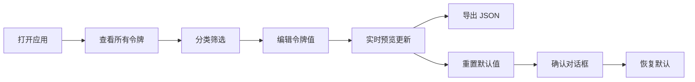

## 1. 产品概述

设计令牌管理面板是一款面向设计师和前端工程师的设计规范协作工具，旨在减少因组件库视觉一致性产生的沟通负担。用户可以查看、编辑和导出项目的设计令牌（颜色、间距、字体），并实时预览令牌变化对示例组件的影响。

- **目标用户**：UI 设计师、前端工程师、设计系统维护者
- **核心价值**：快速对比和调整设计规范，降低设计与开发的沟通成本
- **使用场景**：设计规范制定、组件库迭代、跨团队设计一致性维护

## 2. 核心功能

### 2.1 用户角色
| 角色 | 注册方式 | 核心权限 |
|------|----------|----------|
| 普通用户 | 无需注册，纯前端使用 | 查看、编辑、导出设计令牌，实时预览效果 |

### 2.2 功能模块
1. **令牌管理模块**：令牌表格展示、值编辑、颜色选择器
2. **分类筛选模块**：按 Colors / Spacing / Typography / All 分类筛选
3. **实时预览模块**：示例卡片组件动态应用令牌变化
4. **导出功能模块**：JSON 格式导出所有令牌数据
5. **批量重置模块**：一键恢复默认令牌值

### 2.3 页面详情
| 页面名称 | 模块名称 | 功能描述 |
|-----------|-------------|---------------------|
| 主面板 | 分类标签栏 | 顶部标签切换，选中态下划线+文字颜色变化动画（300ms ease-out），未选中 hover 浅灰背景 |
| 主面板 | 令牌表格 | 列出所有令牌（名称、类别、值、描述），值字段可编辑，行 hover 浅蓝背景+轻微左移 |
| 主面板 | 颜色网格 | 颜色令牌网格预览，hover 显示十六进制值和名称，点击弹出颜色选择器 |
| 右侧预览 | 示例卡片 | 动态应用颜色、间距、字体令牌，0.4秒平滑过渡动画 |
| 顶部操作栏 | 导出按钮 | 以 JSON 格式下载所有令牌数据 |
| 顶部操作栏 | 重置按钮 | 弹出毛玻璃确认对话框，确认后恢复默认值，反向淡入动画 |

## 3. 核心流程

用户打开应用 → 查看所有设计令牌 → 通过分类标签筛选特定类别 → 编辑令牌值（直接修改或颜色选择器）→ 实时预览效果 → 满意后导出 JSON → 可随时重置回默认值

## 4. 用户界面设计

### 4.1 设计风格
- **主色调**：深蓝灰背景（#1E293B），白色卡片底色（#F8FAFC），品牌青蓝色（#0EA5E9）
- **按钮风格**：圆角矩形，品牌色背景，hover 轻微加深
- **字体**：系统无衬线字体栈（system-ui, -apple-system, sans-serif）
- **布局风格**：左右分栏布局，左侧 2/3 主内容区，右侧 1/3 固定预览面板
- **动效风格**：平滑过渡动画，300ms ease-out 为主

### 4.2 页面设计概述
| 页面名称 | 模块名称 | UI 元素 |
|-----------|-------------|-------------|
| 主面板 | 分类标签栏 | 标签切换动画、选中下划线、hover 浅灰背景 |
| 主面板 | 令牌表格 | 可编辑单元格、行 hover 效果、颜色色块预览 |
| 主面板 | 颜色网格 | 色块卡片、hover 信息展示、点击颜色选择器 |
| 右侧预览 | 示例卡片 | 标题、正文、按钮，动态样式应用，过渡动画 |
| 对话框 | 重置确认 | 毛玻璃背景、居中卡片、确认/取消按钮 |

### 4.3 响应式
- **桌面端**：左右分栏，左侧 2/3，右侧 1/3
- **移动端（< 768px）**：预览面板移至主内容下方，表格字体缩小至 14px
- **触控优化**：增大点击区域，适配触摸操作

### 4.4 性能要求
- 令牌列表超过 100 条时保持 60fps 滚动流畅
- 颜色选择器打开时主界面无卡顿
- 所有动画保持 60fps 流畅度
