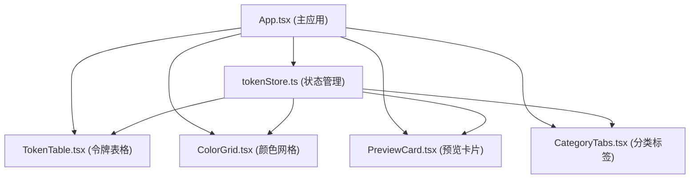

## 1. 架构设计

本项目为纯前端应用，采用 React + TypeScript + Vite 技术栈，状态管理使用 Zustand，无需后端服务。



**数据流向**：
- tokenStore 作为单一数据源，管理所有令牌状态
- 各子组件通过 useTokenStore 订阅状态
- 组件调用 store 的 action 方法（add/update/remove/reset/export）修改状态
- 状态变更自动触发所有订阅组件重渲染

## 2. 技术描述

- **前端框架**：React 18 + TypeScript 5
- **构建工具**：Vite 5 + @vitejs/plugin-react
- **状态管理**：Zustand 4
- **唯一 ID 生成**：uuid 9
- **样式方案**：原生 CSS + CSS 变量 + CSS Modules（按组件组织）
- **初始化方式**：vite-init react-ts 模板

## 3. 路由定义

本项目为单页面应用，无多路由配置，所有功能在首页展示。

| 路由 | 用途 |
|-------|---------|
| / | 设计令牌管理主面板 |

## 4. 数据模型

### 4.1 Token 类型定义

```typescript
interface Token {
  id: string;
  name: string;
  category: 'color' | 'spacing' | 'typography';
  value: string;
  description: string;
}
```

### 4.2 Token Store 状态

```typescript
interface TokenState {
  tokens: Token[];
  defaultTokens: Token[];
  activeCategory: 'all' | 'color' | 'spacing' | 'typography';
  
  // Actions
  addToken: (token: Omit<Token, 'id'>) => void;
  updateToken: (id: string, value: string) => void;
  removeToken: (id: string) => void;
  setActiveCategory: (category: TokenState['activeCategory']) => void;
  resetTokens: () => void;
  exportTokens: () => string;
  getFilteredTokens: () => Token[];
  getColorTokens: () => Token[];
}
```

### 4.3 预设默认令牌数据

**颜色令牌（Colors）**：
- `color.primary` - 主色 #0EA5E9
- `color.secondary` - 次色 #6366F1
- `color.success` - 成功色 #10B981
- `color.warning` - 警告色 #F59E0B
- `color.error` - 错误色 #EF4444
- `color.text` - 文字色 #1E293B
- `color.textLight` - 浅色文字 #64748B
- `color.background` - 背景色 #F8FAFC
- `color.surface` - 表面色 #FFFFFF
- `color.border` - 边框色 #E2E8F0

**间距令牌（Spacing）**：
- `spacing.xs` - 超小间距 4px
- `spacing.sm` - 小间距 8px
- `spacing.md` - 中间距 16px
- `spacing.lg` - 大间距 24px
- `spacing.xl` - 超大间距 32px
- `spacing.2xl` - 特大间距 48px

**字体令牌（Typography）**：
- `font.family.sans` - 无衬线字体 system-ui
- `font.size.xs` - 超小字号 12px
- `font.size.sm` - 小字号 14px
- `font.size.base` - 基准字号 16px
- `font.size.lg` - 大字号 18px
- `font.size.xl` - 超大字号 24px
- `font.size.2xl` - 特大字号 32px
- `font.weight.normal` - 常规字重 400
- `font.weight.medium` - 中等字重 500
- `font.weight.bold` - 粗体字重 700

## 5. 文件结构

```
src/
├── App.tsx                    # 主应用组件
├── main.tsx                   # 应用入口
├── index.css                  # 全局样式
├── store/
│   └── tokenStore.ts          # Zustand 状态管理
├── components/
│   ├── TokenTable.tsx         # 令牌表格组件
│   ├── ColorGrid.tsx          # 颜色网格组件
│   ├── PreviewCard.tsx        # 预览卡片组件
│   ├── CategoryTabs.tsx       # 分类标签组件
│   └── ResetDialog.tsx        # 重置确认对话框
└── types/
    └── token.ts               # Token 类型定义
```

## 6. 性能优化策略

- **列表虚拟化**：令牌表格使用 CSS `contain: strict` 优化渲染性能
- **状态选择器**：Zustand 使用 selector 精确订阅，避免不必要重渲染
- **CSS 过渡**：使用 CSS transition 而非 JS 动画，确保 60fps
- **颜色选择器**：使用原生 `<input type="color">` 避免第三方库开销
- **内存优化**：默认数据深拷贝，避免引用污染
