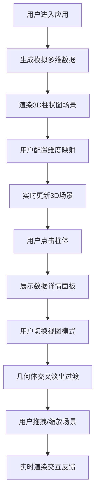

## 1. 产品概述

3D数据仪表盘是一个基于Web的交互式数据可视化应用，通过Three.js技术将多维数据以3D形式呈现，解决传统2D仪表盘在展示多维数据集时信息密度低、空间关联性弱的问题。用户可以通过直观的交互方式探索数据，快速发现数据间的空间关系和趋势。

## 2. 核心功能

### 2.1 用户角色
| 角色 | 注册方式 | 核心权限 |
|------|----------|----------|
| 数据分析师 | 无需注册 | 浏览3D场景、配置维度映射、切换视图模式、查看数据详情 |

### 2.2 功能模块
1. **主仪表盘页面**: 3D场景渲染、左侧配置面板、右侧信息面板、顶部工具栏
2. **维度配置模块**: X轴/Z轴维度选择、数值维度选择
3. **视图切换模块**: 柱状图模式、热力图模式、散点图模式
4. **交互反馈模块**: 柱体悬停高亮、点击选中、动画过渡
5. **数据详情模块**: 选中数据点详细信息展示、同比变化、趋势指示

### 2.3 页面详情
| 页面名称 | 模块名称 | 功能描述 |
|-----------|-------------|---------------------|
| 主仪表盘 | 3D场景渲染 | 使用Three.js渲染20x20柱体网格，支持旋转、缩放、平移交互 |
| 主仪表盘 | 左侧配置面板 | 维度选择器、数值字段选择器、视图模式切换按钮 |
| 主仪表盘 | 右侧信息面板 | 展示选中数据点详情、滑动进入/退出动画 |
| 主仪表盘 | 顶部工具栏 | 视图模式切换按钮、悬停缩放效果 |

## 3. 核心流程

用户进入应用后，系统自动生成模拟多维数据并渲染默认3D柱状图。用户可通过左侧面板调整维度映射，实时更新3D场景；点击任意柱体查看详细数据；通过顶部工具栏切换不同视图模式；使用鼠标拖拽旋转、滚轮缩放、右键平移来探索3D空间。

## 4. 用户界面设计

### 4.1 设计风格
- **颜色方案**: 深色主题，主背景#1a1a2e，辅助卡片背景#16213e，强调色#0f3460，高亮色#e94560
- **按钮样式**: 圆角6px，悬停时缩放1.05倍并改变背景色
- **字体**: Google Fonts Inter，标签字体14px
- **布局**: Flex布局，左右面板固定宽度，中间自适应填充
- **特殊效果**: 毛玻璃效果(backdrop-filter: blur(10px))，渐变色彩映射(低值蓝色→高值红色)

### 4.2 页面设计概述
| 页面名称 | 模块名称 | UI元素 |
|-----------|-------------|-------------|
| 主仪表盘 | 3D场景 | 柱体网格、中轴线网格、渐变色柱体、CSS2D文字标签、悬停圆点标记 |
| 主仪表盘 | 左侧面板 | 下拉选择器、标签文字、视图切换按钮组、半透明毛玻璃背景 |
| 主仪表盘 | 右侧面板 | 数据卡片、维度值展示、数值展示、同比变化百分比、趋势箭头图标、滑动动画 |
| 主仪表盘 | 顶部工具栏 | 模式切换按钮、间距16px、悬停缩放效果 |

### 4.3 响应式设计
- 桌面端(≥768px): 左右面板固定显示，宽度分别为280px和320px
- 移动端(<768px): 左右面板变为可切换的抽屉式侧边栏，支持手势滑动
- 触摸优化: 柱体点击区域扩大，支持触摸旋转和缩放

### 4.4 3D场景指导
- **环境与氛围**: 深色空间背景，中轴线网格持续显示，营造科技感数据空间
- **光照设置**: 环境光+方向光组合，确保柱体侧面有层次感，顶部高亮
- **相机设置**: 透视相机，初始距离15单位，范围5-30单位，支持OrbitControls
- **构图与焦点**: 柱体网格居中，选中柱体通过缩放动画突出
- **交互与动画**: 悬停饱和度提升，点击缩放弹出(200ms)，视图切换交叉淡出(400ms)，详情面板滑动进入(300ms)
- **性能预算**: 400个柱体时帧率≥45FPS，交互延迟≤50ms
