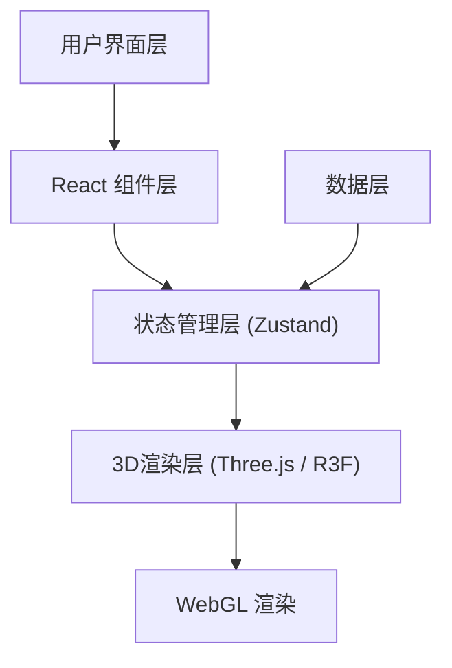

## 1. 架构设计



## 2. 技术描述

- **前端框架**: React@18 + TypeScript@5 + Vite@5
- **3D渲染**: Three.js@0.160 + @react-three/fiber@8 + @react-three/drei@9
- **状态管理**: zustand@4
- **构建工具**: Vite@5 + @vitejs/plugin-react@4
- **类型定义**: @types/react@18, @types/react-dom@18, @types/three@0.160
- **样式方案**: 原生CSS + CSS变量，毛玻璃效果，CSS动画

## 3. 项目结构

```
d:\P\tasks\auto63\
├── index.html
├── package.json
├── tsconfig.json
├── vite.config.js
└── src\
    ├── main.tsx
    ├── App.tsx
    ├── components\
    │   ├── DashboardScene.tsx
    │   ├── ControlPanel.tsx
    │   └── InfoPanel.tsx
    ├── stores\
    │   └── dashboardStore.ts
    └── utils\
        └── dataGenerator.ts
```

## 4. 路由定义

| 路由 | 用途 |
|-------|---------|
| / | 主仪表盘页面，3D场景和控制面板 |

## 5. 数据模型

### 5.1 数据记录类型
```typescript
interface DataRecord {
  id: string;
  region: string;
  time: string;
  category: string;
  sales: number;
  profit: number;
  yearOverYear: number;
}
```

### 5.2 维度类型
```typescript
type DimensionType = 'region' | 'time' | 'category';
type ValueType = 'sales' | 'profit';
type ViewMode = 'bar' | 'heatmap' | 'scatter';
```

### 5.3 状态模型
```typescript
interface DashboardState {
  data: DataRecord[];
  xDimension: DimensionType;
  zDimension: DimensionType;
  valueDimension: ValueType;
  viewMode: ViewMode;
  selectedBar: DataRecord | null;
  hoveredBar: string | null;
  gridSize: number;
}
```

## 6. 核心技术实现

### 6.1 3D渲染架构
- 使用`@react-three/fiber`的`<Canvas>`组件作为3D场景容器
- 使用`@react-three/drei`的`<OrbitControls>`处理相机交互
- 使用`<CSS2DRenderer>`和`<CSS2DObject>`实现始终朝向相机的文字标签
- 使用`useFrame`钩子实现动画循环和性能优化

### 6.2 性能优化策略
- 几何体复用: 使用`InstancedMesh`批量渲染柱体
- 材质共享: 相同类型几何体共享材质实例
- 视锥体剔除: Three.js内置视锥体剔除优化
- 帧率监测: 使用`Stats`或自定义FPS计数器
- 事件委托: 统一的射线检测(Raycaster)处理鼠标交互

### 6.3 动画实现
- 视图切换: 使用`gsap`或CSS动画实现交叉淡出(400ms)
- 柱体选中: 缩放动画(200ms)放大1.5倍
- 详情面板: transform translateX滑动动画(300ms)
- 悬停效果: 饱和度提升和顶部圆点标记

### 6.4 色彩映射
- 数值归一化: 将数值维度映射到[0,1]区间
- 渐变插值: 使用`THREE.Color`的`lerp`方法实现蓝到红渐变
- 热力图: 使用相同的色彩映射但应用到平面色块
