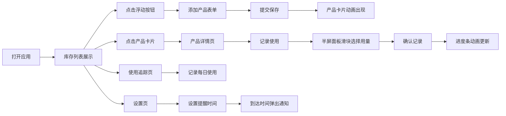

## 1. 产品概述

个人护肤产品库存管理与使用周期追踪应用，帮助用户记录和管理护肤品库存，追踪使用进度，智能推算用完日期，避免产品过期浪费。

- 核心目标：解决护肤品开封后忘记使用期限、用量不清晰导致的过期浪费问题
- 目标用户：关注护肤、拥有多款护肤品的都市人群
- 产品价值：科学管理护肤流程，提升产品使用率，减少浪费

## 2. 核心功能

### 2.1 用户角色

| 角色 | 注册方式 | 核心权限 |
|------|----------|----------|
| 普通用户 | 无需注册，本地使用 | 产品管理、使用记录、数据统计、提醒设置 |

### 2.2 功能模块

1. **库存管理页**：产品卡片网格展示、多维度筛选搜索、添加产品
2. **产品详情页**：产品信息展示、使用记录、7天用量统计图
3. **使用追踪页**：每日使用记录表单、近7天使用频率柱状图
4. **设置页**：每日提醒时间设置、通知授权

### 2.3 页面详情

| 页面名称 | 模块名称 | 功能描述 |
|----------|----------|----------|
| 库存管理页 | 筛选栏 | 按产品类型（多选）、品牌（搜索补全）、状态筛选 |
| 库存管理页 | 产品卡片网格 | 展示产品信息、进度条、预计用完日期，支持点击进入详情 |
| 库存管理页 | 添加产品模态框 | 半透明毛玻璃背景，表单含名称、品牌、类型、容量、开封日期、保质期 |
| 产品详情页 | 产品信息展示 | 大字体展示产品详细信息 |
| 产品详情页 | 使用记录面板 | 半屏面板，滑块记录用量，7天用量条形图 |
| 使用追踪页 | 使用记录表单 | 快速记录多产品使用量 |
| 使用追踪页 | 统计图表 | 近7天使用频率柱状图 |
| 设置页 | 提醒设置 | time input选择提醒时间，浏览器Notification通知 |

## 3. 核心流程

## 4. 用户界面设计

### 4.1 设计风格

- **配色方案**：柔和莫兰迪色系
  - 主色调：#8B9DAF（雾霾蓝）
  - 辅色调：#B5C0CA（浅灰蓝）
  - 背景色：#F5F0EB（米杏色）
  - 类型标签：根据产品类型自动生成柔和色块
  - 进度条：绿色→红色渐变
  - 警告徽章：#E57373（红色脉冲动画）

- **组件风格**：
  - 卡片：圆角16px，细微阴影，悬停上浮8px加深阴影
  - 按钮：主色调填充，按压缩放反馈（scale 0.95 / 0.1s）
  - 输入框：聚焦时蓝色边框+光晕动画
  - 模态框：半透明毛玻璃背景（backdrop-filter: blur(12px)）

- **字体选择**：
  - 标题：PingFang SC / Microsoft YaHei，字重600
  - 正文：PingFang SC / Microsoft YaHei，字重400
  - 数字：等宽数字字体

- **布局风格**：
  - 顶部导航栏固定
  - 卡片式网格布局
  - 移动端底部浮动快速记录按钮

- **动效设计**：
  - 页面切换：translateX 0.3s ease 滑动过渡
  - 卡片出现：scale + opacity 缩放淡入
  - 筛选更新：opacity 0.3s 交叉溶解
  - 进度条更新：width 0.5s ease-out
  - 警告徽章：pulse 动画透明度1→0.5循环
  - 图表柱子：从底部升起动画

### 4.2 页面设计概览

| 页面名称 | 模块名称 | UI元素 |
|----------|----------|--------|
| 库存管理页 | 顶部筛选栏 | 类型多选中兴、品牌搜索框、状态下拉、圆角12px |
| 库存管理页 | 产品卡片 | 类型色块标签、名称品牌、绿红渐变进度条、预计天数、悬停上浮 |
| 库存管理页 | 浮动按钮 | 主色调圆形按钮、+号图标、固定右下角 |
| 库存管理页 | 添加模态框 | 毛玻璃背景、表单输入光晕、单选类型按钮组、日期选择器 |
| 产品详情页 | 信息展示 | 大字体标题、详细信息列表、警告提示 |
| 产品详情页 | 使用面板 | 底部半屏滑入、滑块控件、recharts柱状图、确认按钮 |
| 使用追踪页 | 记录表单 | 产品选择器、用量滑块、批量提交 |
| 使用追踪页 | 统计图表 | recharts柱状图、悬停tooltip、动画升起 |
| 设置页 | 提醒设置 | time input、通知授权按钮、开关控件 |

### 4.3 响应式设计

- **桌面端**（≥1200px）：4列网格布局，侧边导航
- **平板端**（768px-1199px）：2列网格布局
- **手机端**（<768px）：1列网格布局，底部固定浮动快速记录按钮
- 触摸优化：所有可点击元素≥44x44px，支持触摸反馈

### 4.4 性能要求

- 首屏渲染≤1.5秒
- 滚动帧率≥50fps
- 模态框动画流畅无卡顿
- 使用React.memo优化列表渲染
- 合理使用useMemo/useCallback减少重渲染
