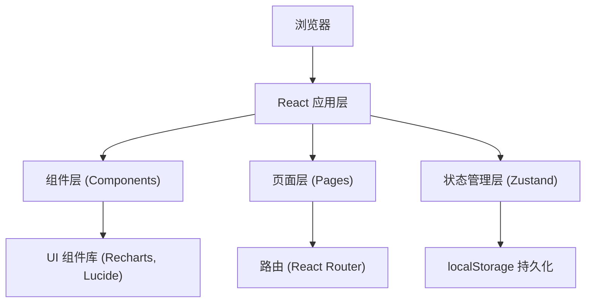
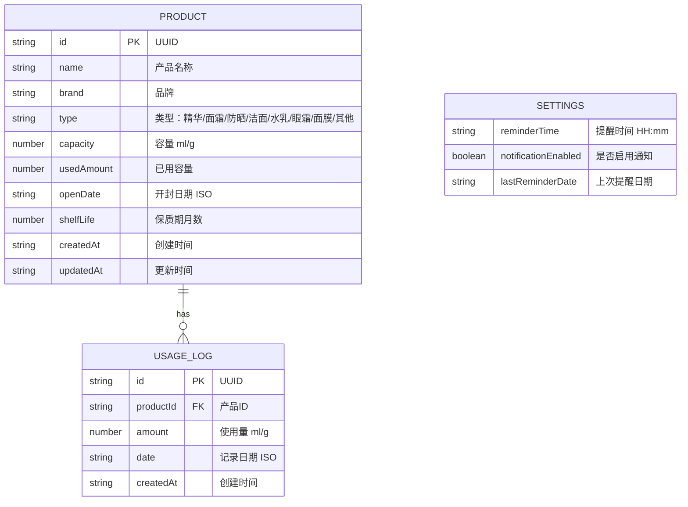

## 1. 架构设计



## 2. 技术描述

- **前端框架**：React@18 + TypeScript@5
- **构建工具**：Vite@5 + @vitejs/plugin-react@4
- **状态管理**：Zustand@4（轻量级，支持persist中间件）
- **路由管理**：React Router DOM@6
- **图表库**：Recharts@2
- **图标库**：Lucide React@0.294
- **唯一ID**：uuid@9
- **数据持久化**：localStorage（Zustand persist 中间件）
- **样式方案**：CSS Modules + CSS Variables
- **包管理器**：npm

## 3. 路由定义

| 路由路径 | 页面组件 | 用途 |
|----------|----------|------|
| / | InventoryPage | 库存列表首页 |
| /inventory | InventoryPage | 库存列表页 |
| /product/:id | ProductDetailPage | 产品详情页 |
| /tracking | TrackingPage | 使用追踪页 |
| /settings | SettingsPage | 设置页 |
| * | InventoryPage | 404重定向到首页 |

## 4. 数据模型

### 4.1 数据模型定义



### 4.2 TypeScript 类型定义

```typescript
type ProductType = '精华' | '面霜' | '防晒' | '洁面' | '水乳' | '眼霜' | '面膜' | '其他';

interface Product {
  id: string;
  name: string;
  brand: string;
  type: ProductType;
  capacity: number;
  usedAmount: number;
  openDate: string;
  shelfLife: number;
  createdAt: string;
  updatedAt: string;
}

interface UsageLog {
  id: string;
  productId: string;
  amount: number;
  date: string;
  createdAt: string;
}

interface Settings {
  reminderTime: string;
  notificationEnabled: boolean;
  lastReminderDate: string;
}

interface AppState {
  products: Product[];
  usageLogs: UsageLog[];
  settings: Settings;
  addProduct: (product: Omit<Product, 'id' | 'createdAt' | 'updatedAt' | 'usedAmount'>) => void;
  updateProduct: (id: string, updates: Partial<Product>) => void;
  deleteProduct: (id: string) => void;
  addUsageLog: (productId: string, amount: number, date?: string) => void;
  updateSettings: (updates: Partial<Settings>) => void;
}
```

## 5. 项目结构

```
├── package.json
├── index.html
├── vite.config.js
├── tsconfig.json
└── src/
    ├── main.tsx              # 应用入口
    ├── App.tsx               # 根组件，布局+路由
    ├── types/
    │   └── index.ts          # 类型定义
    ├── store/
    │   └── useStore.ts       # Zustand 状态管理
    ├── components/
    │   ├── ProductCard.tsx   # 产品卡片组件
    │   ├── ProductForm.tsx   # 添加/编辑产品表单
    │   ├── UsageSlider.tsx   # 用量滑块组件
    │   ├── UsageChart.tsx    # 7天用量图表
    │   ├── FilterBar.tsx     # 筛选栏组件
    │   ├── Navbar.tsx        # 导航栏组件
    │   └── FloatingButton.tsx # 浮动按钮组件
    ├── pages/
    │   ├── InventoryPage.tsx # 库存列表页
    │   ├── ProductDetailPage.tsx # 产品详情页
    │   ├── TrackingPage.tsx  # 使用追踪页
    │   └── SettingsPage.tsx  # 设置页
    ├── utils/
    │   ├── dateUtils.ts      # 日期工具函数
    │   ├── productUtils.ts   # 产品计算工具
    │   └── colorUtils.ts     # 颜色生成工具
    ├── hooks/
    │   └── useNotification.ts # 通知提醒Hook
    └── styles/
        └── variables.css     # CSS 变量
```

## 6. 核心计算逻辑

### 6.1 剩余容量百分比
```typescript
const remainingPercent = ((product.capacity - product.usedAmount) / product.capacity) * 100;
```

### 6.2 预计用完日期
```typescript
// 获取最近7天平均日用量
const avgDailyUsage = get7DayAverageUsage(productId);
if (avgDailyUsage > 0) {
  const remainingDays = Math.ceil((product.capacity - product.usedAmount) / avgDailyUsage);
  const estimatedFinishDate = addDays(new Date(), remainingDays);
}
```

### 6.3 产品状态判断
```typescript
// 已用完：usedAmount >= capacity
// 已过期：currentDate > openDate + shelfLife个月
// 进行中：其他情况
```

### 6.4 低库存警告
```typescript
// 剩余容量 < 10% 时显示红色感叹号徽章，列表排序优先级提升
```

## 7. 性能优化策略

1. **列表虚拟化**：产品较多时使用虚拟滚动
2. **React.memo**：优化ProductCard等频繁渲染组件
3. **useMemo/useCallback**：缓存计算结果和回调函数
4. **防抖搜索**：品牌搜索框使用debounce
5. **CSS优化**：使用transform/opacity动画触发GPU加速
6. **代码分割**：按路由分割代码块
7. **Zustand选择器**：使用state selector避免不必要重渲染
