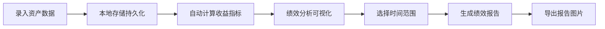

## 1. 产品概述

个人投资组合聚合与绩效分析应用，帮助用户统一管理分散在银行、基金、股票等平台的资产，自动计算投资收益并生成可视化分析报告。

- 核心价值：解决多平台资产分散管理痛点，提供统一的资产视图和绩效分析
- 目标用户：有多元化投资需求的个人投资者
- 产品定位：轻量级纯前端投资管理工具，数据本地持久化

## 2. 核心功能

### 2.1 用户角色
| 角色 | 注册方式 | 核心权限 |
|------|----------|----------|
| 普通用户 | 无需注册，本地使用 | 资产录入、编辑、删除，绩效分析，报告生成 |

### 2.2 功能模块
1. **资产录入页**：浮动表单录入资产数据，卡片网格展示资产列表
2. **绩效分析页**：核心指标卡片、资产配置饼图、收益率柱状图
3. **报告生成页**：按月度/季度筛选生成绩效报告，支持图片导出

### 2.3 页面详情
| 页面名称 | 模块名称 | 功能描述 |
|---------|----------|----------|
| 资产录入页 | 浮动表单 | 录入资产名称、类型、买入价、当前价、持有数量、买入日期，带实时校验和动画反馈 |
| 资产录入页 | 资产卡片列表 | 网格展示资产卡片，支持展开详情、编辑、删除操作 |
| 绩效分析页 | 核心指标面板 | 展示总市值、总收益、最高收益率资产，带滑入动画 |
| 绩效分析页 | 资产配置饼图 | 按类型分组展示市值占比，悬停交互效果 |
| 绩效分析页 | 收益率柱状图 | 按收益率降序排列，支持点击跳转详情 |
| 报告生成页 | 报告筛选器 | 选择月度/季度时间范围筛选资产 |
| 报告生成页 | 报告卡片 | A4风格报告，包含摘要文本、市值趋势图、配置饼图 |
| 报告生成页 | 图片导出 | 将报告卡片导出为PNG图片下载 |

## 3. 核心流程

用户录入资产数据 → 系统自动计算收益率和市值 → 分析模块可视化展示资产配置和收益情况 → 选择时间范围生成绩效报告 → 导出报告图片。

## 4. 用户界面设计

### 4.1 设计风格
- 主色调：深色主题，背景#1E1E2E，卡片背景#2A2A3E
- 强调色：#7C4DFF（紫色）
- 文字颜色：#E0E0E0
- 类型配色：银行#4A90D9（蓝）、基金#50C878（绿）、股票#FF6B6B（红）
- 按钮风格：圆角8px，悬停放大1.05倍，亮度提升10%
- 字体：现代无衬线字体，标题18px-24px，正文14px
- 布局：左侧垂直导航栏 + 右侧内容区域，卡片式布局
- 图标：线性风格图标，与文字垂直对齐

### 4.2 页面设计概述
| 页面名称 | 模块名称 | UI元素 |
|---------|----------|--------|
| 资产录入页 | 浮动表单 | 深色半透明背景，输入框焦点紫色边框+光晕，错误红色边框+震动动画，提交成功滑动收起 |
| 资产录入页 | 资产卡片 | 网格布局，悬停上浮8px加深阴影，点击展开详情面板滑入动画 |
| 绩效分析页 | 指标卡片 | 从左侧依次滑入（间隔150ms），金色边框高亮最高收益资产 |
| 绩效分析页 | 图表区域 | 半透明卡片背景，柔和渐变色，扇形悬停外扩效果 |
| 报告生成页 | 报告卡片 | A4纸风格，白色背景，阴影圆角，导出按钮下载动画 |
| 全局 | 导航栏 | 垂直布局，激活项左侧4px紫色竖条，渐变背景 |

### 4.3 响应式
- 桌面优先设计，移动端自适应
- 页面宽度<768px时：卡片网格单列布局，图表垂直堆叠排列
- 触摸优化：按钮最小尺寸44x44px，增加触摸反馈

### 4.4 动画与交互
- 页面切换：平滑淡入300ms
- 表单提交错误：震动动画200ms
- 新卡片出现：淡入上浮400ms
- 详情面板：上滑展开300ms
- 删除确认：半透明遮罩+缩放淡入
- 输入框焦点：紫色边框+蓝色光晕300ms过渡
- 按钮悬停：亮度+10%，缩放1.05倍，200ms过渡
