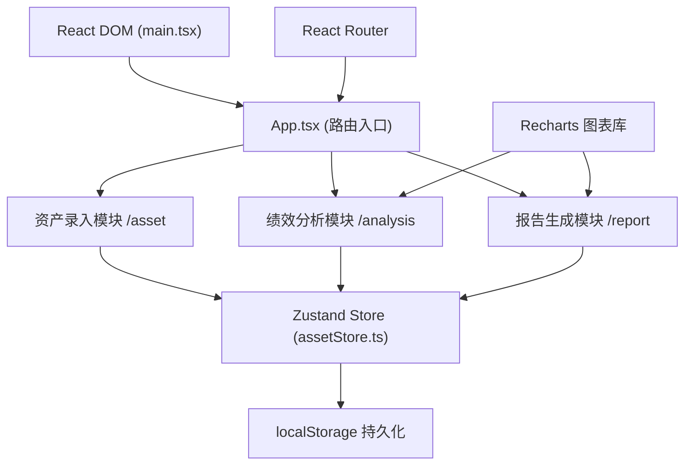
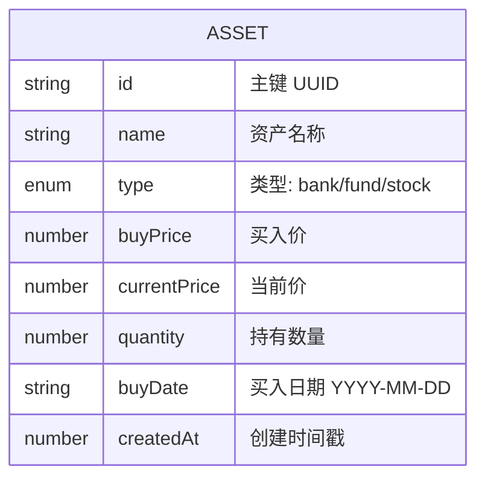

## 1. 架构设计

纯前端单页应用，采用React组件化架构，状态集中管理，数据本地持久化。



## 2. 技术描述

- 前端框架：React 18 + TypeScript
- 构建工具：Vite 5
- 状态管理：Zustand
- 路由管理：React Router v6
- 图表库：Recharts
- 唯一ID：uuid
- 图片导出：html2canvas
- 数据持久化：localStorage
- 样式方案：CSS Modules + 全局CSS变量

## 3. 路由定义

| 路由 | 页面 | 组件 |
|------|------|------|
| /asset | 资产录入页 | AssetEntryForm + AssetList |
| /analysis | 绩效分析页 | AnalysisPanel + PerformanceChart |
| /report | 报告生成页 | ReportGenerator + ReportCard |
| * | 默认重定向 | /asset |

## 4. 数据模型

### 4.1 数据模型定义



### 4.2 TypeScript 类型定义

```typescript
type AssetType = 'bank' | 'fund' | 'stock';

interface Asset {
  id: string;
  name: string;
  type: AssetType;
  buyPrice: number;
  currentPrice: number;
  quantity: number;
  buyDate: string;
  createdAt: number;
}

interface AssetStore {
  assets: Asset[];
  addAsset: (asset: Omit<Asset, 'id' | 'createdAt'>) => void;
  updateAsset: (id: string, updates: Partial<Asset>) => void;
  deleteAsset: (id: string) => void;
  loadFromStorage: () => void;
}

interface ReportData {
  period: 'month' | 'quarter';
  startDate: string;
  endDate: string;
  assets: Asset[];
  totalValue: number;
  totalReturn: number;
  avgReturnRate: number;
  bestPerformer: Asset;
  worstPerformer: Asset;
}
```

## 5. 文件结构与调用关系

```
src/
├── main.tsx              # React入口，挂载App
├── App.tsx               # 路由配置，模块分发
├── types/
│   └── index.ts          # 全局类型定义
├── modules/
│   ├── asset/
│   │   ├── assetStore.ts       # 状态管理（被其他模块调用）
│   │   ├── AssetEntryForm.tsx  # 调用store.addAsset/updateAsset
│   │   └── AssetList.tsx       # 读取store.assets，调用store.deleteAsset
│   ├── analysis/
│   │   ├── AnalysisPanel.tsx   # 读取store.assets计算指标
│   │   └── PerformanceChart.tsx # 读取store.assets渲染图表
│   └── report/
│       ├── ReportGenerator.tsx # 读取store.assets筛选数据
│       └── ReportCard.tsx      # 接收报告数据，调用html2canvas导出
└── utils/
    ├── calculations.ts         # 收益率、市值计算工具函数
    └── storage.ts              # localStorage操作封装
```

**数据流向：**
1. 用户输入 → AssetEntryForm校验 → store.addAsset → localStorage持久化
2. store.assets变化 → 所有订阅组件自动更新
3. AnalysisPanel/PerformanceChart → 读取store.assets → 计算指标 → 渲染
4. ReportGenerator → 按时间筛选store.assets → 生成报告数据 → ReportCard展示

## 6. 性能优化策略

1. **状态分片**：Zustand自动追踪依赖，避免不必要重渲染
2. **列表虚拟**：资产列表超过50条时按需渲染（IntersectionObserver）
3. **计算缓存**：使用useMemo缓存收益率、总市值等派生数据
4. **动画优化**：使用CSS transform/opacity实现硬件加速动画
5. **防抖节流**：表单输入校验防抖300ms，窗口resize节流100ms
6. **localStorage优化**：批量写入，避免频繁IO操作
7. **图表懒渲染**：图表组件使用React.lazy，首屏不加载
