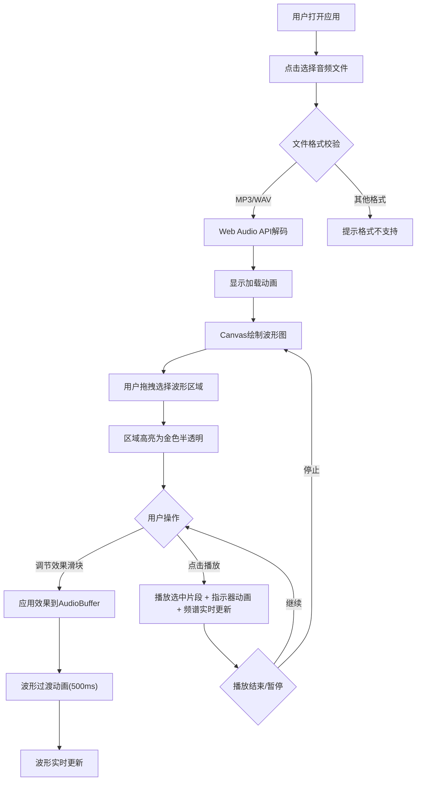

## 1. 产品概述

音乐波形可视化编辑器是一款基于浏览器的音频编辑与可视化应用，解决传统音频播放器缺乏手动编辑和创作功能的痛点。用户可以加载本地音频文件，直观查看波形图，选择片段进行编辑，并实时预览音频效果。

- 主要目标：为音乐创作者、音频爱好者提供轻量级、直观的波形编辑与可视化工具
- 目标用户：音乐制作人、播客编辑者、学生、音频技术爱好者
- 产品价值：无需安装专业软件，在浏览器中即可完成基础音频编辑和可视化创作

## 2. 核心功能

### 2.1 用户角色

| 角色 | 注册方式 | 核心权限 |
|------|----------|----------|
| 普通用户 | 无需注册，直接使用 | 加载本地音频、编辑波形、应用效果、实时预览 |

### 2.2 功能模块

1. **主界面**：音频加载区、波形可视化区、频谱分析区、效果控制面板、播放控制区
2. **波形编辑器**：波形渲染、区域选择、播放指示器、效果过渡动画
3. **频谱分析器**：实时频谱可视化、彩色渐变竖条、余晖动效
4. **效果处理引擎**：音量放大、回声效果、低通滤波
5. **音频播放系统**：片段播放、进度同步、加载动画

### 2.3 页面详情

| 页面名称 | 模块名称 | 功能描述 |
|----------|----------|----------|
| 主界面 | 文件加载区 | 文件选择器，支持MP3/WAV格式，加载时圆形旋转动画 |
| 主界面 | 波形图面板 | Canvas绘制蓝紫渐变波形，纵轴振幅横轴时间，选中区域金色半透明高亮 |
| 主界面 | 频谱面板 | 256条竖条实时频谱，绿→黄→红渐变，顶部余晖动效 |
| 主界面 | 播放控制 | 播放/暂停/停止按钮，支持仅播放选中区域，播放指示器带光晕拖尾 |
| 主界面 | 效果控制区 | 音量滑块(0.5x-2x)、回声延迟(200-1000ms)、低通截止(100-5000Hz) |

## 3. 核心流程

## 4. 用户界面设计

### 4.1 设计风格

- **主色调**：深色背景 `#1a1a2e`，文字 `#e0e0e0`
- **波形渐变**：蓝色 `#4a9eff` → 紫色 `#a855f7`
- **选中区域**：金色半透明 `rgba(255, 215, 0, 0.3)`
- **频谱渐变**：绿色 `#22c55e` → 黄色 `#eab308` → 红色 `#ef4444`
- **按钮/滑块**：默认 `#4a4a8a`，悬停 `#6a6aaa`
- **按钮风格**：圆角设计，悬停时 `translateY(-2px)` 上浮
- **卡片风格**：圆角边框 `12px`，淡淡投影 `0 4px 24px rgba(0,0,0,0.3)`
- **字体**：无衬线现代字体，标题加粗，正文舒适可读
- **图标风格**：简洁线条型，可使用 Unicode 符号或 SVG

### 4.2 页面设计概述

| 页面名称 | 模块名称 | UI元素 |
|----------|----------|----------|
| 主界面 | 整体布局 | 深色主题，卡片式分块，波形图与频谱图上下排列，控制面板在底部 |
| 主界面 | 波形图面板 | Canvas容器，圆角边框，阴影，顶部显示文件名/时长信息 |
| 主界面 | 频谱面板 | Canvas容器，圆角边框，与波形图等宽，上下分布 |
| 主界面 | 播放控制区 | 圆形/圆角按钮组，播放/暂停/停止图标，进度显示 |
| 主界面 | 效果控制区 | 带标签的滑块组，滑块轨道圆角，悬停高亮 |
| 主界面 | 加载状态 | 居中圆形旋转加载动画，半透明遮罩 |

### 4.3 响应式设计

- **桌面端 (>768px)**：波形图和频谱图可并排或上下布局，控件间距适中
- **移动端 (<=768px)**：两个面板强制上下排列，控件间距自动缩小，按钮和滑块尺寸适配触摸操作
- **触控优化**：按钮最小尺寸 44x44px，滑块高度增加便于拖动
- **布局策略**：Flexbox + CSS Media Query，自适应窗口尺寸

### 4.4 动画与交互动效

- **加载动画**：CSS 旋转圆环，持续 1.2s 循环
- **播放指示器**：requestAnimationFrame 驱动，位置线性插值，拖尾效果使用半透明渐变
- **波形过渡**：旧波形 → 新波形使用 500ms 线性插值混合
- **按钮悬停**：颜色过渡 200ms ease-out，translateY(-2px) 上浮
- **频谱余晖**：竖条高度使用轻微随机波动 + 平滑过渡，模拟灯光余晖
