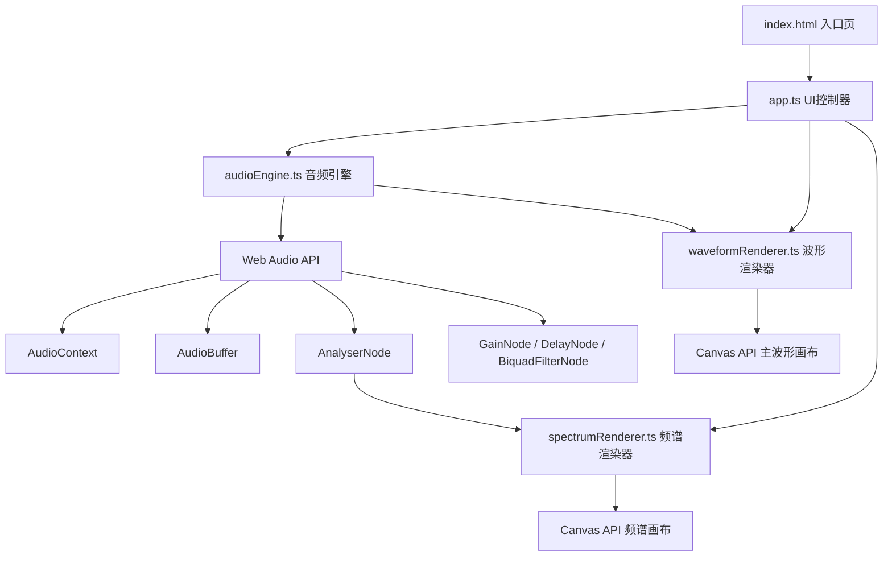

## 1. 架构设计



## 2. 技术描述

- **前端框架**：原生 TypeScript + 原生 Canvas API，不使用任何第三方音频库
- **构建工具**：Vite@5（热更新、快速构建、TypeScript 支持）
- **类型系统**：TypeScript 严格模式（strict: true）
- **样式方案**：原生 CSS，CSS 变量统一主题色，Flexbox 响应式布局
- **音频处理**：Web Audio API（AudioContext、AudioBuffer、GainNode、DelayNode、BiquadFilterNode、AnalyserNode）
- **渲染引擎**：HTML5 Canvas 2D Context + requestAnimationFrame 动画循环
- **无后端**：纯前端应用，所有处理在浏览器本地完成，无需服务器

### 2.1 核心模块职责

| 模块 | 文件 | 职责 |
|------|------|------|
| 音频引擎 | audioEngine.ts | 音频加载/解码、节点链管理、播放控制、效果处理、区域选择管理 |
| 波形渲染器 | waveformRenderer.ts | Canvas 波形绘制、选中区高亮、播放指示器动画、波形过渡动画 |
| 频谱渲染器 | spectrumRenderer.ts | 实时频谱分析、256条彩色竖条绘制、余晖动效 |
| UI 控制器 | app.ts | DOM 事件绑定、控件状态管理、协调三个核心模块 |

## 3. 项目结构与路由

### 3.1 目录结构

```
auto67/
├── package.json            # 依赖配置（typescript, vite）
├── index.html              # 入口 HTML
├── vite.config.js          # Vite 配置
├── tsconfig.json           # TS 严格模式配置
└── src/
    ├── audioEngine.ts      # 音频引擎核心
    ├── waveformRenderer.ts # 波形渲染器
    ├── spectrumRenderer.ts # 频谱渲染器
    └── app.ts              # UI 入口与协调器
```

### 3.2 路由（单页无路由）

| Route | Purpose |
|-------|---------|
| /（根路径） | 单页应用入口，包含所有功能模块 |

## 4. 核心类与接口定义

```typescript
// ==================== audioEngine.ts ====================

interface AudioRegion {
  startSample: number;
  endSample: number;
}

type EffectType = 'volume' | 'echo' | 'lowpass';

interface EffectParams {
  volume?: number;      // 0.5 ~ 2
  echoDelay?: number;   // 200 ~ 1000 (ms)
  lowpassFreq?: number; // 100 ~ 5000 (Hz)
}

class AudioEngine {
  public audioContext: AudioContext | null;
  public decodedBuffer: AudioBuffer | null;
  public analyser: AnalyserNode | null;
  public isPlaying: boolean;
  public currentTime: number;
  public selectedRegion: AudioRegion | null;

  constructor();
  public async loadFile(file: File): Promise<void>;
  public play(): void;
  public pause(): void;
  public stop(): void;
  public selectRegion(startSec: number, endSec: number): void;
  public clearRegion(): void;
  public applyEffect(type: EffectType, params: EffectParams): AudioBuffer;
  public getSampleData(channel?: number): Float32Array;
  public getDuration(): number;
  public onPlaybackEnd(callback: () => void): void;
  private createPlaybackGraph(startSample: number, endSample: number): void;
}

// ==================== waveformRenderer.ts ====================

interface WaveformRendererOptions {
  width: number;
  height: number;
  gradientStart: string;
  gradientEnd: string;
  selectionColor: string;
}

class WaveformRenderer {
  private canvas: HTMLCanvasElement;
  private ctx: CanvasRenderingContext2D;
  private options: WaveformRendererOptions;
  private oldWaveformData: Float32Array | null;
  private newWaveformData: Float32Array | null;
  private transitionStartTime: number;
  private indicatorPosition: number;
  private indicatorTrail: number[];
  private animationFrameId: number;

  constructor(canvas: HTMLCanvasElement, options?: Partial<WaveformRendererOptions>);
  public resize(width: number, height: number): void;
  public setWaveformData(data: Float32Array, animate?: boolean): void;
  public setSelection(startX: number, endX: number): void;
  public clearSelection(): void;
  public setIndicator(progress: number): void;  // 0 ~ 1
  public clearIndicator(): void;
  public startRenderLoop(): void;
  public stopRenderLoop(): void;
  private drawWaveform(ctx: CanvasRenderingContext2D, data: Float32Array): void;
  private drawSelection(ctx: CanvasRenderingContext2D): void;
  private drawIndicator(ctx: CanvasRenderingContext2D): void;
  private renderFrame(timestamp: number): void;
}

// ==================== spectrumRenderer.ts ====================

interface SpectrumRendererOptions {
  barCount: number;  // 默认 256
  width: number;
  height: number;
}

class SpectrumRenderer {
  private canvas: HTMLCanvasElement;
  private ctx: CanvasRenderingContext2D;
  private analyser: AnalyserNode | null;
  private options: SpectrumRendererOptions;
  private frequencyData: Uint8Array;
  private previousHeights: number[];
  private randomOffsets: number[];
  private animationFrameId: number;

  constructor(canvas: HTMLCanvasElement, options?: Partial<SpectrumRendererOptions>);
  public setAnalyser(analyser: AnalyserNode): void;
  public resize(width: number, height: number): void;
  public startRenderLoop(): void;
  public stopRenderLoop(): void;
  private getBarColor(normalizedHeight: number): string;
  private renderFrame(): void;
}
```

## 5. 关键技术方案

### 5.1 音频节点链（播放时）

```
AudioBufferSourceNode → [GainNode 音量] → [DelayNode + GainNode 回声] → [BiquadFilterNode 低通] → AnalyserNode → AudioDestination
```

- 所有效果节点在 `applyEffect` 时离线处理 AudioBuffer（OfflineAudioContext），产生新的 AudioBuffer
- 播放时仅连接必要节点（Source → Analyser → Destination），确保播放性能

### 5.2 波形绘制优化

- 将 AudioBuffer 按 Canvas 宽度降采样，每个像素点计算 min/max 振幅
- 降采样结果缓存，仅在重新加载/应用效果时重新计算
- 使用 requestAnimationFrame 统一渲染循环，避免多个定时器冲突

### 5.3 性能保障

- **波形绘制**：降采样算法，O(n) 时间复杂度，n=Canvas 宽度
- **频谱更新**：AnalyserNode FFT size = 512，频域数据直接使用
- **过渡动画**：波形混合使用线性插值，500ms 内每帧计算混合系数
- **帧率目标**：requestAnimationFrame 驱动，最低 30fps，典型 60fps

## 6. 事件通信

| 事件源 | 目标 | 说明 |
|--------|------|------|
| app.ts 文件选择器 | audioEngine.loadFile() | 加载并解码文件 |
| audioEngine 加载完成 | waveformRenderer.setWaveformData() | 更新波形数据 |
| app.ts 鼠标拖拽 | audioEngine.selectRegion() | 选择播放区域 |
| app.ts 播放按钮 | audioEngine.play() → 定时器回调 | 触发指示器位置更新 |
| audioEngine 播放进度 | waveformRenderer.setIndicator() | 更新播放指示器 |
| audioEngine 初始化 analyser | spectrumRenderer.setAnalyser() | 建立频谱数据源 |
| app.ts 效果滑块 | audioEngine.applyEffect() → waveformRenderer.setWaveformData(animate=true) | 处理音频并触发波形过渡动画 |
