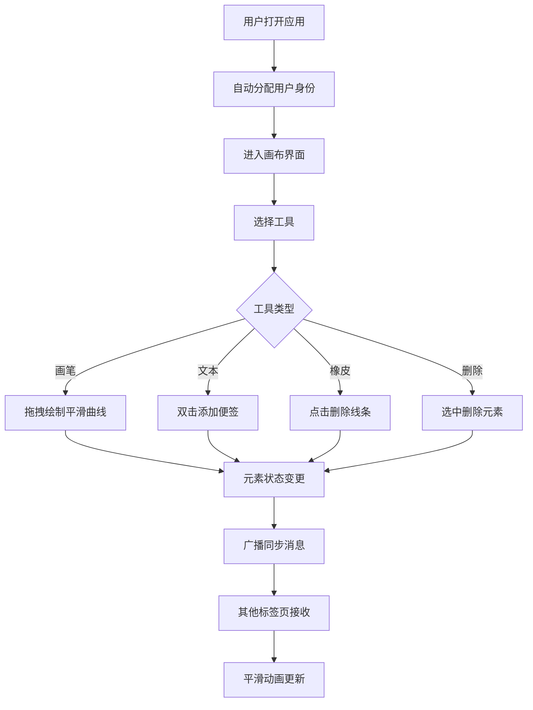

## 1. 产品概述

在线协作白板应用，支持多用户在同一画布上同时绘图和贴便签，用于远程头脑风暴或教学设计场景。通过实时同步技术实现跨标签页协作，提供流畅的绘图体验和丰富的交互功能。

- 主要用途：远程协作、头脑风暴、教学设计、团队讨论
- 目标用户：教育工作者、产品经理、设计团队、远程工作者
- 产品价值：提供直观、高效的在线协作空间，降低远程沟通成本

## 2. 核心特性

### 2.1 用户角色
| 角色 | 注册方式 | 核心权限 |
|------|----------|----------|
| 普通用户 | 自动分配临时身份 | 绘制线条、添加便签、编辑元素、实时协作 |

### 2.2 功能模块
1. **画布绘图**：自由线条绘制、平滑曲线、坐标预览、颜色选择
2. **便签管理**：文本便签、Markdown支持、拖拽移动、箭头连接
3. **元素操作**：选中、拖拽、旋转、删除、控制手柄
4. **实时协作**：跨标签页同步、用户状态、在线人数显示
5. **工具系统**：画笔、橡皮、颜色选择器、文本工具、删除工具

### 2.3 页面详情
| 页面名称 | 模块名称 | 功能描述 |
|----------|----------|------------|
| 主画布页 | 工具栏 | 左侧固定工具条，5个工具按钮，响应式布局 |
| 主画布页 | 绘图画布 | 核心绘图区域，支持鼠标/触摸操作 |
| 主画布页 | 状态栏 | 顶部显示在线用户列表和人数 |
| 主画布页 | 便签组件 | 可编辑文本便签，支持Markdown |
| 主画布页 | 控制手柄 | 选中元素时显示，支持拖拽旋转 |

## 3. 核心流程

用户打开应用后自动分配临时身份，进入画布界面。选择画笔工具可绘制自由线条，线条采用Catmull-Rom样条曲线平滑处理，绘制时鼠标附近悬浮显示坐标和颜色预览。选择文本工具双击画布可添加便签，支持Markdown格式。选中元素后显示控制手柄和旋转手柄，可进行拖拽、旋转和删除操作。所有操作通过BroadcastChannel实时同步到其他标签页，元素位置更新采用300ms ease-out缓动动画。

## 4. 用户界面设计

### 4.1 设计风格
- 主色调：浅灰背景 #f5f5f5，画布米白 #fafaf5
- 强调色：画笔默认蓝色，12种预设颜色
- 按钮风格：圆角矩形，悬停上浮5px，背景变深
- 字体：使用有独特个性的标题字体搭配舒适的正文字体
- 动效：弹性放大、平滑缓动、淡入淡出

### 4.2 页面设计概述
| 页面名称 | 模块名称 | UI元素 |
|----------|----------|--------|
| 主画布页 | 工具栏 | 左侧垂直排列，圆角按钮，图标+悬停效果，12色色块弹性动画 |
| 主画布页 | 画布区域 | 米白色背景，网格纹理，抗锯齿渲染 |
| 主画布页 | 状态栏 | 顶部半透明条，彩色圆形头像，用户离开放缩淡出 |
| 主画布页 | 便签 | 浅黄色背景，圆角，阴影，双击编辑放大淡入 |
| 主画布页 | 控制手柄 | 方形角点 + 顶部圆形旋转手柄，拖拽反馈 |

### 4.3 响应式设计
- 桌面端（≥1280px）：工具栏左侧垂直固定
- 平板/移动端（<1280px）：工具栏底部横向固定
- 触摸设备：手势拖动画布，双指缩放
- 性能目标：50fps以上，操作延迟≤16ms

### 4.4 交互细节
- 绘制时：鼠标附近悬浮小标签显示坐标(x,y)和颜色色块
- 选中线条：四角方形手柄 + 顶部中间圆形旋转手柄
- 颜色选择：点击色块时弹性放大动画（scale 1.2 → 1.0）
- 元素同步：300ms ease-out 缓动动画
- 用户离开：头像缩小淡出动画
