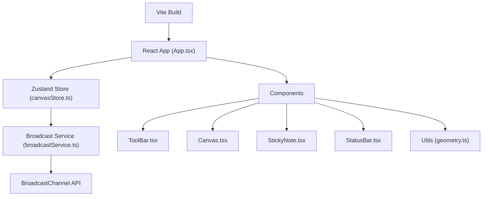

## 1. 架构设计



## 2. 技术选型说明

- 前端框架：React 18 + TypeScript
- 构建工具：Vite
- 状态管理：Zustand
- 通信层：BroadcastChannel API（预留WebSocket接口）
- 唯一标识：uuid
- 样式方案：CSS Modules / 内联样式（根据需要）
- 曲线算法：Catmull-Rom 样条曲线插值

## 3. 数据类型定义

```typescript
interface Point {
  x: number;
  y: number;
}

interface LineElement {
  id: string;
  type: 'line';
  points: Point[];
  color: string;
  strokeWidth: number;
  x: number;
  y: number;
  rotation: number;
  scale: number;
}

interface StickyNoteElement {
  id: string;
  type: 'stickyNote';
  content: string;
  x: number;
  y: number;
  width: number;
  height: number;
  rotation: number;
}

interface ArrowElement {
  id: string;
  type: 'arrow';
  fromId: string;
  toId: string;
  label: string;
}

interface User {
  id: string;
  name: string;
  color: string;
  avatar: string;
}

type CanvasElement = LineElement | StickyNoteElement | ArrowElement;

interface CanvasState {
  elements: CanvasElement[];
  selectedElementId: string | null;
  currentTool: 'pen' | 'eraser' | 'text' | 'delete' | 'select';
  currentColor: string;
  users: User[];
  currentUserId: string;
}
```

## 4. 项目文件结构

```
auto69/
├── package.json
├── index.html
├── vite.config.js
├── tsconfig.json
└── src/
    ├── main.tsx
    ├── App.tsx
    ├── store/
    │   └── canvasStore.ts
    ├── components/
    │   ├── ToolBar.tsx
    │   ├── Canvas.tsx
    │   ├── StickyNote.tsx
    │   └── StatusBar.tsx
    ├── services/
    │   └── broadcastService.ts
    └── utils/
        └── geometry.ts
```

## 5. 核心算法说明

### 5.1 Catmull-Rom 样条曲线平滑
```
输入：原始点集合 P0, P1, P2, ..., Pn
输出：平滑后的曲线点集合
算法：对每四个连续点计算Catmull-Rom插值，生成密集点集
张力系数：0.5（默认）
插值密度：每段5个点
```

### 5.2 点到线条碰撞检测
```
遍历线条每两个相邻点组成的线段
计算点到线段的最短距离
若距离小于阈值（如5px）则判定为命中
```

### 5.3 旋转变换
```
以元素中心点为原点
将坐标点旋转指定角度（弧度）
旋转矩阵：[cosθ, -sinθ; sinθ, cosθ]
```

## 6. 通信接口定义

### BroadcastService 接口
```typescript
interface BroadcastMessage {
  type: 'elementAdded' | 'elementUpdated' | 'elementRemoved' | 'userJoined' | 'userLeft';
  payload: any;
  senderId: string;
  timestamp: number;
}

interface IBroadcastService {
  send(message: BroadcastMessage): void;
  subscribe(callback: (message: BroadcastMessage) => void): () => void;
  disconnect(): void;
}
```

## 7. 性能优化策略

1. 绘图防抖：使用requestAnimationFrame批量处理绘制请求
2. 局部重绘：仅更新变化区域，而非整个画布
3. 点采样：鼠标移动过快时适当采样，减少计算量
4. 离屏缓存：复杂图形缓存到离屏canvas
5. 事件节流：mousemove事件使用requestAnimationFrame调度
