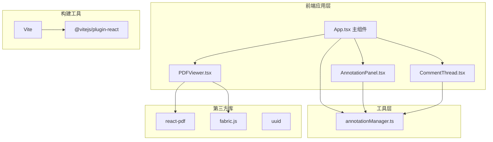

## 1. 架构设计



## 2. 技术描述

- **前端框架**：React 18 + TypeScript（严格模式）
- **构建工具**：Vite 5 + @vitejs/plugin-react
- **PDF 渲染**：react-pdf（基于 pdf.js）
- **画布绘制**：fabric.js（矢量标注、选择控制）
- **工具库**：uuid（生成唯一 ID）
- **样式方案**：CSS Modules + 内联样式
- **状态管理**：React useState + useCallback + 自定义 manager 类
- **后端**：无（纯前端模拟，数据存储在内存中）

## 3. 目录结构

```
d:\P\tasks\auto7\
├── package.json
├── index.html
├── tsconfig.json
├── vite.config.js
├── public/
│   └── sample.pdf          (测试用 PDF 文件)
└── src/
    ├── App.tsx             (主组件，状态管理与布局)
    ├── components/
    │   ├── PDFViewer.tsx   (PDF 渲染 + fabric 画布)
    │   ├── AnnotationPanel.tsx  (左侧工具面板)
    │   └── CommentThread.tsx    (右侧批注面板)
    ├── utils/
    │   └── annotationManager.ts (标注与批注数据管理)
    └── styles/
        └── global.css      (全局样式)
```

## 4. 数据模型

### 4.1 标注数据结构

```typescript
interface BaseAnnotation {
  id: string;
  page: number;
  type: 'pen' | 'rect' | 'text' | 'highlight';
  color: string;
}

interface PenAnnotation extends BaseAnnotation {
  type: 'pen';
  points: { x: number; y: number }[];
  strokeWidth: number;
}

interface RectAnnotation extends BaseAnnotation {
  type: 'rect' | 'highlight';
  x: number;
  y: number;
  width: number;
  height: number;
  strokeWidth: number;
}

interface TextAnnotation extends BaseAnnotation {
  type: 'text';
  x: number;
  y: number;
  text: string;
  fontSize: number;
}

type Annotation = PenAnnotation | RectAnnotation | TextAnnotation;
```

### 4.2 批注数据结构

```typescript
interface Comment {
  id: string;
  authorId: string;
  authorName: string;
  authorAvatar: string;
  content: string;
  timestamp: number;
  isNew: boolean;
}

interface CommentThread {
  id: string;
  annotationId: string;
  page: number;
  anchorX: number;
  anchorY: number;
  comments: Comment[];
  isCollapsed: boolean;
}
```

### 4.3 用户数据结构

```typescript
interface User {
  id: string;
  name: string;
  avatar: string;
  isTeacher: boolean;
}
```

## 5. 核心模块说明

### 5.1 AnnotationManager

封装所有标注和批注数据的增删改查逻辑，通过回调同步 UI。

- `addAnnotation(annotation)`：添加标注
- `updateAnnotation(id, updates)`：更新标注
- `deleteAnnotation(id)`：删除标注
- `getAnnotationsByPage(page)`：获取指定页面的标注
- `addComment(threadId, comment)`：添加评论
- `addThread(thread)`：添加批注线程
- `getThreadsByPage(page)`：获取指定页面的批注线程
- `subscribe(callback)`：订阅数据变化

### 5.2 PDFViewer

负责 PDF 渲染和 fabric.js 画布管理。

- 使用 `react-pdf` 渲染 PDF 页面
- 在 PDF 上叠加 fabric.js Canvas
- 处理绘制交互（mousedown/mousemove/mouseup）
- 处理标注选中、删除、右键菜单
- 处理锚点点击事件
- 翻页时同步画布内容

### 5.3 AnnotationPanel

左侧标注工具面板。

- 四种工具切换（画笔、矩形、文本、高亮）
- 颜色选择器
- 工具按钮选中态样式
- 微交互动画

### 5.4 CommentThread

右侧批注线程面板。

- 按锚点分组显示评论
- 折叠/展开动画
- 未读评论红点指示
- 评论输入框
- 虚拟化列表渲染
- 滚动定位

### 5.5 App.tsx

主组件，负责：

- 三栏布局
- 状态管理（当前页、当前工具、标注数据、批注数据）
- 模拟用户功能
- 响应式布局处理
- 顶部导航栏

## 6. 性能优化策略

1. **标注分页**：翻页时只加载当前页的标注，避免全量渲染
2. **评论虚拟化**：使用 IntersectionObserver 或计算可见区域，仅渲染可见评论卡片
3. **画布优化**：fabric.js 对象池复用，避免频繁创建销毁
4. **防抖节流**：滚动、绘制等高频操作使用节流
5. **CSS 动画**：使用 transform 和 opacity 动画，触发 GPU 加速
6. **React 优化**：使用 useMemo、useCallback、memo 减少重渲染

## 7. 构建配置

- **入口**：index.html
- **开发命令**：npm run dev
- **TypeScript**：严格模式（strict: true）
- **热更新**：Vite 原生支持 HMR
