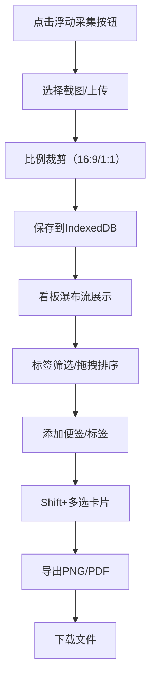

## 1. 产品概述

面向创意工作者的灵感管理工具，提供网页截图、手绘草图采集与视觉笔记看板整理功能。

- 核心用途：帮助设计师、作家、内容创作者快速捕捉灵感素材，以可视化看板形式整理和分享创意
- 目标用户：设计师、插画师、作家、内容创作者、创意工作者
- 产品价值：降低灵感捕捉门槛，提供直观的视觉化整理方式，提升创意工作效率

## 2. 核心功能

### 2.1 功能模块

1. **素材采集模块**：浮动采集按钮、网页截图模拟、本地图片上传、比例裁剪工具
2. **看板管理模块**：无限滚动瀑布流、卡片拖拽排序、标签筛选系统、文字便签编辑
3. **导出分享模块**：多卡片选择、Canvas渲染预览、PNG/PDF导出、进度显示

### 2.2 页面详情

| 页面名称 | 模块名称 | 功能描述 |
|-----------|-------------|---------------------|
| 看板主页 | 标签侧边栏 | 显示所有标签及卡片数量，彩色圆点标识，点击筛选 |
| 看板主页 | 瀑布流卡片区 | 无限滚动展示素材卡片，支持拖拽排序、删除、多选 |
| 看板主页 | 浮动采集按钮 | 模拟浏览器扩展，触发截图或上传流程 |
| 裁剪弹窗 | 素材采集面板 | 支持16:9/1:1比例裁剪，网格辅助线，缩放滑块 |
| 卡片详情弹窗 | 卡片模态框 | 查看原图、添加/编辑Markdown便签、管理标签 |
| 导出对话框 | 导出分享模块 | 选择导出格式、调整布局、实时预览、进度显示 |

## 3. 核心流程

### 3.1 素材采集流程
用户点击浮动采集按钮 → 选择截图或上传 → 进入裁剪界面 → 调整比例和裁剪区域 → 确认保存 → 素材以卡片形式出现在看板

### 3.2 看板管理流程
用户浏览看板卡片 → 点击标签筛选 → 拖拽调整卡片顺序 → 双击空白区创建便签 → 拖拽便签到目标位置 → 双击便签编辑内容

### 3.3 导出分享流程
用户Shift+点击多选卡片 → 点击导出按钮 → 选择PNG/PDF格式 → 调整布局参数（列数、间距）→ 实时预览效果 → 确认导出 → 显示进度条 → 下载完成

## 4. 用户界面设计

### 4.1 设计风格
- **主色调**：暖灰色 #F5F0EB（背景），深蓝色 #1A2744（强调色）
- **辅助色**：便签浅黄色 #FFF8C9，标签多彩色系（自动生成和谐配色）
- **卡片样式**：圆角8px，悬停时scale(1.03)加深阴影，选中时蓝色发光边框
- **按钮样式**：圆角6px，深蓝色填充，悬停时轻微上浮
- **字体**：系统默认无衬线字体（正文），Caveat手写体（便签）
- **布局风格**：左侧240px固定标签边栏 + 右侧自适应瀑布流内容区
- **图标风格**：线性简约图标，与强调色一致

### 4.2 页面设计概述

| 页面名称 | 模块名称 | UI元素 |
|-----------|-------------|-------------|
| 看板主页 | 标签侧边栏 | 彩色圆点、标签名称、卡片计数、悬停高亮、选中状态 |
| 看板主页 | 瀑布流卡片区 | 缩略图卡片、相对时间戳、标签徽章、悬停放大动画、多选蓝色边框 |
| 看板主页 | 浮动采集按钮 | 右下角固定、圆形、深蓝色、悬停放大、点击波纹效果 |
| 看板主页 | 文字便签 | 浅黄色圆角背景、Caveat手写字体、拖拽移动、双击编辑 |
| 裁剪弹窗 | 素材采集面板 | 网格辅助线、比例切换按钮、缩放滑块、确认/取消按钮 |
| 导出对话框 | 导出模块 | 格式选项卡、布局参数滑块、实时预览画布、进度百分比条 |

### 4.3 动画规范
- **过渡函数**：ease-out，持续250ms
- **卡片悬停**：transform: scale(1.03) + box-shadow加深
- **标签筛选**：opacity先降至0再渐入（300ms异步展开）
- **模态框打开**：backdrop-filter: blur(8px) + 缩放淡入
- **回收区**：拖拽进入时显示红色脉冲光晕
- **便签出现**：缩放淡入动画

### 4.4 响应式设计
- **桌面端**（>768px）：左侧240px标签边栏 + 4列瀑布流
- **平板端**（≤768px）：标签边栏折叠为顶部可展开抽屉，2列瀑布流
- **触控优化**：增大点击区域，支持触摸拖拽

## 5. 性能指标
- 50张素材卡片首屏渲染 ≤ 500ms
- 拖拽排序帧率 ≥ 55fps
- 20张卡片PNG导出渲染时间 ≤ 3秒
