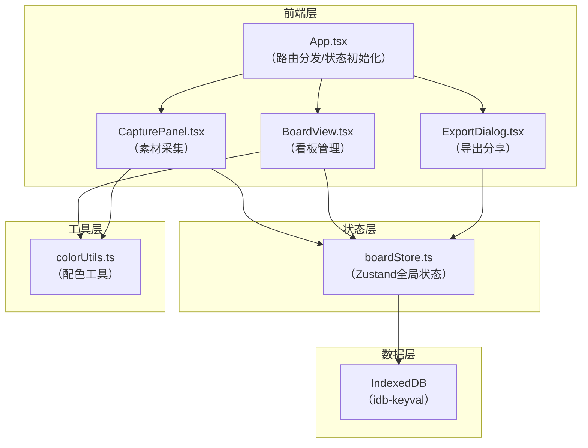
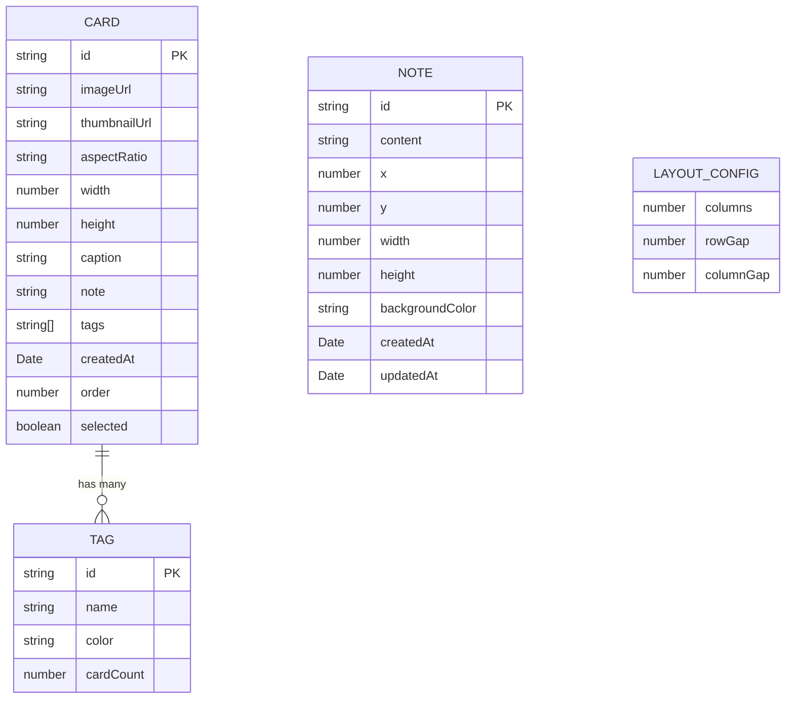

## 1. 架构设计



**数据流向说明**：
1. CapturePanel采集素材 → 通过boardStore保存到IndexedDB
2. BoardView从boardStore读取素材 → 渲染瀑布流卡片
3. BoardView将选中卡片传递给ExportDialog
4. ExportDialog使用Canvas渲染 → 导出PNG/PDF

## 2. 技术描述

- **前端框架**：React 18 + TypeScript 5
- **构建工具**：Vite 5 + @vitejs/plugin-react
- **状态管理**：Zustand 4
- **路由**：React Router DOM 6
- **前端数据库**：IndexedDB（idb-keyval）
- **唯一ID生成**：uuid
- **样式方案**：原生CSS + CSS Variables（不使用Tailwind，保持极简风格）
- **导出方案**：html2canvas + jspdf（按需）或原生Canvas API

### 2.1 依赖清单

| 包名 | 版本 | 用途 |
|------|------|------|
| react | ^18.2.0 | 核心框架 |
| react-dom | ^18.2.0 | DOM渲染 |
| typescript | ^5.4.0 | 类型系统 |
| vite | ^5.2.0 | 构建工具 |
| @vitejs/plugin-react | ^4.2.0 | React插件 |
| zustand | ^4.5.0 | 状态管理 |
| react-router-dom | ^6.22.0 | 路由管理 |
| idb-keyval | ^6.2.0 | IndexedDB封装 |
| uuid | ^9.0.0 | 唯一ID生成 |
| @types/react | ^18.2.0 | 类型定义 |
| @types/react-dom | ^18.2.0 | 类型定义 |
| @types/uuid | ^9.0.0 | 类型定义 |

## 3. 路由定义

| 路由 | 用途 |
|-------|---------|
| / | 看板主页（BoardView） |
| /capture | 素材采集页（CapturePanel，模态展示） |
| /export | 导出对话框（ExportDialog，模态展示） |

## 4. 文件结构与调用关系

```
src/
├── App.tsx
│   ├── 初始化boardStore
│   ├── 路由分发
│   └── 布局容器
├── modules/
│   ├── capture/
│   │   └── CapturePanel.tsx
│   │       ├── 调用boardStore.addCard()
│   │       └── 调用colorUtils.generateColors()
│   ├── board/
│   │   ├── BoardView.tsx
│   │   │   ├── 调用boardStore.cards
│   │   │   ├── 调用boardStore.tags
│   │   │   ├── 调用colorUtils.generateColors()
│   │   │   └── 传递selectedCards给ExportDialog
│   │   ├── CardItem.tsx
│   │   ├── TagSidebar.tsx
│   │   ├── StickyNote.tsx
│   │   └── TrashZone.tsx
│   └── export/
│       └── ExportDialog.tsx
│           ├── 接收cards/layout数据
│           └── Canvas渲染导出
├── store/
│   └── boardStore.ts
│       ├── cards: Card[]
│       ├── tags: Tag[]
│       ├── notes: Note[]
│       ├── layout: LayoutConfig
│       ├── addCard()
│       ├── updateCard()
│       ├── deleteCard()
│       ├── reorderCards()
│       ├── addTag()
│       ├── addNote()
│       ├── updateNote()
│       └── 持久化到IndexedDB
└── utils/
    └── colorUtils.ts
        ├── generateHarmoniousColors()
        ├── getTagColor()
        └── getNoteBackground()
```

## 5. 数据模型

### 5.1 数据模型定义



### 5.2 TypeScript类型定义

```typescript
// 素材卡片
interface Card {
  id: string;
  imageUrl: string;
  thumbnailUrl: string;
  aspectRatio: '16:9' | '1:1';
  width: number;
  height: number;
  caption: string;
  note: string;
  tags: string[];
  createdAt: Date;
  order: number;
  selected: boolean;
}

// 标签
interface Tag {
  id: string;
  name: string;
  color: string;
  cardCount: number;
}

// 文字便签
interface Note {
  id: string;
  content: string;
  x: number;
  y: number;
  width: number;
  height: number;
  backgroundColor: string;
  createdAt: Date;
  updatedAt: Date;
}

// 导出布局配置
interface ExportLayout {
  columns: number;
  rowGap: number;
  columnGap: number;
  cardWidth: number;
}

// Store状态
interface BoardState {
  cards: Card[];
  tags: Tag[];
  notes: Note[];
  selectedTagId: string | null;
  selectedCardIds: string[];
  // actions
  addCard: (card: Omit<Card, 'id' | 'createdAt' | 'order' | 'selected'>) => void;
  updateCard: (id: string, updates: Partial<Card>) => void;
  deleteCard: (id: string) => void;
  reorderCards: (startIndex: number, endIndex: number) => void;
  addTag: (name: string) => void;
  addNote: (note: Omit<Note, 'id' | 'createdAt' | 'updatedAt'>) => void;
  updateNote: (id: string, updates: Partial<Note>) => void;
  toggleCardSelection: (id: string, isMultiSelect: boolean) => void;
  clearSelection: () => void;
  setSelectedTag: (tagId: string | null) => void;
}
```

## 6. 核心实现策略

### 6.1 性能优化
- **虚拟滚动**：react-window或自定义IntersectionObserver实现无限滚动
- **图片懒加载**：IntersectionObserver + 缩略图预加载
- **拖拽性能**：requestAnimationFrame + will-change优化
- **IndexedDB缓存**：增量更新，避免全量读写

### 6.2 导出实现
- 使用Canvas API直接渲染卡片网格
- PDF导出使用jspdf + Canvas.toDataURL
- 进度计算基于已渲染卡片数/总卡片数

### 6.3 动画实现
- CSS Transition/Transform为主
- 复杂动画使用Web Animations API
- 避免layout thrash，使用transform和opacity属性
