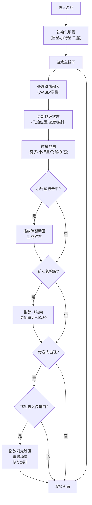

## 1. 产品概述

太空飞船陨石采集游戏是一款基于浏览器的物理驱动太空游戏，玩家操控飞船在太空中采集矿石资源，通过策略性的资源收集和燃料管理获得高分。

- 主要目标：提供流畅的物理驾驶手感，结合资源收集策略，创造沉浸式的太空探索体验
- 目标用户：休闲游戏玩家、太空题材爱好者
- 核心价值：在浏览器中实现高性能的Canvas渲染，提供60FPS的流畅游戏体验

## 2. 核心功能

### 2.1 功能模块

1. **主游戏场景**：太空背景渲染、星星闪烁动画、小行星带生成与自转
2. **飞船控制系统**：WASD键盘操控、惯性物理引擎、平滑旋转、燃料管理
3. **战斗系统**：激光发射、碰撞检测、小行星碎裂动画、矿石掉落
4. **资源收集系统**：矿石自动拾取、得分计算、拾取动画与音效
5. **HUD显示系统**：矿石数量、燃料条、得分显示、数值动画
6. **传送门系统**：定时生成、闪烁光环、场景重置、燃料恢复、过渡特效
7. **事件通知系统**：重要事件提示、屏幕边缘泛光、图标闪烁

### 2.2 页面详情

| 页面名称 | 模块名称 | 功能描述 |
|-----------|-------------|---------------------|
| 游戏主页面 | 太空背景 | 径向渐变深空背景、200+闪烁星星、动态亮度变化 |
| 游戏主页面 | 小行星带 | 50颗随机大小小行星、灰色到褐色渐变、缓慢自转 |
| 游戏主页面 | 飞船控制 | 32x32三角飞船、WASD操控、惯性移动、平滑旋转 |
| 游戏主页面 | 激光系统 | 空格键发射、蓝色发光拖尾、0.3秒射速、8px/帧速度 |
| 游戏主页面 | 矿石系统 | 5x5像素矿石、金/蓝/绿三色、脉动发光、自动拾取 |
| 游戏主页面 | HUD界面 | 矿石计数、燃料条（100%-0%）、得分显示、发光效果 |
| 游戏主页面 | 传送门 | 60秒出现一次、持续15秒、红色闪烁光环、场景重置 |
| 游戏主页面 | 特效系统 | 碎裂动画、+1弹跳数值、拾取音效、全屏闪光过渡 |

## 3. 核心流程

玩家进入游戏后，使用WASD控制飞船在太空中移动，按空格键发射激光击碎小行星。小行星被击碎后掉落矿石，飞船靠近矿石自动拾取获得分数。玩家需要管理燃料消耗（移动消耗燃料，靠近小行星双倍消耗），当传送门出现时驶入传送门可以重置场景并恢复燃料。游戏持续进行，玩家通过策略性的资源收集最大化得分。

## 4. 用户界面设计

### 4.1 设计风格

- **主色调**：深空蓝色主题，背景使用从深蓝(#0a0a2e)到黑色(#000000)的径向渐变
- **强调色**：蓝色(#00d4ff)激光、金色(#ffd700)/蓝色(#00bfff)/绿色(#32cd32)矿石、红色(#ff4444)传送门光环
- **字体**：monospace家族，科幻风格，数字与图标带轻微发光效果( text-shadow: 0 0 8px currentColor )
- **动画**：平滑过渡动画(transition)、数值缩放动画、脉动发光效果、屏幕边缘泛光

### 4.2 页面设计概述

| 页面名称 | 模块名称 | UI元素 |
|-----------|-------------|-------------|
| 游戏主页面 | 背景层 | 径向渐变、200颗闪烁星星（大小/亮度/频率随机） |
| 游戏主页面 | 游戏层 | 50颗小行星（5-15px，灰褐渐变，自转）、三角飞船、激光弹丸（蓝色拖尾）、矿石（脉动发光）、传送门（红色光环） |
| 游戏主页面 | HUD层 | 左上角矿石计数（图标+数字）、顶部燃料条（带渐变填充）、右上角得分（带发光效果） |
| 游戏主页面 | 特效层 | 碎裂碎片（5个向外扩散渐隐，300ms）、+1弹跳数值、屏幕边缘红光泛光（传送门出现时）、全屏闪光（500ms过渡） |

### 4.3 响应性

- 桌面端优先，Canvas固定800x600像素
- 使用meta viewport适配移动端，但核心游戏区域保持固定分辨率
- 键盘控制为主要交互方式

### 4.4 性能优化

- 目标60FPS，单帧渲染控制在16ms内
- 使用requestAnimationFrame进行渲染
- 对象池复用激光和碎片对象
- 分层渲染优化绘制性能
- 离屏画布预渲染静态元素
