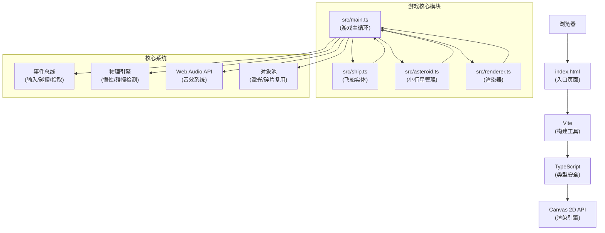

## 1. 架构设计



## 2. 技术描述

- **前端**：TypeScript 5.x + Vite 5.x + HTML5 Canvas 2D
- **初始化工具**：Vite vanilla-ts 模板
- **构建工具**：Vite，启动脚本 `npm run dev`
- **音频**：Web Audio API（程序化生成音效）
- **无后端**，纯前端单页应用
- **无数据库**，游戏状态内存管理

## 3. 项目结构

```
auto71/
├── index.html              # 入口HTML，包含Canvas和meta
├── package.json            # 依赖：typescript, vite
├── vite.config.js          # Vite构建配置
├── tsconfig.json           # TypeScript严格模式配置
└── src/
    ├── main.ts             # 游戏主循环，初始化/更新/渲染调度
    ├── ship.ts             # 飞船实体类（位置/速度/旋转/燃料/输入）
    ├── asteroid.ts         # 小行星管理模块（生成/碰撞/销毁/矿石）
    └── renderer.ts         # 渲染器（背景/HUD/传送门/特效）
```

## 4. 核心数据结构

### 4.1 飞船实体 (Ship)

```typescript
interface Ship {
  x: number;              // X坐标
  y: number;              // Y坐标
  vx: number;             // X速度
  vy: number;             // Y速度
  rotation: number;       // 旋转角（弧度）
  fuel: number;           // 燃料 0-100
  maxSpeed: number;       // 最大速度 6px/帧
  acceleration: number;   // 加速度 0.3px/帧²
  friction: number;       // 摩擦力 0.95
  rotationSpeed: number;  // 旋转速度 3度/帧
}
```

### 4.2 小行星 (Asteroid)

```typescript
interface Asteroid {
  id: number;
  x: number;
  y: number;
  size: number;           // 5-15px
  rotation: number;       // 当前旋转角
  rotationSpeed: number;  // 自转速度
  color: string;          // 灰褐渐变色
  vertices: number[];     // 多边形顶点偏移
}
```

### 4.3 激光 (Laser)

```typescript
interface Laser {
  x: number;
  y: number;
  vx: number;
  vy: number;
  trail: {x: number; y: number; alpha: number}[];  // 拖尾
  life: number;          // 生命周期
}
```

### 4.4 矿石 (Ore)

```typescript
interface Ore {
  x: number;
  y: number;
  type: 'gold' | 'blue' | 'green';
  color: string;
  pulsePhase: number;     // 脉动相位
  value: number;          // 10或30分
}
```

### 4.5 碎片 (Particle)

```typescript
interface Particle {
  x: number;
  y: number;
  vx: number;
  vy: number;
  alpha: number;
  size: number;
  life: number;           // 300ms
}
```

### 4.6 传送门 (Portal)

```typescript
interface Portal {
  x: number;
  y: number;
  active: boolean;
  appearTime: number;     // 出现时间
  duration: number;       // 持续时间 15000ms
  pulsePhase: number;
}
```

### 4.7 游戏状态 (GameState)

```typescript
interface GameState {
  score: number;
  oreCount: number;
  fuel: number;
  time: number;           // 游戏运行时间
  portalTimer: number;    // 传送门计时器
  screenFlash: number;    // 全屏闪光 0-1
  edgeGlow: number;       // 边缘泛光 0-1
  scoreAnimations: {value: number; y: number; alpha: number; color: string}[];
}
```

## 5. 核心算法

### 5.1 物理引擎

```typescript
// 飞船惯性移动
vx *= friction;
vy *= friction;
vx += Math.cos(rotation) * acceleration;
vy += Math.sin(rotation) * acceleration;
speed = Math.sqrt(vx² + vy²);
if (speed > maxSpeed) {
  vx = (vx / speed) * maxSpeed;
  vy = (vy / speed) * maxSpeed;
}
x += vx;
y += vy;

// 平滑旋转
targetRotation = direction;
rotationDiff = targetRotation - rotation;
rotation += clamp(rotationDiff, -rotationSpeed, rotationSpeed);
```

### 5.2 碰撞检测

```typescript
// 圆形碰撞检测
function circleCollision(
  x1: number, y1: number, r1: number,
  x2: number, y2: number, r2: number
): boolean {
  const dx = x2 - x1;
  const dy = y2 - y1;
  const distance = Math.sqrt(dx * dx + dy * dy);
  return distance < r1 + r2;
}

// 激光-小行星碰撞（激光半径2px，小行星半径size）
// 飞船-矿石碰撞（飞船半径16px，矿石半径5px，距离<20px）
```

### 5.3 燃料消耗

```typescript
// 每秒消耗0.5%，移动时消耗
fuelConsumption = 0.5 / 60;  // 每帧消耗
// 检测是否靠近小行星（距离<50px）
if (nearAsteroid) {
  fuelConsumption *= 2;  // 双倍消耗
}
fuel = max(0, fuel - fuelConsumption);
if (fuel <= 0) {
  vx *= 0.9;  // 逐渐停止
  vy *= 0.9;
}
```

## 6. 渲染流程

### 6.1 每帧渲染顺序

1. **背景层**：径向渐变背景 → 闪烁星星
2. **游戏层**：小行星 → 矿石 → 激光 → 飞船 → 传送门
3. **特效层**：碎裂碎片 → +1数值动画 → 边缘泛光
4. **HUD层**：矿石计数 → 燃料条 → 得分 → 传送门图标
5. **过渡层**：全屏闪光

### 6.2 性能优化策略

- **对象池**：激光和碎片对象复用，避免频繁GC
- **分层渲染**：静态背景预渲染到离屏Canvas
- **脏矩形**：仅重绘变化区域（本游戏全屏重绘已足够快）
- **数学优化**：预计算三角函数，使用近似算法
- **帧率控制**：requestAnimationFrame，跳过帧保持逻辑稳定

## 7. 事件总线

```typescript
type EventType = 
  | 'key_down' | 'key_up'
  | 'laser_fire' | 'asteroid_hit'
  | 'ore_pickup' | 'portal_enter'
  | 'fuel_low' | 'portal_appear';

interface EventBus {
  on(type: EventType, callback: Function): void;
  emit(type: EventType, data?: any): void;
  off(type: EventType, callback: Function): void;
}
```
