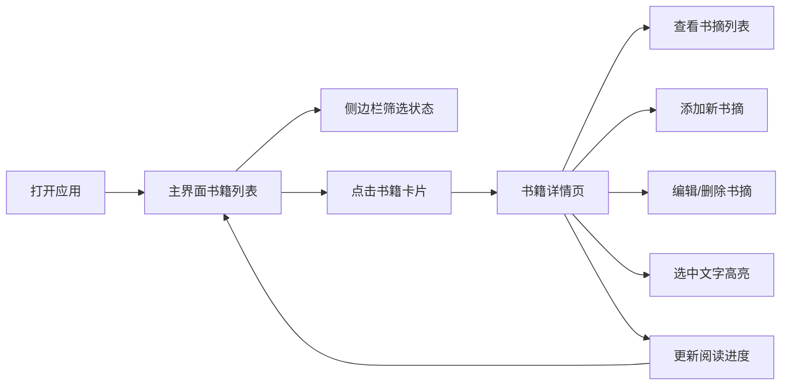

## 1. 产品概述

阅读进度与书摘管理工具是一款面向爱读书人群的个人知识管理应用，帮助用户追踪阅读进度、整理书摘笔记、统计阅读时长。

- 核心价值：让阅读更有成就感，让书摘管理更轻松高效
- 目标用户：热爱阅读、需要系统化管理阅读记录和书摘的个人用户

## 2. 核心功能

### 2.1 功能模块
1. **主界面（书籍列表页）**：卡片式书籍展示、侧边栏状态筛选、添加书籍
2. **书籍详情页**：书摘列表、添加/编辑/删除书摘、文字高亮标记、进度更新
3. **数据统计**：预计读完日期计算、每周阅读时长统计

### 2.2 页面详情

| 页面名称 | 模块名称 | 功能描述 |
|---------|---------|---------|
| 主界面 | 书籍卡片列表 | 卡片式展示，渐变封面、书名、作者、进度条；悬停上浮动画；点击进入详情 |
| 主界面 | 侧边栏筛选 | 按阅读状态（在读/已读完/想读）筛选，切换时交错淡入动画 |
| 主界面 | 添加书籍 | 弹窗表单输入书名、作者、总页数、初始进度、阅读状态 |
| 详情页 | 书籍信息头 | 显示书名、作者、总页数、当前进度、预计读完日期 |
| 详情页 | 书摘列表 | 按添加日期倒序，圆角卡片+淡蓝色竖条装饰，支持文字选中高亮 |
| 详情页 | 书摘操作 | 编辑（铅笔图标）、删除（垃圾桶图标），编辑时高度展开动画 |
| 详情页 | 添加书摘 | 文本输入框，支持文字输入和剪贴板粘贴 |
| 详情页 | 进度更新 | 进度条拖动或按钮调整进度百分比 |

## 3. 核心流程

用户打开应用 → 在主界面浏览书籍卡片 → 通过侧边栏筛选阅读状态 → 点击卡片进入详情页 → 查看/添加/编辑/删除书摘 → 标记文字高亮 → 更新阅读进度 → 返回主界面继续浏览

## 4. 用户界面设计

### 4.1 设计风格
- **主题色**：暖白色背景 (#FFFBF5)，柔和蓝色 (#6BA3D6)、绿色 (#7CB77F)、橙色 (#E8A87C) 点缀
- **进度条渐变**：从绿色 (#7CB77F) 渐变为橙色 (#E8A87C)
- **按钮风格**：圆角按钮，悬停微缩放动画，点击水波纹扩散效果（400ms）
- **字体**：中文使用系统优雅衬线/无衬线字体，字号层次分明
- **布局风格**：卡片式布局，主界面网格排列，移动端单列自适应
- **图标**：Lucide 图标库，线条简洁统一

### 4.2 页面设计概览

| 页面名称 | 模块名称 | UI 元素 |
|---------|---------|--------|
| 主界面 | 书籍卡片 | 随机柔和渐变封面块、书名、作者名、渐变进度条（200ms平滑过渡）、悬停上浮5px+阴影加深 |
| 主界面 | 侧边栏 | 筛选按钮组（在读/已读完/想读）、选中状态高亮、切换时卡片交错淡入 |
| 详情页 | 书摘卡片 | 圆角卡片、左侧淡蓝色竖条、文字区域、高亮显示（淡黄背景+加粗文字）、右上角编辑/删除按钮 |
| 详情页 | 编辑状态 | 高度展开动画（300ms）、文本编辑框、保存/取消按钮 |

### 4.3 响应式设计
- **桌面端**：书籍卡片网格布局（3-4列），侧边栏左侧固定
- **平板端**：2列网格布局
- **移动端**：单列布局，侧边栏改为顶部筛选标签，卡片宽度自适应容器
- **触摸优化**：增大点击区域，优化滚动体验

### 4.4 动效设计
- 进度条宽度过渡：200ms 平滑动画
- 卡片悬停：translateY(-5px) + 阴影加深，200ms 过渡
- 筛选切换：卡片交错淡入（stagger delay）
- 编辑展开：高度 300ms ease-out 过渡
- 按钮点击：水波纹扩散消失（400ms）
- 按钮悬停：scale(1.03) 微缩放
