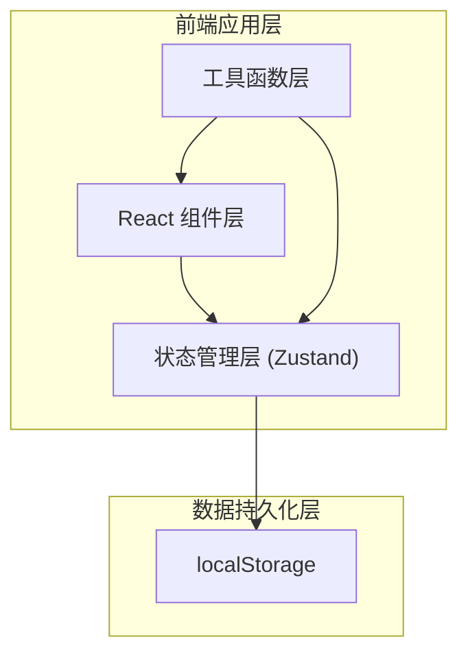
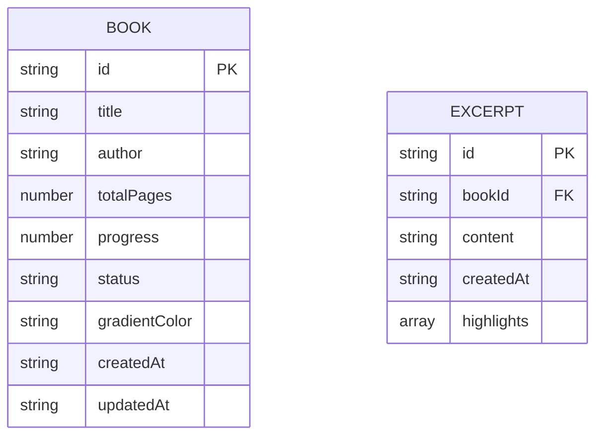

## 1. 架构设计



## 2. 技术描述
- **前端框架**：React 18 + TypeScript
- **构建工具**：Vite
- **状态管理**：Zustand（轻量级状态管理，支持持久化中间件）
- **路由**：无需路由库，通过组件状态切换主界面/详情页
- **图标**：lucide-react
- **唯一ID**：uuid
- **数据持久化**：localStorage 模拟后端
- **样式方案**：原生 CSS（CSS Modules 或内联样式，配合 CSS 变量实现主题）

## 3. 组件结构

| 组件 | 文件路径 | 职责 |
|-----|---------|-----|
| App | src/App.tsx | 主应用容器，管理视图切换（列表/详情） |
| BookCard | src/components/BookCard.tsx | 书籍卡片，展示封面、书名、作者、进度条 |
| BookDetail | src/components/BookDetail.tsx | 书籍详情，书摘列表、添加/编辑/删除书摘、高亮功能 |
| Sidebar | src/components/Sidebar.tsx | 侧边栏筛选组件 |
| AddBookModal | src/components/AddBookModal.tsx | 添加书籍弹窗 |
| HighlightCard | src/components/HighlightCard.tsx | 单条书摘卡片（含高亮、编辑、删除） |

## 4. 数据模型

### 4.1 类型定义



### 4.2 数据结构说明

**Book（书籍）**
- `id`: 唯一标识符 (uuid)
- `title`: 书名
- `author`: 作者
- `totalPages`: 总页数
- `progress`: 当前进度百分比 (0-100)
- `status`: 阅读状态 ("reading" | "finished" | "wishlist")
- `gradientColor`: 封面渐变色值
- `createdAt`: 创建时间 ISO 字符串
- `updatedAt`: 更新时间 ISO 字符串

**Excerpt（书摘）**
- `id`: 唯一标识符 (uuid)
- `bookId`: 关联书籍 ID
- `content`: 书摘内容
- `createdAt`: 添加时间 ISO 字符串
- `highlights`: 高亮范围数组 [{ start: number, end: number }]

**WeeklyStats（周统计）**
- 计算方式：根据书籍 updatedAt 和 progress 变化估算每周阅读时长

## 5. 状态管理设计

使用 Zustand create 创建全局 store：

```typescript
interface BookStore {
  books: Book[];
  excerpts: Excerpt[];
  currentFilter: 'all' | 'reading' | 'finished' | 'wishlist';
  selectedBookId: string | null;
  
  // 书籍操作
  addBook: (book: Omit<Book, 'id' | 'createdAt' | 'updatedAt' | 'gradientColor'>) => void;
  updateBook: (id: string, updates: Partial<Book>) => void;
  deleteBook: (id: string) => void;
  setFilter: (filter: BookStore['currentFilter']) => void;
  selectBook: (id: string | null) => void;
  
  // 书摘操作
  addExcerpt: (bookId: string, content: string) => void;
  updateExcerpt: (id: string, content: string) => void;
  deleteExcerpt: (id: string) => void;
  toggleHighlight: (excerptId: string, start: number, end: number) => void;
  
  // 工具方法
  getFilteredBooks: () => Book[];
  getExcerptsByBook: (bookId: string) => Excerpt[];
  calculateEstimatedFinish: (bookId: string) => string | null;
  getWeeklyStats: () => { week: string; hours: number }[];
}
```

## 6. 性能优化策略

1. **虚拟滚动**：书籍列表超过 20 本时启用虚拟滚动（可使用简单自实现或轻量库）
2. **响应时间**：所有操作（添加书摘、更新进度）界面响应 < 50ms
3. **状态持久化**：Zustand persist 中间件，自动同步 localStorage
4. **组件渲染优化**：React.memo 包裹列表项，避免不必要重渲染
5. **CSS 动画**：使用 transform/opacity 实现硬件加速动画

## 7. 文件结构

```
auto72/
├── package.json
├── index.html
├── vite.config.js
├── tsconfig.json
├── src/
│   ├── main.tsx
│   ├── App.tsx
│   ├── types.ts
│   ├── store.ts
│   ├── styles.css
│   └── components/
│       ├── BookCard.tsx
│       ├── BookDetail.tsx
│       ├── Sidebar.tsx
│       └── AddBookModal.tsx
```
