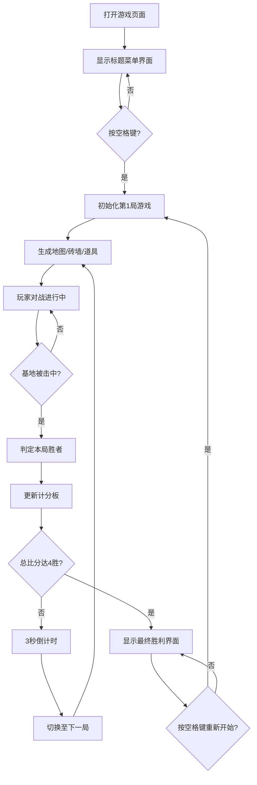

## 1. 产品概述

像素坦克大战是一款本地双人对战的HTML5网页小游戏，解决传统本地多人对战需要特殊手柄或复杂设置的问题，让两名玩家可以在同一台设备上通过浏览器快速开启对战。

- 主要目的：提供即时可玩、无需安装的本地双人坦克对战体验
- 目标用户：想与朋友快速进行休闲对战的玩家
- 目标价值：零门槛、高趣味性的本地多人游戏体验

## 2. 核心功能

### 2.1 用户角色
| 角色 | 注册方式 | 核心权限 |
|------|----------|----------|
| 玩家1 | 无需注册 | 使用WASD移动，J键开火 |
| 玩家2 | 无需注册 | 使用方向键移动，小键盘0开火 |

### 2.2 功能模块
1. **标题菜单界面**：游戏标题、开始提示、动态星空背景
2. **对战核心玩法**：坦克移动、射击、砖墙障碍物、基地攻防
3. **道具系统**：护盾、加速、连发、地雷四种道具，随机生成与拾取
4. **对战流程管理**：7局4胜制、局间倒计时、胜负判定
5. **UI界面系统**：计分板、倒计时、胜利庆祝界面
6. **粒子特效系统**：砖墙碎裂、道具拾取、坦克爆炸、烟花庆祝

### 2.3 页面详情
| 页面名称 | 模块名称 | 功能描述 |
|----------|----------|----------|
| 标题菜单 | 标题展示 | 像素字体"像素坦克大战"，白色带黑色描边，36px |
| 标题菜单 | 开始提示 | "按空格键开始"闪烁提示，1秒周期透明度循环 |
| 标题菜单 | 星空背景 | 5颗3像素星星，对角线0.5像素/秒缓慢移动 |
| 对战界面 | 坦克系统 | 绿色/蓝色坦克，3像素/帧移动，1.5秒开火冷却 |
| 对战界面 | 炮弹系统 | 8像素/帧飞行速度，圆形碰撞检测，白色拖尾效果 |
| 对战界面 | 砖墙系统 | 中央锯齿形红色砖墙，48x24像素砖块，可被击碎 |
| 对战界面 | 基地系统 | 左右两侧闪烁菱形基地，被击中游戏结束 |
| 对战界面 | 道具系统 | 10个随机道具，呼吸灯效果，200ms拾取动画 |
| 对战界面 | 地雷系统 | 放置地雷，60像素爆炸半径，2秒晕眩效果 |
| 对战界面 | 计分板 | 顶部两侧显示分数，中间显示局数，像素字体 |
| 对战界面 | 倒计时 | 局间3秒倒计时，数字缩放弹出旋转360度动画 |
| 胜利界面 | 庆祝动画 | 胜利坦克旋转、彩色烟花弹、半透明金色背景 |
| 胜利界面 | 胜利文本 | 大号胜利文本，从底部弹入动画，持续800ms |

## 3. 核心流程

## 4. 用户界面设计

### 4.1 设计风格
- **主色调**：深灰蓝 #1a1a2e 作为背景色
- **坦克颜色**：玩家1绿色（鲜艳有辨识度），玩家2蓝色（鲜艳有辨识度）
- **砖墙颜色**：红色
- **基地颜色**：金色闪烁菱形
- **字体**：像素风格字体，白色描边
- **布局风格**：固定800x600像素画布，白色实线边框
- **动画风格**：所有动画平滑流畅，60FPS稳定帧率

### 4.2 页面设计概览
| 页面名称 | 模块名称 | UI元素 |
|----------|----------|----------|
| 标题菜单 | 整体 | 深色背景(#1a1a2e)，居中布局，像素字体，星空动画 |
| 对战界面 | 画布 | 800x600像素，白色边框，俯视视角 |
| 对战界面 | 计分板 | 顶部两侧，玩家1绿色/玩家2蓝色，中间局数，24px像素字体，白色描边 |
| 对战界面 | 道具 | 呼吸灯效果（透明度0.3-1.0循环），每2秒一次 |
| 对战界面 | 炮弹 | 带白色拖尾效果 |
| 胜利界面 | 背景 | 半透明金色覆盖层 |
| 胜利界面 | 坦克 | 原地旋转，连续发射彩色烟花弹 |
| 胜利界面 | 文本 | 大号胜利文本，从底部向上弹入并保持，800ms动画 |

### 4.3 响应式设计
- 桌面端优先设计，固定800x600像素画布尺寸
- 画布居中显示，无移动端适配需求（本地双人对战场景）

### 4.4 音效设计
- 背景音乐：8-bit风格轻快旋律，循环播放，音量可调
- 游戏音效：射击、爆炸、道具拾取、胜利等音效（可选增强）
