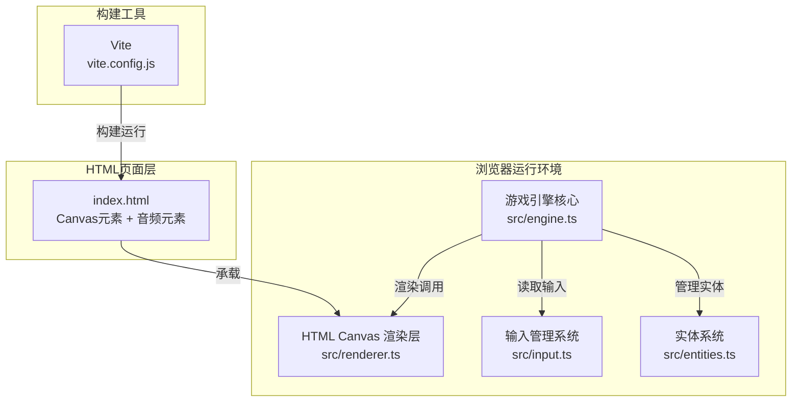

## 1. 架构设计



## 2. 技术说明

- **前端框架**：原生 TypeScript + HTML5 Canvas（不依赖第三方游戏引擎）
- **构建工具**：Vite 5.x（提供开发服务器与TypeScript编译）
- **编程语言**：TypeScript 5.x（严格模式，target ES2020）
- **渲染方式**：Canvas 2D API，手动实现游戏循环与渲染管线
- **音频**：HTML5 Audio API，背景音乐循环播放

## 3. 文件结构

| 文件路径 | 用途 |
|----------|------|
| package.json | 项目依赖与启动脚本配置 |
| index.html | 入口页面，包含Canvas元素、meta viewport、背景音乐音频元素 |
| vite.config.js | Vite构建配置，提供开发服务器 |
| tsconfig.json | TypeScript配置，严格模式，target ES2020 |
| src/engine.ts | 游戏循环与主逻辑，状态管理、帧率控制、游戏阶段切换、输入事件分发 |
| src/entities.ts | 所有实体类定义：坦克、炮弹、砖墙、道具、地雷、粒子、基地 |
| src/renderer.ts | Canvas渲染器，绘制实体、UI元素、粒子特效 |
| src/input.ts | 键盘事件监听与管理，键位映射，去抖动处理 |

## 4. 游戏状态机定义

```typescript
type GameState = 'menu' | 'countdown' | 'playing' | 'roundEnd' | 'victory';
```

| 状态 | 说明 | 触发条件 |
|------|------|----------|
| menu | 标题菜单界面 | 游戏启动或按空格重新开始 |
| countdown | 局间倒计时（3-2-1） | 上一局结束后，比分未达4胜 |
| playing | 对战进行中 | 倒计时结束 |
| roundEnd | 单局结束展示 | 一方基地被击中 |
| victory | 最终胜利庆祝界面 | 一方比分达到4胜 |

## 5. 核心实体数据模型

### 5.1 实体类型定义

```typescript
// 坦克方向
type Direction = 'up' | 'down' | 'left' | 'right';

// 道具类型
type PowerUpType = 'shield' | 'speed' | 'rapidFire' | 'mine';

// 坦克
interface Tank {
  x: number;
  y: number;
  width: number;
  height: number;
  direction: Direction;
  speed: number;
  color: string;
  playerId: 1 | 2;
  lastFireTime: number;
  fireCooldown: number;
  shieldActive: boolean;
  shieldEndTime: number;
  speedBoostActive: boolean;
  speedBoostEndTime: number;
  rapidFireActive: boolean;
  rapidFireEndTime: number;
  stunned: boolean;
  stunEndTime: number;
}

// 炮弹
interface Bullet {
  x: number;
  y: number;
  radius: number;
  speed: number;
  direction: Direction;
  ownerId: 1 | 2;
  trail: Array<{x: number, y: number}>;
}

// 砖墙
interface Brick {
  x: number;
  y: number;
  width: number;
  height: number;
  health: number;
}

// 道具
interface PowerUp {
  x: number;
  y: number;
  type: PowerUpType;
  size: number;
  spawnTime: number;
}

// 地雷
interface Mine {
  x: number;
  y: number;
  radius: number;
  ownerId: 1 | 2;
  armed: boolean;
}

// 基地
interface Base {
  x: number;
  y: number;
  size: number;
  playerId: 1 | 2;
}

// 粒子
interface Particle {
  x: number;
  y: number;
  vx: number;
  vy: number;
  color: string;
  size: number;
  life: number;
  maxLife: number;
}

// 拾取提示文字
interface PickupText {
  x: number;
  y: number;
  text: string;
  color: string;
  life: number;
  maxLife: number;
}
```

### 5.2 碰撞检测算法

使用圆形碰撞检测算法：
```
对于两个圆形实体A和B：
distance = sqrt((A.x - B.x)^2 + (A.y - B.y)^2)
if distance < A.radius + B.radius → 碰撞发生
```

对于矩形（坦克、砖墙），使用AABB（轴对齐包围盒）碰撞检测，然后转换为圆形近似以统一算法。

## 6. 游戏循环与帧率控制

```typescript
// 目标帧率：60FPS
const TARGET_FPS = 60;
const FRAME_TIME = 1000 / TARGET_FPS;

// 使用requestAnimationFrame + 时间累加器实现固定步长更新
let lastTime = 0;
let accumulator = 0;

function gameLoop(currentTime: number) {
  const deltaTime = currentTime - lastTime;
  lastTime = currentTime;
  accumulator += deltaTime;
  
  while (accumulator >= FRAME_TIME) {
    update(FRAME_TIME);
    accumulator -= FRAME_TIME;
  }
  
  render();
  requestAnimationFrame(gameLoop);
}
```

## 7. 性能优化策略

1. **对象池模式**：粒子对象复用，避免频繁GC
2. **空间分区**：中央砖墙区域预计算，减少每帧碰撞检测数量
3. **离屏Canvas**：静态背景元素预渲染
4. **减少重绘**：仅更新变化区域，采用脏矩形优化（如需要）
5. **圆形碰撞**：使用圆形碰撞算法替代复杂多边形检测，保证60FPS
