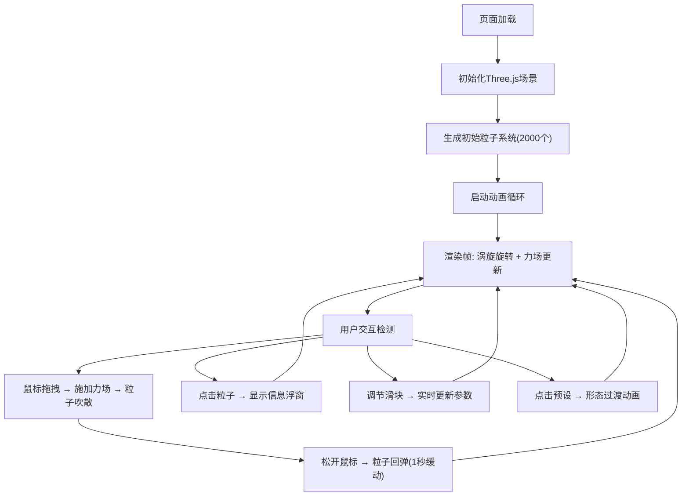

## 1. 产品概述

星云粒子雕刻是一个基于Three.js的交互式3D粒子系统，让用户在三维空间中通过鼠标拖拽和参数调节来生成并塑形动态的粒子星云，直观感受流体力学的魅力。

- 主要用途：教育展示、艺术创作、物理模拟演示
- 目标用户：对流体力学、粒子系统、3D交互感兴趣的开发者、学生、艺术家
- 产品价值：提供直观的粒子流体模拟体验，将抽象的物理概念可视化

## 2. 核心功能

### 2.1 功能模块

1. **3D粒子场景**：2000个球壳分布粒子，涡旋运动，力场交互，拖尾效果
2. **左侧控制面板**：粒子数量、涡旋速度、回弹强度、颜色模式滑块
3. **粒子信息浮窗**：点击粒子显示坐标和速度，最多5个同时显示
4. **预设形态切换**：星云、漩涡、爆炸、星系四种预设，带动画过渡
5. **响应式布局**：桌面端侧边栏，移动端抽屉式菜单

### 2.2 页面详情

| 页面名称 | 模块名称 | 功能描述 |
|-----------|-------------|---------------------|
| 主页面 | 3D场景模块 | 全屏Three.js渲染，粒子系统实时渲染，鼠标交互力场 |
| 主页面 | 控制面板模块 | 暗色毛玻璃风格面板，滑块参数调节，实时响应 |
| 主页面 | 粒子信息模块 | 点击粒子弹出信息浮窗，跟随粒子面向相机 |
| 主页面 | 预设按钮模块 | 底部预设按钮，快速切换粒子形态 |
| 主页面 | 响应式布局模块 | 移动端抽屉式菜单，平滑滑入滑出动画 |

## 3. 核心流程

## 4. 用户界面设计

### 4.1 设计风格

- **主色调**：暗色背景 (#1a1a2e)，霓虹渐变 (#ff6b35 → #6b35ff)
- **配色方案**：
  - 暖色渐变：中心暖橙 → 边缘蓝紫
  - 冷色渐变：中心青蓝 → 边缘洋红
  - 彩虹渐变：全色谱循环
- **字体**：现代无衬线字体，数字使用等宽字体
- **按钮风格**：圆角12px，半透明背景，霓虹边框，悬停放大效果
- **布局风格**：卡片式毛玻璃效果，深度阴影，层次分明
- **动效风格**：所有动画200-400ms缓动，easeInOutQuad曲线

### 4.2 页面设计概述

| 页面名称 | 模块名称 | UI元素 |
|-----------|-------------|-------------|
| 主页面 | 3D场景 | 全屏Canvas，粒子带拖尾，深度透视，涡旋运动 |
| 主页面 | 控制面板 | 宽度320px，圆角12px，背景rgba(30,30,30,0.85)，边框1px半透明 |
| 主页面 | 滑块控件 | 轨道高4px，填充色#ff6b35到#6b35ff渐变，滑块按钮直径16px带阴影 |
| 主页面 | 信息浮窗 | 宽160px，圆角，背景rgba(20,20,20,0.9)，边框1px #555 |
| 主页面 | 预设按钮 | 底部排列，霓虹渐变边框，点击放射状过渡动画 |
| 主页面 | 抽屉菜单 | 汉堡按钮触发，平滑滑入滑出，移动端适配 |

### 4.3 响应性

- **桌面端**（≥768px）：左侧固定控制面板，右侧全屏3D场景
- **移动端**（<768px）：控制面板折叠为抽屉，汉堡按钮展开/收起
- **触摸优化**：滑块增大触摸区域，按钮最小44px点击区域

### 4.4 3D场景指导

- **环境**：纯黑背景，无环境光，粒子自发光
- **光照**：粒子使用PointsMaterial自发光，无需外部光照
- **相机**：PerspectiveCamera，fov 75，初始距离15单位
- **构图**：粒子球壳居中，占据视野中心60%区域
- **交互**：鼠标位置映射到3D空间，拖拽产生径向力场
- **后处理**：粒子叠加AdditiveBlending，拖尾使用透明度衰减
- **性能**：粒子数量动态调整，使用BufferGeometry优化渲染
