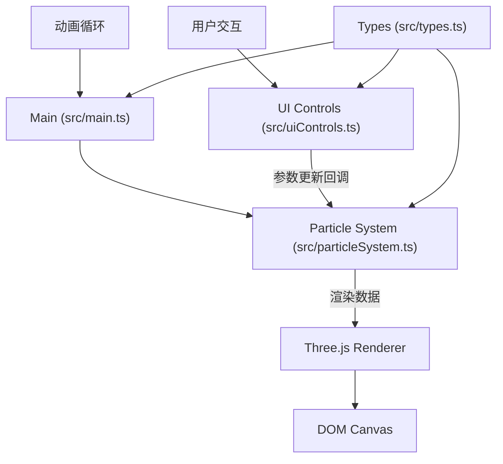

## 1. 架构设计



## 2. 技术描述

- **前端框架**：原生 TypeScript + Three.js，无React依赖
- **构建工具**：Vite 5.x
- **核心库**：
  - three@0.160.x - 3D渲染引擎
  - @types/three@0.160.x - Three.js类型定义
- **开发语言**：TypeScript 5.x，严格模式
- **样式**：原生CSS，CSS变量管理主题
- **无后端**：纯前端应用，无需服务器

## 3. 文件结构

```
d:\P\tasks\auto75/
├── package.json          # 项目依赖与脚本
├── index.html            # 入口HTML
├── vite.config.js        # Vite配置
├── tsconfig.json         # TypeScript配置
└── src/
    ├── main.ts           # 应用入口：场景初始化、事件绑定、动画循环
    ├── particleSystem.ts # 粒子系统：生成、更新、力场、拖尾
    ├── uiControls.ts     # UI控制：滑块、按钮、抽屉、回调
    └── types.ts          # 类型定义：粒子、预设、回调签名
```

## 4. 模块职责

### 4.1 src/types.ts - 类型定义

- **ParticleData**：粒子数据结构（位置、速度、原始位置、颜色、大小、生命周期）
- **PresetConfig**：预设配置（名称、生成函数、过渡动画参数）
- **UICallbacks**：UI回调接口（参数变化时通知粒子系统）
- **ColorMode**：颜色模式枚举（warm/cool/rainbow）

### 4.2 src/particleSystem.ts - 粒子系统

**核心方法**：
- `constructor(scene: THREE.Scene)` - 初始化粒子系统
- `generateParticles(count: number, preset?: string)` - 生成粒子
- `update(delta: number, mouseForce?: Vector3)` - 每帧更新粒子位置、速度、力场
- `setVortexSpeed(speed: number)` - 设置涡旋速度
- `setSpringStrength(strength: number)` - 设置回弹强度
- `setColorMode(mode: ColorMode)` - 设置颜色模式
- `setParticleCount(count: number)` - 动态调整粒子数量（淡入淡出）
- `applyPreset(preset: string)` - 应用预设形态（带动画过渡）
- `getParticleAtScreenPoint(x: number, y: number, camera: Camera)` - 射线检测点击粒子
- `getParticleWorldPosition(index: number)` - 获取粒子世界坐标
- `getParticleVelocity(index: number)` - 获取粒子速度

**物理模拟**：
- 涡旋运动：绕Y轴旋转 + 轻微上下波动
- 力场：鼠标位置产生径向排斥力，距离衰减
- 回弹：弹簧系统，指向原始位置，阻尼系数0.95
- 拖尾：位置历史记录，透明度衰减渲染

### 4.3 src/uiControls.ts - UI控制

**核心方法**：
- `constructor(callbacks: UICallbacks)` - 初始化UI，传入回调
- `createSlider()` - 创建自定义滑块组件
- `createPresetButtons()` - 创建预设按钮组
- `createHamburgerMenu()` - 创建移动端汉堡菜单
- `updateSliderValue()` - 更新滑块数值显示
- `toggleDrawer()` - 切换抽屉展开/收起

**UI组件**：
- 粒子数量滑块 (1000-5000)
- 涡旋速度滑块 (0.01-0.1)
- 回弹强度滑块 (0.1-0.9)
- 颜色模式选择器 (暖色/冷色/彩虹)
- 预设按钮组 (星云/漩涡/爆炸/星系)
- 粒子信息浮窗 (最多5个)

### 4.4 src/main.ts - 应用入口

**核心流程**：
1. 初始化Three.js场景、相机、渲染器
2. 创建ParticleSystem实例，生成初始2000粒子
3. 创建UIControls实例，绑定回调函数
4. 设置事件监听：
   - mousedown/mousemove/mouseup：拖拽力场
   - click：射线检测粒子点击
   - resize：窗口大小调整
   - touchstart/touchmove/touchend：触摸支持
5. 启动requestAnimationFrame循环
6. 每帧调用：
   - particleSystem.update()
   - 更新信息浮窗位置（始终面向相机）
   - renderer.render()

## 5. 性能优化策略

### 5.1 渲染优化
- 使用`THREE.BufferGeometry`而非`Geometry`
- 粒子数量动态调整，使用`setDrawRange`控制可见粒子数
- `AdditiveBlending`叠加混合，无需深度写入
- `PointsMaterial`大小衰减，模拟透视

### 5.2 动画优化
- 粒子位置更新使用TypedArray直接操作buffer
- 拖尾效果使用顶点色透明度衰减，而非额外几何体
- 力场计算只在鼠标拖拽时激活
- 使用`deltaTime`确保不同帧率下运动一致

### 5.3 内存优化
- 粒子对象池复用，避免频繁GC
- 粒子数量减少时，保留buffer只调整可见范围
- 浮窗对象池，最多5个复用

## 6. 动画缓动函数

```typescript
function easeInOutQuad(t: number): number {
  return t < 0.5 ? 2 * t * t : -1 + (4 - 2 * t) * t;
}

function easeOutCubic(t: number): number {
  return 1 - Math.pow(1 - t, 3);
}
```

## 7. 颜色模式实现

### 暖色模式
- 中心：`hsl(20, 100%, 65%)` (#ff6b35)
- 边缘：`hsl(260, 100%, 60%)` (#6b35ff)
- 插值：基于粒子到中心距离的归一化值

### 冷色模式
- 中心：`hsl(190, 100%, 60%)` (#35c9ff)
- 边缘：`hsl(320, 100%, 60%)` (#ff35c9)

### 彩虹模式
- 色相：`hsl(距离 * 360, 100%, 60%)`
- 全色谱循环

## 8. 预设形态生成

### 星云 (Nebula)
- 球壳分布：半径5-8单位
- 随机偏移：半径方向±0.5单位

### 漩涡 (Vortex)
- 螺旋分布：半径随角度增大
- 上下分层：Z轴随半径正弦波动

### 爆炸 (Explosion)
- 球面均匀分布：半径8单位
- 初始速度：径向向外

### 星系 (Galaxy)
- 圆盘分布：XY平面，Z轴很小
- 旋臂结构：正弦扰动半径

## 9. 响应式断点

| 断点 | 布局模式 | 控制面板 |
|------|----------|----------|
| ≥768px | 桌面端 | 左侧固定320px |
| <768px | 移动端 | 抽屉式，默认隐藏 |
