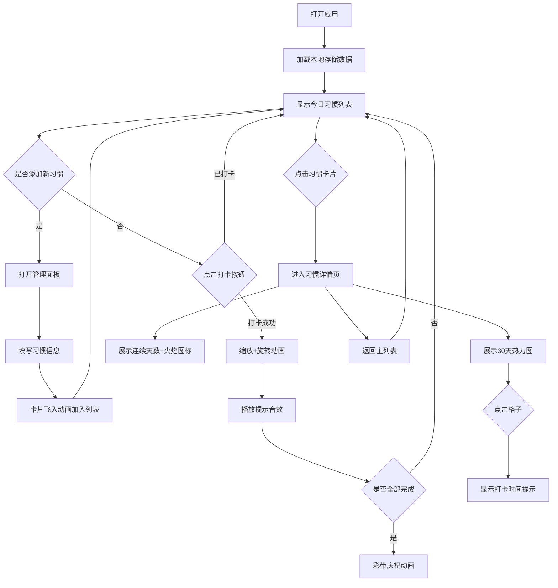

## 1. 产品概述

个人习惯追踪与可视化应用，帮助用户直观查看习惯坚持的长期趋势和连续打卡记录，提升日常习惯养成的动力与成就感。

- 解决用户无法直观看到自己坚持习惯的长期趋势和连续打卡记录的痛点
- 通过精美的可视化界面（热力图、火焰连续天数、彩带庆祝动画）让用户获得正向反馈

## 2. 核心功能

### 2.1 用户角色

| 角色 | 注册方式 | 核心权限 |
|------|----------|----------|
| 普通用户 | 无需注册，本地存储 | 管理习惯、打卡、查看统计 |

### 2.2 功能模块

1. **主列表页**：今日待完成习惯列表、顶部进度条、庆祝彩带动画
2. **管理面板**：添加/编辑习惯（名称、图标、颜色、每周目标天数）
3. **习惯详情页**：连续打卡天数、总完成次数、30天热力图

### 2.3 页面详情

| 页面名称 | 模块名称 | 功能描述 |
|----------|----------|----------|
| 主列表页 | 今日习惯列表 | 展示今日待打卡习惯，每个习惯右侧圆形打卡按钮，点击后有缩放+旋转动画+提示音；全部完成后顶部彩带庆祝 |
| 主列表页 | 进度条/统计 | 展示今日完成进度，支持跳转到习惯详情 |
| 管理面板 | 添加习惯表单 | 输入名称、选择图标、颜色、每周目标天数；添加后卡片从下方飞入 |
| 习惯详情页 | 连续打卡统计 | 大号数字+金色火焰图标展示连续天数，总完成次数 |
| 习惯详情页 | 30天热力图 | 网格化展示30天完成状态：空白灰色、完成浅绿、连续7天深绿、30天全勤金色；点击格子显示打卡时间 |

## 3. 核心流程

## 4. 用户界面设计

### 4.1 设计风格

- **主色调**：青蓝色 #0f3460 + 金色强调色 #e94560
- **背景**：深色模式，背景色 #1a1a2e，卡片 #16213e
- **视觉效果**：毛玻璃卡片（backdrop-filter: blur(10px)）
- **过渡动画**：所有交互 300ms ease-in-out
- **字体**：现代无衬线字体，清晰的层级对比

### 4.2 页面设计概览

| 页面名称 | 模块名称 | UI 元素 |
|----------|----------|---------|
| 主列表页 | 习惯卡片 | 左侧圆形图标背景（用户色），右侧名称+本周完成次数；悬停放大变亮；飞入动画 |
| 主列表页 | 打卡按钮 | 圆形按钮；点击缩放+旋转→对勾状态；已打卡灰色禁用 |
| 主列表页 | 庆祝彩带 | 彩色粒子从中间向两边扩散，持续1秒 |
| 管理面板 | 添加表单 | 名称输入框、图标选择器、颜色选择器、目标天数选择器 |
| 详情页 | 统计头 | 大号数字+金色火焰图标、总完成次数数字 |
| 详情页 | 热力图 | 5x6或6x5网格，格子颜色按规则变化；hover高亮；点击弹出tooltip |

### 4.3 响应式

- Desktop-first 设计，移动端自适应
- 习惯卡片宽度响应式，手机端单列、桌面端双列或多列
- 热力图格子大小自适应容器宽度
- 触摸优化：按钮最小 44x44px

## 5. 性能要求

- 习惯列表采用虚拟滚动，仅渲染可见区域 DOM
- 30天热力图渲染时间不超过 50ms
- 所有动画采用 CSS transform / opacity，不触发重排
- 本地存储读写异步化，避免阻塞 UI
