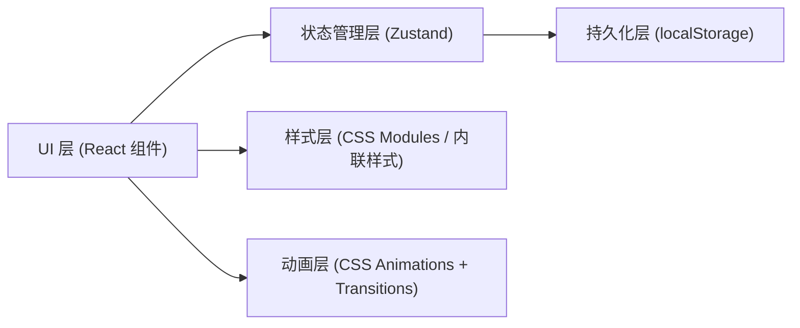
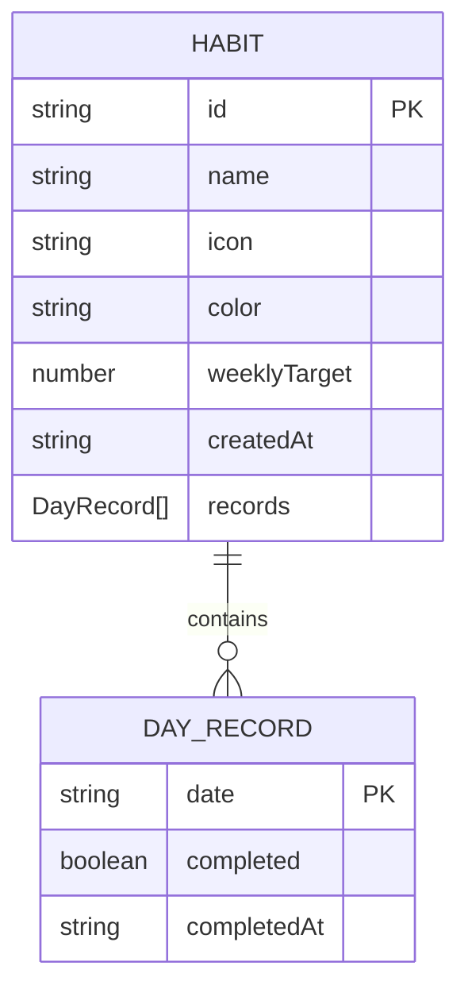

## 1. 架构设计



## 2. 技术描述

- **前端框架**：React@18 + TypeScript（严格模式）
- **构建工具**：Vite@5 + @vitejs/plugin-react
- **状态管理**：Zustand（含 localStorage 中间件）
- **唯一 ID 生成**：uuid
- **样式**：原生 CSS（CSS 变量 + backdrop-filter）
- **后端/数据库**：无，数据完全持久化在浏览器 localStorage
- **音频**：Web Audio API（轻柔提示音，无需音频文件）

## 3. 路由定义

| 路由（组件级状态） | 用途 |
|-------------------|------|
| `/`（默认页） | 主列表页：今日习惯 + 管理面板 |
| `/detail/:id` | 习惯详情页：连续天数 + 热力图 |

使用 React Router DOM 或组件内部状态切换实现页面导航。

## 4. 数据模型

### 4.1 数据模型定义



### 4.2 核心类型

```typescript
export interface DayRecord {
  date: string;         // YYYY-MM-DD
  completed: boolean;
  completedAt: string;  // ISO timestamp
}

export interface Habit {
  id: string;
  name: string;
  icon: string;         // emoji 名称
  color: string;        // hex color
  weeklyTarget: number; // 1-7
  createdAt: string;
  records: DayRecord[];
}

export interface HabitStore {
  habits: Habit[];
  todayHabits: Habit[];           // computed
  addHabit: (data: Omit<Habit, 'id' | 'createdAt' | 'records'>) => void;
  toggleHabit: (habitId: string, date: string) => void;
  getStreak: (habitId: string) => number;
  getTotalCompletions: (habitId: string) => number;
  getWeeklyCount: (habitId: string) => number;
  getHeatmapData: (habitId: string) => HeatmapCell[];
}

export interface HeatmapCell {
  date: string;
  completed: boolean;
  streakLevel: 0 | 1 | 2 | 3; // 0:空 1:完成 2:7+ 3:金
  completedAt?: string;
}
```

## 5. 文件结构

```
d:\P\tasks\auto77\
├── index.html
├── package.json
├── tsconfig.json
├── vite.config.js
├── .trae/documents/
└── src/
    ├── main.tsx
    ├── App.tsx                 # 主应用、路由、庆祝动画
    ├── types.ts                # 类型定义
    ├── store.ts                # Zustand store
    ├── styles/
    │   └── global.css          # CSS 变量、全局样式
    └── components/
        ├── HabitCard.tsx       # 单个习惯卡片（飞入、悬停、打卡）
        ├── HabitList.tsx       # 习惯列表（虚拟滚动）
        ├── TodayList.tsx       # 今日习惯列表 + 打卡
        ├── HabitDetail.tsx     # 习惯详情（热力图+统计）
        ├── AddHabitModal.tsx   # 添加习惯模态框
        ├── Celebration.tsx     # 彩带动画
        └── Heatmap.tsx         # 30天热力图
```

## 6. 性能优化要点

1. **虚拟滚动**：HabitList 使用 react-window 或自实现 IntersectionObserver + 状态，仅渲染可见项
2. **热力图渲染**：使用纯 CSS Grid + data-attribute，避免 React 重渲染开销，目标 <50ms
3. **memo 优化**：HabitCard、HeatmapCell 用 React.memo 包裹
4. **选择器优化**：Zustand 使用 shallow selector，避免不必要的订阅触发
5. **CSS 硬件加速**：所有动画使用 transform、opacity，开启 will-change
6. **localStorage 节流**：状态更新后 debounce 200ms 再写入磁盘
