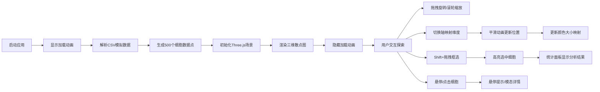

## 1. 产品概述

面向生物实验室的三维细胞群体交互式可视化分析工具，帮助研究人员直观观察不同药物条件下的细胞群体分布特征，通过交互式三维散点图展示细胞计数与药物响应数据的空间关系。

- 核心价值：将高维细胞特征数据转化为直观的三维可视化，支持交互式探索与分析
- 目标用户：生物实验室研究人员、数据分析师、药物研发人员
- 市场价值：提升科研数据分析效率，加速药物响应机制研究

## 2. 核心特性

### 2.1 功能模块

1. **三维散点图主场景**：500个细胞数据点的3D可视化，支持坐标轴映射、颜色大小映射
2. **交互式探索模块**：拖拽旋转、滚轮缩放、悬停高亮、点击详情
3. **维度控制模块**：X/Y/Z轴特征维度动态切换，平滑动画过渡
4. **框选统计模块**：Shift+拖拽框选细胞，统计分析选中群体特征
5. **数据加载模块**：内置CSV模拟数据解析，支持500个细胞样本

### 2.2 页面详情

| 页面名称 | 模块名称 | 功能描述 |
|---------|---------|----------|
| 主界面 | 左侧控制面板 | 三个下拉选择器控制X/Y/Z轴映射，细线分隔控件 |
| 主界面 | 中间3D场景 | Three.js渲染三维散点图，深空灰背景，半透明网格辅助线 |
| 主界面 | 右侧统计面板 | 显示选中细胞数量、平均值统计、细胞列表，支持折叠收起 |
| 主界面 | 加载动画 | Three.js旋转圆环加载动画，数据加载完成后消失 |
| 主界面 | 模态详情框 | 点击细胞显示完整信息，毛玻璃半透明背景 |
| 主界面 | 悬停提示框 | 右下角浮动显示细胞属性，鼠标悬停时触发 |

## 3. 核心流程

## 4. 用户界面设计

### 4.1 设计风格

- **主色调**：深空灰背景 `#1a1a2e`，面板背景 `#16213e`，分隔线 `#0f3460`，文字 `#e0e0e0`
- **配色方案**：蓝-紫-红HSL渐变映射（低值蓝色、中值紫色、高值红色），悬停高亮黄色，永久高亮金色，框选高亮绿色
- **字体**：采用现代无衬线字体，标题16px粗体，正文14px常规，数据展示13px等宽字体
- **布局风格**：三栏布局，左右面板圆角10px带内阴影，轻微毛玻璃质感
- **动效风格**：所有过渡150-300ms平滑缓动，轴切换500ms easeInOutCubic动画

### 4.2 页面设计概览

| 页面名称 | 模块名称 | UI元素 |
|---------|---------|--------|
| 主界面 | 左侧控制面板 | 280px宽度，标题"轴映射控制"，三个带标签的下拉选择器，细线分隔，下拉菜单悬停下划线动效 |
| 主界面 | 中间3D场景 | 自适应剩余空间，深空灰背景，半透明网格辅助线，粒子系统渲染细胞点 |
| 主界面 | 右侧统计面板 | 300px宽度，可折叠，统计卡片，细胞列表滚动区域，"清除选择"按钮 |
| 主界面 | 加载动画 | 白色半透明旋转圆环，周期2秒，居中显示 |
| 主界面 | 模态框 | 毛玻璃背景 `backdrop-filter: blur(8px)`，深色半透明，关闭按钮，细胞详情表格 |
| 主界面 | 悬停提示 | 右下角固定位置，半透明黑色背景，白色文字，圆角8px |

### 4.3 响应式设计

- **桌面端（≥900px）**：三栏布局，左右面板常驻显示
- **移动端（<900px）**：左右面板改为抽屉式侧边栏，汉堡菜单触发滑入，场景占满全屏，触摸手势优化
- **触摸优化**：支持双指缩放旋转，长按触发框选模式

### 4.4 3D场景设计

- **环境与氛围**：深空灰渐变背景，营造专业科研氛围，无多余装饰
- **光照设置**：环境光强度0.6，点光源两个分别置于对角，确保粒子颜色准确呈现
- **相机动画**：初始自动调整视角覆盖所有点，OrbitControls旋转灵敏度0.5，缩放范围0.1-50
- **构图焦点**：点云居中，坐标轴标签清晰，网格辅助线半透明不干扰主体
- **交互动效**：悬停放大1.5倍高亮黄色，点击永久高亮金色，框选绿色边框，未选中点透明度0.2
- **性能预算**：粒子数量≤2000，单帧渲染≤16ms，交互帧率≥55FPS
