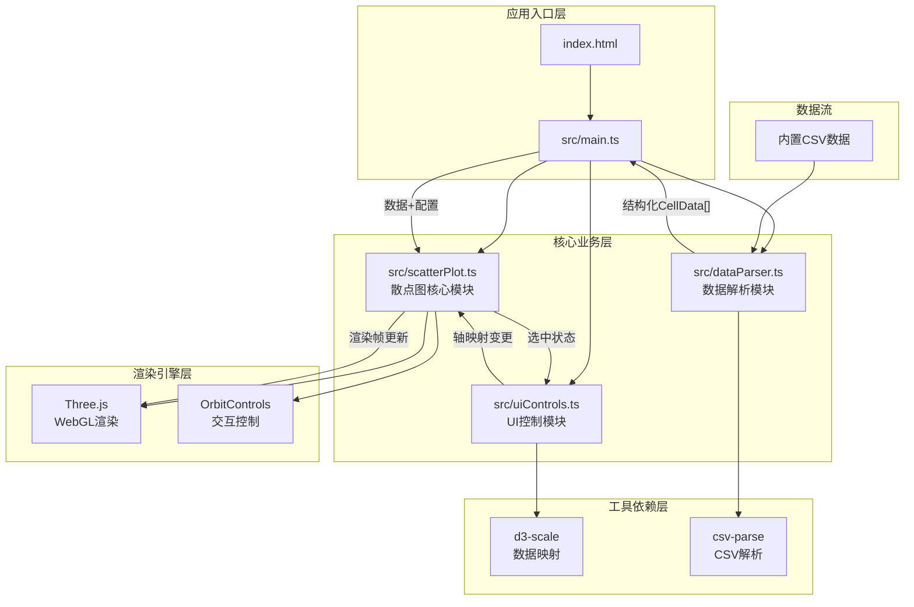
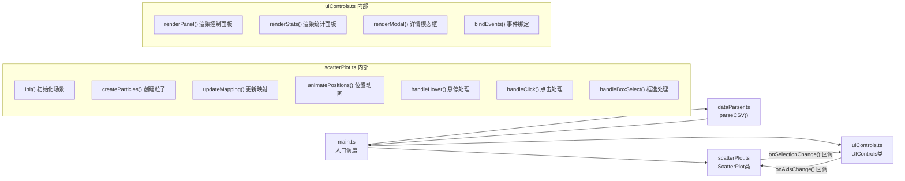

## 1. 架构设计



## 2. 技术栈说明

- **构建工具**：Vite 5.x - 快速开发构建，HMR热更新
- **开发语言**：TypeScript 5.x - 严格类型检查，提升可维护性
- **3D渲染**：Three.js 0.160.x + @types/three - 高性能WebGL粒子系统
- **数据处理**：d3-scale 7.x - 线性缩放映射，csv-parse 5.x - CSV解析
- **样式方案**：原生CSS + CSS Variables - 无需额外CSS框架，性能最优

### 2.1 模块调用关系



## 3. 数据模型

### 3.1 核心数据结构

```typescript
// 细胞数据结构
interface CellData {
  id: number;
  diameter: number;      // 细胞直径 (8-25μm)
  fluorescence: number; // 荧光强度 (0-1000)
  viability: number;    // 活性标记 (0-100%)
  cellType: string;     // 细胞类型标签
}

// 轴映射配置
interface AxisMapping {
  x: keyof Pick<CellData, 'diameter' | 'fluorescence' | 'viability'>;
  y: keyof Pick<CellData, 'diameter' | 'fluorescence' | 'viability'>;
  z: keyof Pick<CellData, 'diameter' | 'fluorescence' | 'viability'>;
}

// 可视化配置
interface VisualConfig {
  sizeRange: [number, number];  // [2, 8] 点大小范围
  colorRange: {                 // HSL颜色范围
    low: { h: 240, s: 80, l: 50 };   // 蓝色
    mid: { h: 280, s: 80, l: 50 };   // 紫色
    high: { h: 0, s: 80, l: 50 };    // 红色
  };
  animationDuration: {
    position: number;  // 500ms
    color: number;     // 300ms
  };
}

// 框选统计结果
interface SelectionStats {
  count: number;
  avgDiameter: number;
  avgFluorescence: number;
  avgViability: number;
  selectedCells: CellData[];
}
```

### 3.2 内置CSV数据格式

```csv
id,diameter,fluorescence,viability,cellType
1,15.2,456,78.5,T-Cell
2,18.7,623,92.1,B-Cell
3,12.4,289,45.3,T-Cell
...
```

共500条模拟数据，包含4种细胞类型（T-Cell, B-Cell, NK-Cell, Macrophage），数值范围：
- diameter: 8-25
- fluorescence: 0-1000
- viability: 0-100

## 4. 文件结构

```
auto79/
├── index.html              # 入口页面，Canvas容器+loading动画
├── package.json            # 依赖配置与启动脚本
├── vite.config.js          # Vite构建配置
├── tsconfig.json           # TypeScript严格模式配置
└── src/
    ├── main.ts             # 应用入口，初始化调度
    ├── scatterPlot.ts      # Three.js散点图核心模块
    ├── uiControls.ts       # UI控制与统计面板模块
    ├── dataParser.ts       # CSV数据解析模块
    ├── types.ts            # 类型定义（可选）
    └── assets/
        └── mockData.csv    # 内置500条模拟数据
```

### 4.1 各文件职责

| 文件 | 职责 | 输出 | 依赖 |
|-----|-----|-----|-----|
| `main.ts` | 应用入口，初始化场景/相机/渲染器，加载数据，协调各模块 | 渲染循环 | scatterPlot, uiControls, dataParser |
| `scatterPlot.ts` | 粒子系统创建，位置/颜色/大小映射，交互处理（悬停/点击/框选），动画控制 | Three.js Points对象，回调事件 | three, @types/three, d3-scale |
| `uiControls.ts` | 侧边控制面板渲染，下拉选择器，统计面板，模态框，事件绑定 | DOM元素，回调函数 | 无外部依赖 |
| `dataParser.ts` | 解析内置CSV，提取列名，生成结构化CellData数组 | CellData[] | csv-parse |

## 5. 性能优化策略

### 5.1 渲染性能

1. **粒子系统优化**：使用单个`Points`对象而非多个`Mesh`，减少Draw Call
2. **BufferGeometry**：使用`Float32Array`直接操作顶点缓冲区，避免频繁GC
3. **材质复用**：统一使用`PointsMaterial`，通过顶点颜色区分
4. **帧率控制**：`requestAnimationFrame`回调中仅更新必要属性
5. **视锥体剔除**：Three.js内置，超出视野粒子不渲染

### 5.2 动画性能

1. **位置动画**：使用线性插值在GPU侧完成，每帧更新position buffer
2. **缓动函数**：easeInOutCubic预计算采样，避免每帧重复计算
3. **属性更新**：`needsUpdate`精确控制，避免全量重绘
4. **离屏计算**：数据映射计算在空闲帧完成，不阻塞主线程

### 5.3 交互性能

1. **Raycaster优化**：限制射线检测频率，鼠标移动时节流
2. **框选算法**：NDC空间快速筛选，避免逐个点世界坐标转换
3. **事件委托**：统一事件监听，避免为每个粒子注册事件
4. **DOM更新节流**：统计面板数据更新使用`requestAnimationFrame`合并
