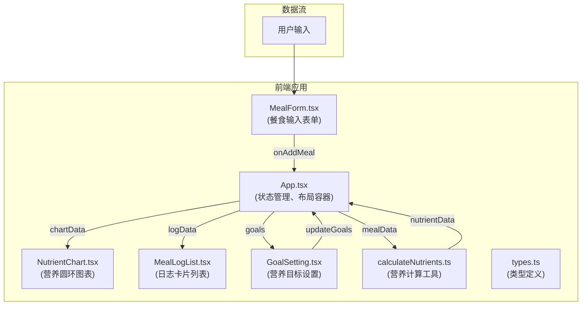
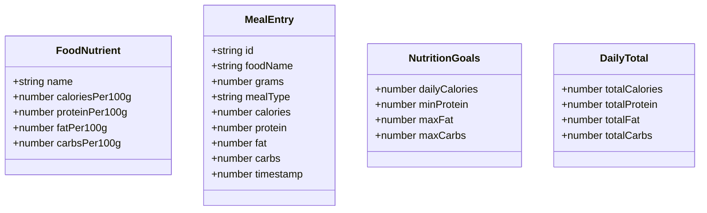

## 1. 架构设计

## 2. 技术描述
- **前端框架**：React 18 + TypeScript
- **构建工具**：Vite 5
- **图表库**：recharts 2
- **状态管理**：React useState（本地状态管理，无后端）
- **样式方案**：CSS Modules + CSS Variables
- **类型系统**：TypeScript 严格模式，ESNext模块
- **纯前端架构**：无后端服务，所有数据存储在浏览器内存中

## 3. 文件结构与调用关系

| 文件路径 | 职责描述 | 调用关系 |
|---------|---------|---------|
| `package.json` | 项目依赖配置 | 被Vite和npm读取 |
| `index.html` | 入口HTML页面 | 挂载根容器，加载main.tsx |
| `tsconfig.json` | TypeScript配置 | 严格模式、ESNext模块 |
| `vite.config.js` | Vite构建配置 | 开发服务器、构建选项 |
| `src/main.tsx` | 应用入口 | 渲染App组件到DOM |
| `src/App.tsx` | 主应用组件 | 管理全局状态，组合所有子组件 |
| `src/components/MealForm.tsx` | 餐食输入表单 | 接收用户输入，调用onAddMeal回调 |
| `src/components/NutrientChart.tsx` | 营养圆环图表 | 接收chartData，使用recharts渲染 |
| `src/components/MealLogList.tsx` | 日志卡片列表 | 接收logData，渲染卡片列表 |
| `src/components/GoalSetting.tsx` | 营养目标设置 | 接收currentGoals，调用onUpdateGoals |
| `src/utils/calculateNutrients.ts` | 营养计算工具 | 提供calculateMealNutrients函数 |
| `src/types/index.ts` | TypeScript类型定义 | 被所有组件引用 |
| `src/styles/App.css` | 全局样式 | CSS变量、动画定义 |

**数据流向**：
1. 用户在 `MealForm` 输入食物名称和份量
2. `MealForm` 调用 `onAddMeal` 回调将数据传递给 `App`
3. `App` 调用 `calculateNutrients.ts` 中的计算函数
4. 计算结果更新 `App` 中的状态
5. 状态变化驱动 `NutrientChart`、`MealLogList` 和 `GoalSetting` 重新渲染

## 4. 数据模型

### 4.1 类型定义

### 4.2 内置食物数据库
存储常见食物的营养成分（每100克）：
- 主食类：米饭、面条、面包、燕麦
- 蛋白质类：鸡胸肉、牛肉、鸡蛋、豆腐、鱼
- 蔬菜水果：苹果、香蕉、西兰花、番茄
- 乳制品：牛奶、酸奶、奶酪
- 其他：坚果、食用油等

## 5. 性能优化策略

### 5.1 性能目标
- 每次添加餐食后，图表和列表总更新响应时间 ≤ 100ms
- 圆环图表渲染帧率 ≥ 30FPS

### 5.2 优化措施
1. **组件 memo 优化**：使用 `React.memo` 包装子组件，避免不必要的重渲染
2. **计算缓存**：营养计算结果缓存，相同输入直接返回结果
3. **动画优化**：使用 CSS transform 和 opacity 属性动画，触发 GPU 加速
4. **列表虚拟化**：当日志超过50条时，考虑虚拟滚动（当前需求暂不实现）
5. **防抖处理**：营养目标输入框使用防抖，避免频繁状态更新
6. **批量更新**：使用 React 18 自动批处理，减少渲染次数

### 5.3 性能监控
- 使用 `performance.now()` 监控关键操作耗时
- 在开发环境中输出性能指标到控制台
- 图表组件使用 `useTransition` 标记非紧急更新
