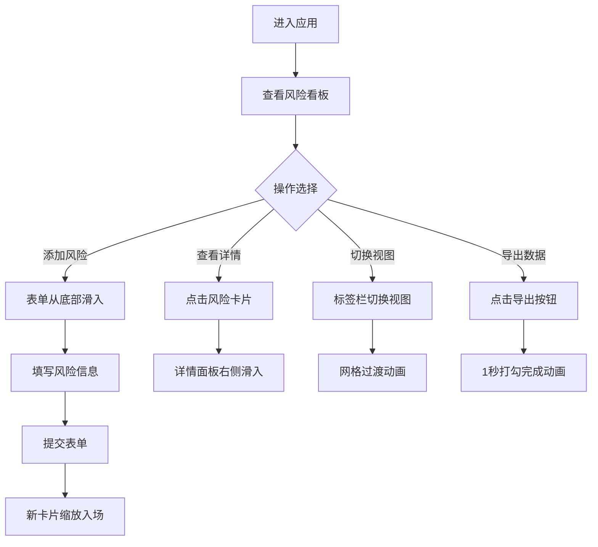

## 1. 产品概述

项目风险管理看板是一款帮助团队快速收集、追踪和分析项目风险的可视化管理工具。解决项目管理中风险信息分散、难以追踪和影响评估的核心痛点，提升团队对项目风险的响应效率。

- 主要用途：风险条目管理、多维度视图展示、实时风险统计与分析
- 目标用户：项目经理、项目团队成员、质量保障人员
- 产品价值：集中化风险管理，可视化风险分布，提升风险响应速度

## 2. 核心 Features

### 2.1 用户角色

本应用无复杂角色权限区分，所有用户拥有完整操作权限。

### 2.2 Feature 模块

1. **风险看板主页面**：风险列表展示、三种视图切换、风险统计信息栏
2. **风险条目管理**：添加风险表单、风险卡片展示、风险详情面板
3. **风险统计与导出**：实时风险分布统计、CSV导出、PNG快照导出
4. **多视图展示**：按状态分组看板视图、按等级分组瀑布流视图、按时间轴甘特图视图

### 2.3 Page Details

| 页面名称 | 模块名称 | Feature 描述 |
|---------|---------|-------------|
| 风险看板主页 | 顶部信息栏 | 实时统计高/中/低风险数量（红/橙/黄色数字，滚动动画）、CSV/PNG导出按钮（打勾动画） |
| 风险看板主页 | 视图切换标签栏 | 三种视图模式切换（状态看板/等级瀑布流/时间甘特图），切换时网格过渡动画 |
| 风险看板主页 | 状态分组看板视图 | 三列布局（待处理/处理中/已关闭），支持拖拽排序（交互优化） |
| 风险看板主页 | 等级分组瀑布流视图 | 按高/中/低风险等级分组的瀑布流布局 |
| 风险看板主页 | 时间轴甘特图视图 | 横向时间轴，每条风险以横条展示创建与预计解决日期，高亮当前日期竖线 |
| 风险看板主页 | 风险卡片组件 | 展示标题、等级标签、状态、负责人，悬停浮动效果，点击展开详情 |
| 风险看板主页 | 添加风险表单 | 从底部滑入的表单，包含标题、等级、状态、影响范围、负责人字段 |
| 风险看板主页 | 风险详情面板 | 从右侧滑入，半透明磨砂玻璃效果，展示完整风险信息 |

## 3. 核心流程

### 主操作流程

用户进入应用 → 查看风险看板整体分布 → 点击"添加风险"按钮 → 表单从底部滑入 → 填写风险信息 → 提交后新卡片从顶部缩放入场 → 点击风险卡片 → 详情面板从右侧滑入查看完整信息 → 切换视图模式查看不同维度的风险分布 → 点击导出按钮获取数据快照

## 4. User Interface Design

### 4.1 Design Style

- **主色调**：蓝紫色系 #0f3460（沉稳专业）
- **强调色**：橙色 #e94560（高风险警示）、金色 #ffd700（中等风险）、黄色（低风险）
- **背景色**：深色主题 #1a1a2e，卡片底色 #16213e
- **文字主色**：浅灰色 #e0e0e0
- **卡片风格**：圆角12px，柔和阴影 0 4px 15px rgba(0,0,0,0.3)
- **字体**：使用现代无衬线字体，标题加粗，正文清晰易读
- **交互风格**：所有元素带200ms cubic-bezier过渡动画，悬停/点击状态明确

### 4.2 Page Design Overview

| 页面名称 | 模块名称 | UI Elements |
|---------|---------|-------------|
| 风险看板主页 | 顶部信息栏 | 深色背景，三色数字统计，图标按钮，hover高亮，点击反馈 |
| 风险看板主页 | 视图标签栏 | 下划线指示器，active状态高亮，切换平滑过渡 |
| 风险看板主页 | 风险卡片 | 圆角12px，渐变边框悬停效果，上浮3px动画，左侧色条指示 |
| 风险看板主页 | 添加表单 | 底部滑入动画，半透明背景，表单控件圆角，focus状态高亮 |
| 风险看板主页 | 详情面板 | 右侧滑入，backdrop-filter磨砂玻璃，半透明黑色背景 |
| 风险看板主页 | 甘特图视图 | 时间轴刻度，彩色横条，今日竖线动态刷新 |

### 4.3 Responsiveness

- **桌面优先**：最小宽度1200px，看板容器flex-grow自适应窗口
- **响应式降级**：窗口宽度小于1200px时，卡片自动切换为单列布局
- **触控优化**：按钮最小点击区域44x44px，支持键盘导航
- **动画性能**：视图切换动画帧率不低于45fps，使用transform和opacity实现硬件加速

## 5. 动画与交互规范

### 入场动画
- 表单：从底部滑入（translateY 100% → 0，300ms ease-out）
- 新卡片：缩放入场（scale 0.8 + opacity 0 → scale 1 + opacity 1，200ms ease-out）
- 详情面板：从右侧滑入（translateX 100% → 0，300ms ease-out）+ 背景渐显

### 悬停交互
- 风险卡片：向上浮动3px（translateY -3px），左侧3px彩色边条显现
- 按钮/标签：背景色渐变，轻微缩放（1.02x），阴影加深

### 视图切换
- 网格过渡动画：交错缩放消失与出现（staggered scale 1→0→1，300ms）
- 数字更新：滚动动画（数字从旧值平滑过渡到新值）

### 反馈动画
- 导出按钮：点击后显示1秒的打勾完成动画
- 甘特图今日线：每日自动刷新位置，平滑过渡
