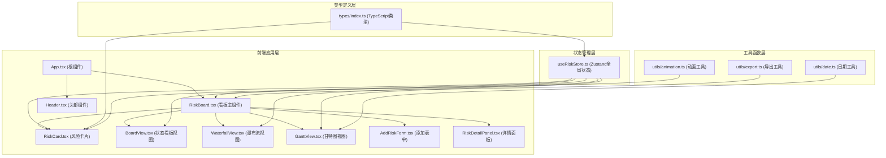
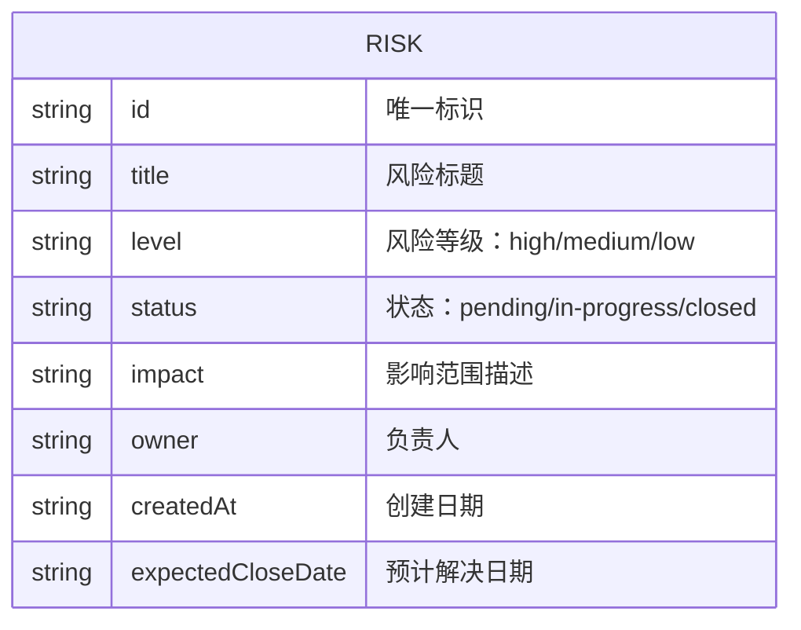

## 1. Architecture Design



## 2. Technology Description

- **前端框架**：React@18 + TypeScript@5（严格模式）
- **构建工具**：Vite@5 + @vitejs/plugin-react@4
- **状态管理**：Zustand@4（轻量高性能状态管理）
- **唯一ID生成**：uuid@9
- **样式方案**：CSS Modules + CSS Variables（原生CSS，避免第三方样式库以提升性能）
- **动画方案**：CSS Transitions/Animations + React状态驱动（硬件加速）

## 3. Route Definitions

本应用为单页面应用，无复杂路由配置。

| Route | Purpose |
|-------|---------|
| / | 风险看板主页（唯一页面，包含所有功能模块） |

## 4. Data Model

### 4.1 Data Model Definition



### 4.2 TypeScript 类型定义

```typescript
export type RiskLevel = 'high' | 'medium' | 'low';
export type RiskStatus = 'pending' | 'in-progress' | 'closed';
export type ViewMode = 'board' | 'waterfall' | 'gantt';

export interface Risk {
  id: string;
  title: string;
  level: RiskLevel;
  status: RiskStatus;
  impact: string;
  owner: string;
  createdAt: string;
  expectedCloseDate: string;
}

export interface RiskStore {
  risks: Risk[];
  viewMode: ViewMode;
  filter: {
    level?: RiskLevel;
    status?: RiskStatus;
  };
  addRisk: (risk: Omit<Risk, 'id' | 'createdAt'>) => void;
  updateRisk: (id: string, updates: Partial<Risk>) => void;
  deleteRisk: (id: string) => void;
  setViewMode: (mode: ViewMode) => void;
  setFilter: (filter: Partial<RiskStore['filter']>) => void;
}

export const RISK_LEVEL_COLORS: Record<RiskLevel, string> = {
  high: '#e94560',
  medium: '#ffd700',
  low: '#f0c040',
};

export const STATUS_LABELS: Record<RiskStatus, string> = {
  pending: '待处理',
  'in-progress': '处理中',
  closed: '已关闭',
};

export const LEVEL_LABELS: Record<RiskLevel, string> = {
  high: '高风险',
  medium: '中风险',
  low: '低风险',
};
```

## 5. 核心组件设计

### 5.1 组件树结构

```
App.tsx
└── RiskBoard.tsx
    ├── Header.tsx
    │   ├── StatsCounter.tsx (数字滚动动画)
    │   └── ExportButton.tsx (打勾动画)
    ├── ViewTabs.tsx (视图切换标签)
    ├── AddRiskButton.tsx
    ├── AddRiskForm.tsx (底部滑入表单)
    ├── RiskDetailPanel.tsx (右侧滑入面板)
    └── ViewContainer
        ├── BoardView.tsx (三列看板)
        │   └── BoardColumn.tsx
        │       └── RiskCard.tsx
        ├── WaterfallView.tsx (瀑布流)
        │   └── WaterfallGroup.tsx
        │       └── RiskCard.tsx
        └── GanttView.tsx (甘特图)
            └── GanttBar.tsx
```

### 5.2 性能优化策略

1. **虚拟滚动**：500条数据使用CSS contain + React.memo减少重渲染
2. **动画优化**：使用transform和opacity属性，启用GPU加速
3. **状态分片**：Zustand使用selector避免不必要的重渲染
4. **批量更新**：使用React.useTransition处理视图切换等非紧急更新
5. **防抖节流**：窗口resize事件使用debounce，滚动事件使用throttle
6. **代码分割**：三种视图组件按需加载（虽然是单页，但可通过React.lazy优化）

## 6. 性能指标要求

| 指标 | 目标值 | 测量方式 |
|------|--------|---------|
| 初始加载时间（500条） | ≤ 1.5秒 | Lighthouse Performance |
| 视图切换动画帧率 | ≥ 45fps | Chrome DevTools Performance |
| 首次内容绘制 (FCP) | ≤ 1.0秒 | Lighthouse |
| 最大内容绘制 (LCP) | ≤ 1.5秒 | Lighthouse |
| 交互延迟 (INP) | ≤ 200ms | Lighthouse |

## 7. 工程配置要点

### tsconfig.json（严格模式）
- strict: true
- noImplicitAny: true
- strictNullChecks: true
- noUnusedLocals: true
- noUnusedParameters: true

### vite.config.js
- React plugin启用fastRefresh
- 生产构建启用terser压缩
- 配置路径别名 @ → src
- 启用sourcemap便于调试

### package.json
- 依赖：react, react-dom, uuid, zustand
- 开发依赖：typescript, vite, @vitejs/plugin-react, @types/react, @types/react-dom, @types/uuid
- 启动脚本：npm run dev
