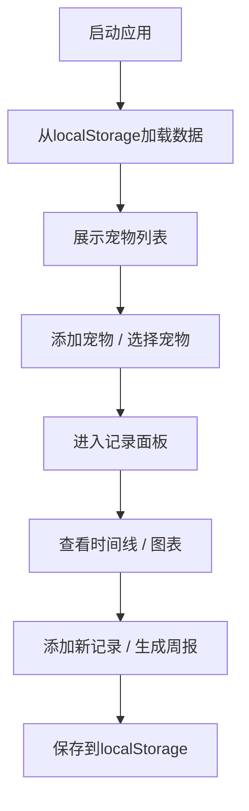

## 1. 产品概述

远程宠物投喂与行为记录应用，帮助用户管理多只宠物的日常健康与活动记录，通过数据可视化和周报分析提升宠物养护质量。

- 面向养宠人士，解决宠物日常记录零散、难以追踪健康趋势的问题
- 通过数据持久化和可视化图表，提供科学的宠物养护参考

## 2. 核心功能

### 2.1 功能模块

1. **宠物管理**：添加、删除、选择宠物，生成个性化头像卡片
2. **记录管理**：记录喂食、喂水、遛弯、健康状态，支持筛选和时间线展示
3. **数据可视化**：基于Chart.js的趋势图表，多维度展示记录数据
4. **周报生成**：自动生成周统计报告，包含数据对比和健康建议

### 2.3 页面详情

| 页面名称 | 模块名称 | 功能描述 |
|-----------|-------------|---------------------|
| 首页 | 宠物列表 | 展示宠物卡片，支持添加/删除宠物，卡片带渐变背景和悬停动画 |
| 记录面板 | 时间线列表 | 按日期倒序展示记录，支持类型筛选，悬停高亮，点击联动图表 |
| 记录面板 | 数据图表 | 散点图展示记录趋势，不同类型颜色区分，悬停显示详情 |
| 周报模态框 | 周报展示 | 统计本周记录、对比上周、折线图展示、智能健康建议 |

## 3. 核心流程

用户进入应用后，首先看到宠物列表页面。可以添加新宠物或选择已有宠物。选择宠物后进入记录面板，查看时间线和图表，可以添加新记录或生成周报。所有操作实时同步到localStorage。

## 4. 用户界面设计

### 4.1 设计风格

- 主色调：暖白色（#FAFAF5）配绿色点缀（#5B9279）
- 记录类型色：食物#FF9800、水#2196F3、遛弯#4CAF50、健康#F44336
- 卡片圆角：12-16px，柔和阴影
- 字体：系统无衬线字体
- 动效：200-500ms平滑过渡，入场/退场动画

### 4.2 页面设计概述

| 页面名称 | 模块名称 | UI元素 |
|-----------|-------------|-------------|
| 宠物列表 | 宠物卡片 | 渐变色圆形头像、名字首字母、浅圆角卡片、悬停上浮效果、缩放入场动画 |
| 宠物列表 | 添加表单 | 底部滑入动画、名称输入、种类下拉、年龄输入、提交按钮 |
| 记录面板 | 时间线 | Unicode图标、日期倒序、悬停图标放大变色、点击高亮 |
| 记录面板 | 图表区 | Chart.js散点图、透明背景、半透明网格、毛玻璃提示框 |
| 记录面板 | 添加记录 | 类型选择、备注输入、时间选择、向下展开动画 |
| 周报模态框 | 周报 | 缩放弹出动画、统计数据、对比折线图、智能建议文本 |

### 4.3 响应式

- 桌面端：宠物列表多列卡片，记录面板左右分栏（时间线+图表）
- 移动端（<768px）：宠物列表单列，记录面板图表下移至时间线下方
- 触摸优化：增加可点击区域，适配移动端手势

### 4.4 自定义样式

- 滚动条：宽度6px，滑块颜色为主色绿色
- 按钮：悬停轻微放大（scale 1.05）和变色，200ms过渡
- 列表项：300ms高度展开动画，500ms图表数据渐变
