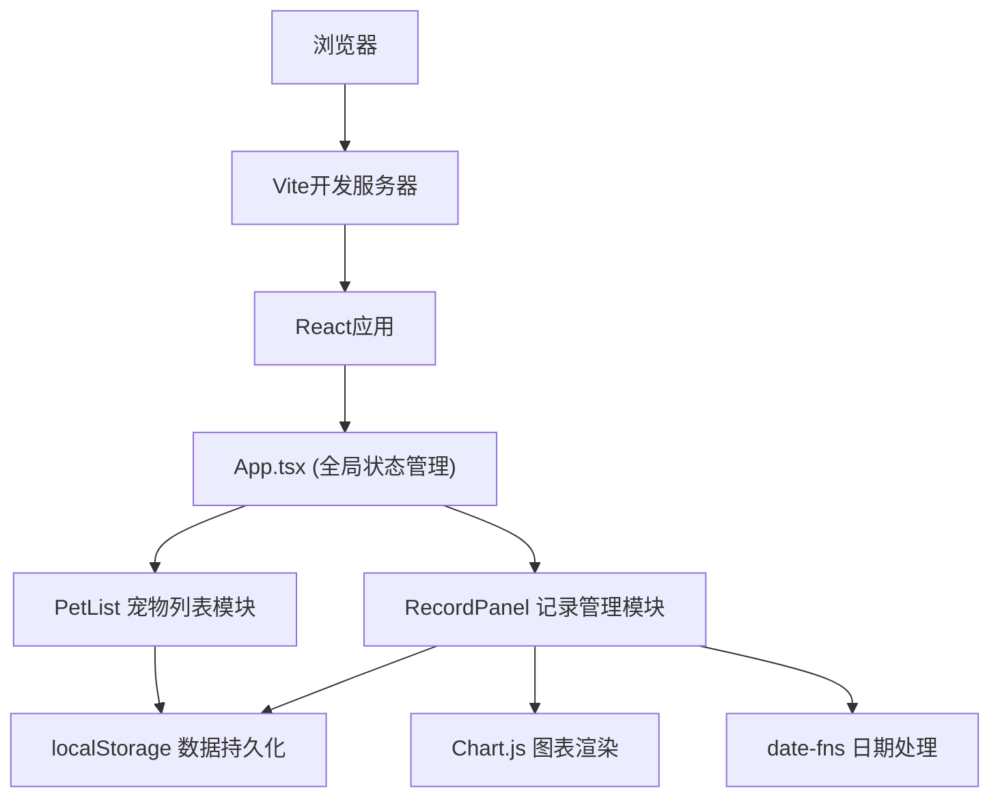
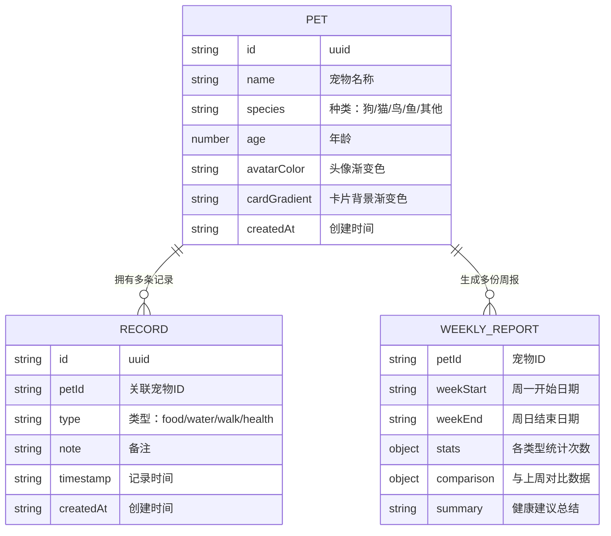

## 1. 架构设计

纯前端Vite + React + TypeScript应用，数据通过localStorage持久化，无需后端服务。



## 2. 技术描述

- 前端框架：React@18 + TypeScript@5
- 构建工具：Vite@5 + @vitejs/plugin-react@4
- 图表库：chart.js@4 + react-chartjs-2@5
- 工具库：uuid@9 + date-fns@3
- 状态管理：React useState + useCallback（轻量场景，无需额外状态库）
- 数据存储：localStorage模拟后端

## 3. 文件结构

| 文件 | 作用 |
|-------|---------|
| `package.json` | 项目依赖和脚本配置 |
| `index.html` | 应用入口页面 |
| `vite.config.js` | Vite构建配置，React fast refresh |
| `tsconfig.json` | TypeScript配置，严格模式 + 路径别名 |
| `src/types.ts` | 类型定义（Pet、Record、WeeklyReport接口） |
| `src/App.tsx` | 主应用组件，全局状态和视图切换 |
| `src/components/PetList.tsx` | 宠物列表卡片组件 |
| `src/components/RecordPanel.tsx` | 记录面板（时间线+图表）组件 |

## 4. 数据模型

### 4.1 数据结构定义



### 4.2 类型定义

```typescript
export type PetSpecies = 'dog' | 'cat' | 'bird' | 'fish' | 'other';
export type RecordType = 'food' | 'water' | 'walk' | 'health';

export interface Pet {
  id: string;
  name: string;
  species: PetSpecies;
  age: number;
  avatarColor: string;
  cardGradient: string;
  createdAt: string;
}

export interface Record {
  id: string;
  petId: string;
  type: RecordType;
  note: string;
  timestamp: string;
  createdAt: string;
}

export interface WeeklyReport {
  petId: string;
  weekStart: string;
  weekEnd: string;
  stats: Record<RecordType, number>;
  comparison: {
    current: Record<RecordType, number>;
    previous: Record<RecordType, number>;
  };
  summary: string;
}
```

### 4.3 localStorage键定义

- `pet_care_pets`: 宠物列表数据
- `pet_care_records`: 所有记录数据

## 5. 性能优化

### 5.1 启动性能

- Vite冷启动优化，首次加载<1秒
- 按需引入Chart.js模块，减少打包体积
- 使用React.memo优化组件重渲染

### 5.2 交互性能

- 记录切换响应<100ms
- 图表更新动画保持60fps
- localStorage读写控制在5ms以内（使用debounce）
- useCallback缓存事件处理函数

### 5.3 渲染优化

- 列表项使用唯一key（uuid）
- 图表数据变更时使用Chart.js动画配置
- 避免不必要的状态更新

## 6. 关键实现点

### 6.1 工具函数

- `getWeekRange(date)`: 计算周一至周日范围
- `generateWeeklyReport(petId, records)`: 生成周报数据
- `saveToStorage(key, data)`: 带debounce的localStorage写入
- `loadFromStorage(key)`: localStorage读取

### 6.2 动画实现

- CSS transform + transition实现卡片入场、表单滑入
- Chart.js animation配置实现数据平滑过渡
- React状态驱动类名切换实现高度展开动画

### 6.3 响应式布局

- CSS Grid + Flexbox实现自适应布局
- Media query `@media (max-width: 768px)` 处理移动端
- 图表容器使用百分比宽度，自动重绘
