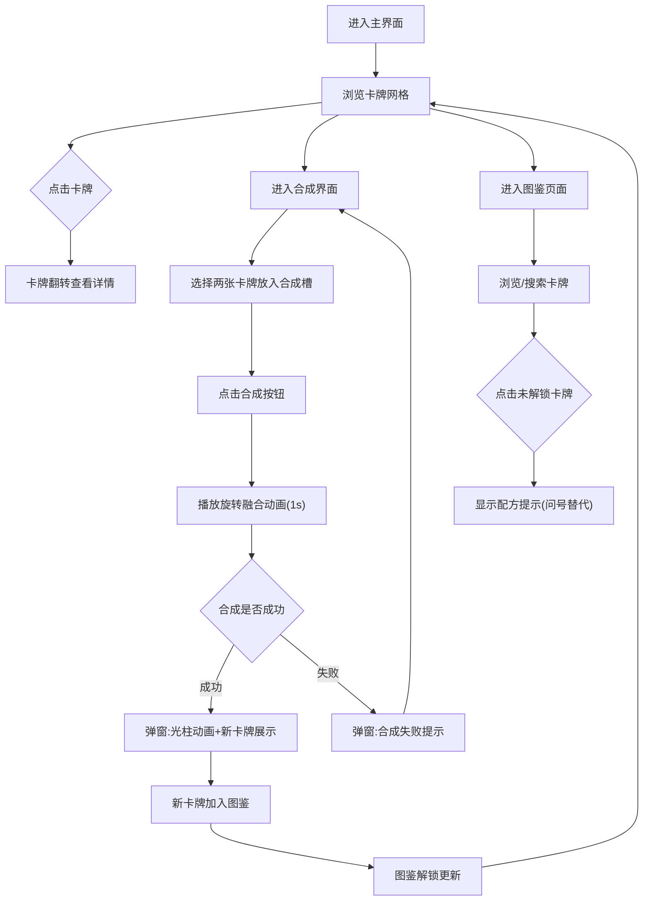

## 1. 产品概述

元素融合录是一款基于随机配方组合的在线卡牌合成与收藏游戏。玩家通过收集六种基础元素卡牌（火、水、风、土、光、暗），按照特定配方尝试合成高级卡牌，合成结果随机但有保底机制，未解锁卡牌在图鉴中以灰色剪影显示，解锁后展示精美动态插画和详细属性。

- 目标用户：喜欢卡牌收集、合成玩法的休闲游戏玩家
- 核心价值：融合合成随机性与图鉴收集成就感，提供视觉精美、交互流畅的卡牌体验

## 2. 核心功能

### 2.1 用户角色

| 角色 | 注册方式 | 核心权限 |
|------|----------|----------|
| 玩家 | 无需注册，本地存储 | 收集卡牌、合成卡牌、浏览图鉴 |

### 2.2 功能模块

1. **主界面**：卡牌网格展示、卡牌交互（悬停浮起+旋转+辉光、点击翻转）、动态星云背景
2. **合成界面**：六边形合成槽、合成动画（旋转融合+火花粒子）、结果弹窗（毛玻璃+光柱+按钮展开）
3. **图鉴页面**：瀑布流展示、已解锁/未解锁卡牌区分、合成配方提示、搜索过滤

### 2.3 页面详情

| 页面名称 | 模块名称 | 功能描述 |
|----------|----------|----------|
| 主界面 | 星云动态背景 | Canvas绘制缓慢流动星云，深色主题，60FPS |
| 主界面 | 卡牌网格 | 3行4列圆角矩形卡牌，稀有度边框颜色（灰/绿/蓝/紫/金），渐变卡面+元素SVG图标 |
| 主界面 | 卡牌悬停交互 | 鼠标悬停向上浮起8px，顺时针旋转2度，稀有度对应辉光效果 |
| 主界面 | 卡牌点击翻转 | 点击后翻转180度展示背面属性数值和描述 |
| 合成界面 | 合成槽 | 左右两个六边形凹槽，选中卡牌时边框闪烁对应元素颜色（0.5秒） |
| 合成界面 | 合成动画 | 两张卡牌旋转靠近+对应元素颜色火花粒子效果（1秒） |
| 合成界面 | 结果弹窗 | 毛玻璃背景，成功合成时中央彩色光柱从下往上照射（800ms），按钮从中间向两边展开入场动画 |
| 图鉴页面 | 瀑布流展示 | 所有可合成卡牌，已解锁全彩动态插画（呼吸动画0.5%），未解锁灰色剪影+名称 |
| 图鉴页面 | 配方提示 | 点击灰色剪影弹出合成配方提示，未解锁部分用问号替代 |
| 图鉴页面 | 搜索过滤 | 顶部搜索框，输入实时过滤，淡入动画更新 |

## 3. 核心流程

1. 玩家进入主界面，查看已拥有的卡牌集合
2. 玩家点击卡牌查看详情（翻转动画）
3. 玩家进入合成界面，选择两张卡牌放入六边形合成槽
4. 点击合成按钮，播放旋转融合动画（1秒）+火花粒子效果
5. 弹窗展示合成结果：成功则展示新卡牌+光柱动画；失败则提示合成失败
6. 新获得的卡牌自动加入图鉴，图鉴中对应条目解锁
7. 玩家可在图鉴页面浏览所有卡牌，搜索过滤，查看未解锁卡牌的配方提示

## 4. 用户界面设计

### 4.1 设计风格

- 主色调：深色太空主题（#0a0a1a为底色），搭配六种元素色（火#ff4d2e、水#2e9bff、风#7ee8fa、土#c8a24e、光#ffe066、暗#8b5cf6）
- 稀有度边框色：灰(#9ca3af)、绿(#22c55e)、蓝(#3b82f6)、紫(#a855f7)、金(#f59e0b)
- 卡牌样式：圆角矩形，渐变色块卡面+元素SVG图标，悬浮阴影
- 字体：标题使用衬线体（如 Cinzel），正文使用无衬线体（如 Quicksand）
- 布局：卡牌3×4网格居中，合成槽对称排列，图鉴瀑布流
- 图标风格：元素符号使用简洁SVG线条图标

### 4.2 页面设计概览

| 页面名称 | 模块名称 | UI元素 |
|----------|----------|--------|
| 主界面 | 星云背景 | Canvas全屏，深色底+紫蓝渐变星云缓慢流动 |
| 主界面 | 卡牌网格 | 3行4列网格，每卡圆角矩形(160×220px)，间隙16px，居中对齐 |
| 主界面 | 卡牌悬停 | translateY(-8px) + rotate(2deg) + box-shadow辉光，过渡300ms |
| 主界面 | 卡牌翻转 | perspective 1000px, rotateY(180deg)，背面显示属性 |
| 合成界面 | 合成槽 | 六边形clip-path，凹槽阴影效果，选中时边框闪烁 |
| 合成界面 | 合成动画 | 两卡旋转靠拢+Canvas火花粒子，1秒时长 |
| 合成界面 | 结果弹窗 | backdrop-filter blur(12px)，光柱animation 800ms，按钮scaleX展开 |
| 图鉴页面 | 瀑布流 | CSS columns/masonry布局，已解锁呼吸动画scale(1±0.005) |
| 图鉴页面 | 搜索框 | 顶部固定，输入时实时过滤+淡入transition |
| 图鉴页面 | 灰色剪影 | filter grayscale(1) opacity(0.5)，点击弹出配方tooltip |

### 4.3 响应式

- 桌面优先设计（1440px基准）
- 1024px以下卡牌网格调整为3列
- 768px以下卡牌网格调整为2列，合成槽纵向排列

### 4.4 性能要求

- 所有动画运行在60FPS
- 合成流程从点击合成到展示结果不超过2.5秒
- 星云背景使用requestAnimationFrame优化
- 卡牌动画使用CSS transform/GPU加速
- 粒子效果控制粒子数量上限（≤100个）
