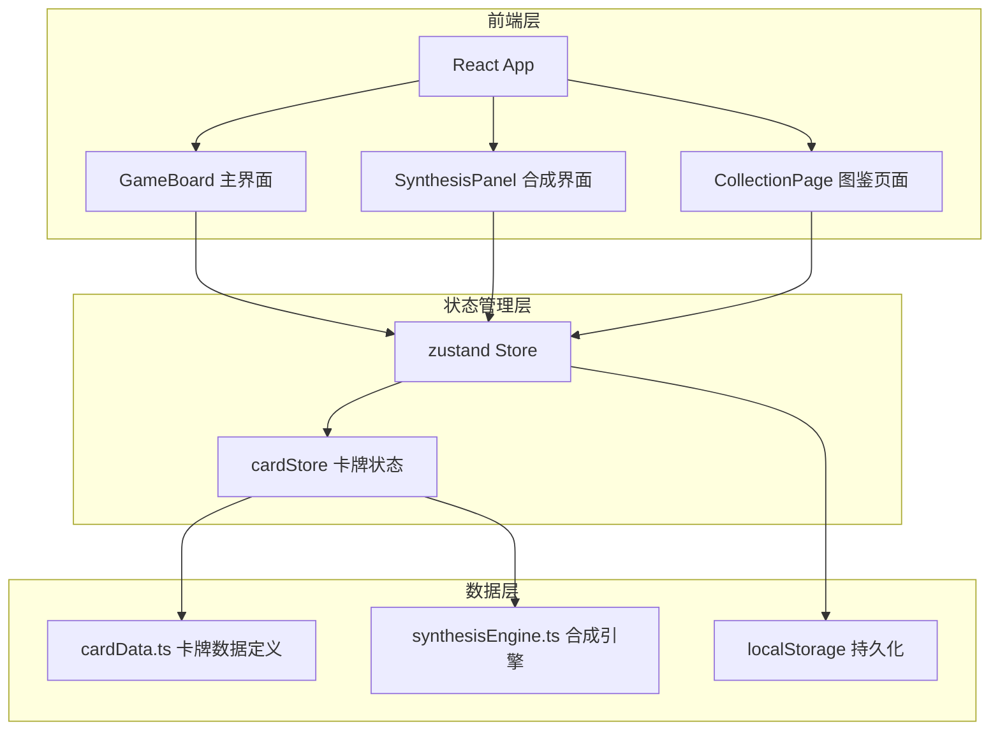
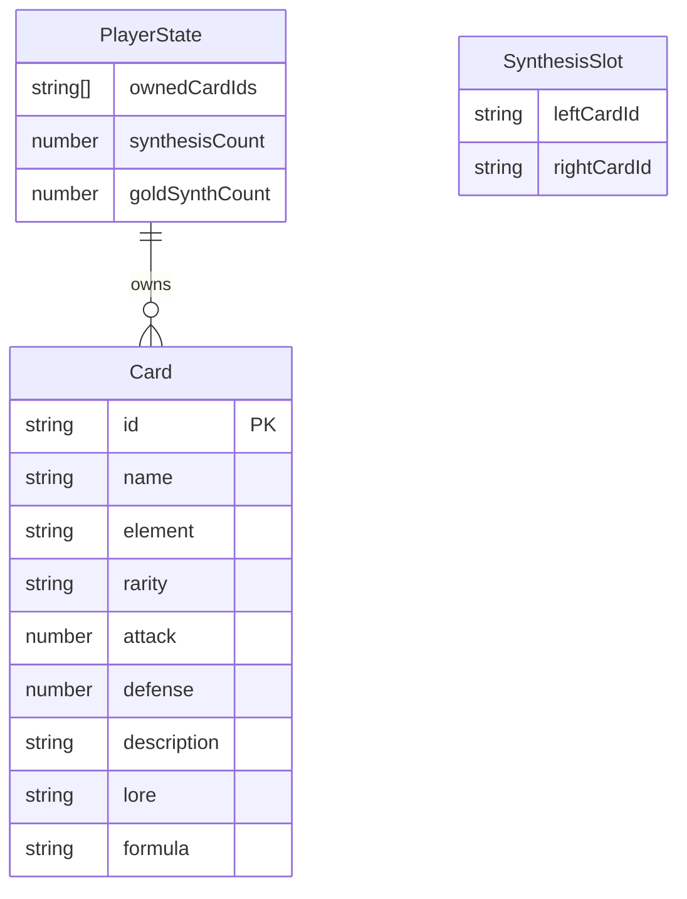

## 1. 架构设计



## 2. 技术说明

- 前端框架：React 18 + TypeScript（严格模式）
- 构建工具：Vite + @vitejs/plugin-react
- 状态管理：zustand（含localStorage持久化）
- 动画库：framer-motion（卡牌翻转、悬停、合成动画）
- 样式方案：CSS Modules + CSS变量主题系统
- 初始化工具：vite-init (react-ts模板)

## 3. 路由定义

| 路由 | 用途 |
|------|------|
| / | 主界面 - 卡牌网格展示与交互 |
| /synthesis | 合成界面 - 卡牌合成操作 |
| /collection | 图鉴页面 - 全部卡牌浏览与搜索 |

## 4. 数据模型

### 4.1 数据模型定义



### 4.2 卡牌数据结构

```typescript
interface Card {
  id: string;
  name: string;
  element: 'fire' | 'water' | 'wind' | 'earth' | 'light' | 'dark' | 'composite';
  rarity: 'common' | 'uncommon' | 'rare' | 'epic' | 'legendary';
  attack: number;
  defense: number;
  description: string;
  lore: string;
  formula?: [string, string];
}

interface PlayerState {
  ownedCardIds: string[];
  synthesisCount: number;
  goldSynthCount: number;
  selectedCardId: string | null;
  leftSlotCardId: string | null;
  rightSlotCardId: string | null;
}
```

### 4.3 稀有度与合成概率

| 稀有度 | 边框颜色 | 合成成功概率 | 保底次数 |
|--------|----------|------------|----------|
| common (普通) | 灰 #9ca3af | 100% | - |
| uncommon (优秀) | 绿 #22c55e | 80% | - |
| rare (稀有) | 蓝 #3b82f6 | 50% | - |
| epic (史诗) | 紫 #a855f7 | 25% | - |
| legendary (传说) | 金 #f59e0b | 10% | 100次必出 |

## 5. 文件结构

```
src/
  store/
    cardStore.ts       - zustand状态管理：卡牌图鉴、拥有列表、选中卡牌、合成槽
  components/
    GameBoard.tsx       - 主游戏界面：卡牌网格、合成槽、合成按钮、结果弹窗
  utils/
    cardData.ts         - 卡牌数据定义与初始化
    synthesisEngine.ts  - 合成引擎：配方匹配、概率计算、保底机制
```
