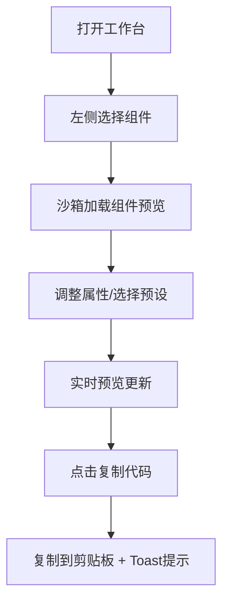

## 1. 产品概述

面向设计团队的素材管理与协作平台中的交互式UI组件库活文档工具，让设计师和开发者能一键查看、调试和分享组件状态。

- 主要目标：提供一个在线UI组件探索与调试工作台，支持实时调整组件属性、预览效果、复制代码片段和分享组件状态
- 目标用户：设计师、前端开发者、产品经理
- 产品价值：提升组件库的使用效率，减少沟通成本，加速设计到开发的转换流程

## 2. 核心功能

### 2.1 用户角色

| 角色 | 注册方式 | 核心权限 |
|------|----------|----------|
| 普通用户 | 无需注册，纯前端工具 | 浏览组件、调整属性、复制代码、导出分享 |

### 2.2 功能模块

1. **组件列表模块**：侧边栏展示预设组件（按钮、输入框、卡片、开关、标签），支持点击切换
2. **组件沙箱模块**：实时预览组件效果，支持棋盘格背景辅助线，响应切换动画
3. **状态控制面板**：属性编辑器（颜色选择器、滑块、下拉列表），支持预设状态切换
4. **代码导出模块**：实时生成React代码片段，语法高亮，一键复制到剪贴板

### 2.3 页面详情

| 页面名称 | 模块名称 | 功能描述 |
|----------|----------|----------|
| 工作台主页 | 组件列表 | 侧边栏展示5个预设组件，带图标和名称，悬停高亮，点击切换带视差动画 |
| 工作台主页 | 组件沙箱 | 居中显示组件预览，棋盘格背景，属性变化带弹跳动画，预设切换带翻转动画 |
| 工作台主页 | 控制面板 | 右侧显示当前组件所有可调属性，颜色、尺寸、圆角、阴影、字体、图标等 |
| 工作台主页 | 代码展示 | 沙箱下方显示JSX代码，语法高亮，复制按钮带成功反馈和Toast提示 |
| 工作台主页 | 预设状态 | 3-5个预设状态快捷切换，如按钮的默认、悬停、禁用、加载、成功 |

## 3. 核心流程

用户打开工作台 → 左侧选择组件 → 右侧沙箱加载组件预览 → 通过控制面板调整属性（或选择预设状态） → 实时查看预览效果 → 点击复制按钮获取代码 → 代码复制到剪贴板并显示Toast提示

## 4. 用户界面设计

### 4.1 设计风格

- 主色调：深色主题，背景#181825，侧栏#1e1e2e，卡片#313244
- 强调色：#89b4fa（蓝色），#cdd6f4（文字）
- 按钮风格：圆角设计，滑块手柄带阴影，颜色选择器毛玻璃效果
- 字体：系统无衬线字体，清晰易读
- 布局风格：三栏布局（左240px组件列表、中间沙箱、右320px控制面板），响应式设计
- 图标风格：使用Iconify图标库，简洁线性风格

### 4.2 页面设计概述

| 页面名称 | 模块名称 | UI元素 |
|----------|----------|--------|
| 工作台主页 | 组件列表 | 深色背景，240px宽度，悬停高亮+3px蓝色左边框，图标+文字 |
| 工作台主页 | 组件沙箱 | 棋盘格背景（20px格子深浅交替），居中预览，切换300ms透明度动画，属性调整200ms弹跳动画，预设切换Y轴180度翻转动画 |
| 工作台主页 | 控制面板 | 320px宽度，圆角卡片分组（12px圆角），圆形颜色选择器（react-colorful），滑块带实时数值显示，下拉列表带搜索过滤 |
| 工作台主页 | 代码导出 | 代码块语法高亮，复制按钮悬停效果，1.5秒对勾反馈，Toast提示"已复制" |

### 4.3 响应式

- 桌面端优先设计（≥1024px）：三栏布局
- 平板/移动端（<1024px）：控制面板折叠到底部，组件列表可隐藏
- 触控优化：滑块、按钮等交互元素增大触控区域

## 5. 性能要求

- 属性调整后组件预览更新延迟 ≤ 200ms
- 组件列表切换动画帧率稳定在60FPS
- 代码生成和复制操作响应时间 ≤ 100ms
