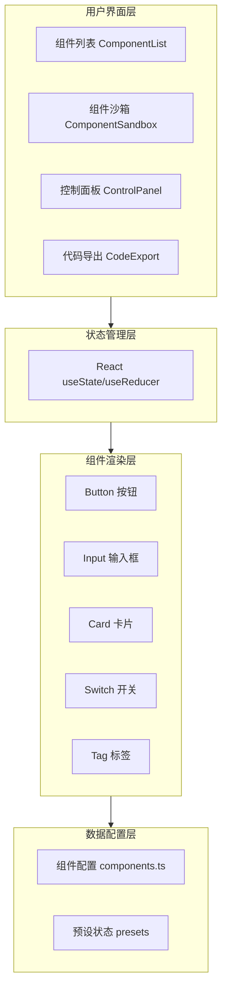

## 1. 架构设计



## 2. 技术描述

- 前端框架：React@18 + TypeScript@5
- 构建工具：Vite@5 + @vitejs/plugin-react
- 状态管理：React useState/useReducer（纯前端轻量状态）
- 颜色选择器：react-colorful（圆形取色器）
- 图标库：@iconify/react
- 唯一ID：uuid
- 样式方案：CSS Modules / 内联样式（动态属性）
- 代码语法高亮：自定义轻量高亮（避免大依赖）

## 3. 文件结构与数据流向

```
d:\P\tasks\auto85/
├── index.html                           入口HTML
├── package.json                         项目依赖配置
├── vite.config.js                       Vite构建配置
├── tsconfig.json                        TypeScript配置
└── src/
    ├── App.tsx                          应用入口，主布局
    ├── data/
    │   └── components.ts                组件配置数据（默认属性、属性类型、范围、预设）
    ├── components/
    │   ├── ComponentList.tsx            左侧组件列表
    │   ├── ComponentSandbox.tsx         中间组件沙箱预览
    │   ├── ControlPanel.tsx             右侧属性控制面板
    │   ├── CodeExport.tsx               代码导出与复制
    │   ├── PreviewButton.tsx            预览组件：按钮
    │   ├── PreviewInput.tsx             预览组件：输入框
    │   ├── PreviewCard.tsx              预览组件：卡片
    │   ├── PreviewSwitch.tsx            预览组件：开关
    │   └── PreviewTag.tsx               预览组件：标签
    ├── hooks/
    │   └── useClipboard.ts              剪贴板操作Hook
    ├── utils/
    │   ├── codeGenerator.ts             React代码生成工具
    │   └── syntaxHighlight.ts           代码语法高亮工具
    └── styles/
        └── global.css                   全局样式与CSS变量
```

**数据流向说明：**

1. `components.ts` → 被 `App.tsx`、`ComponentList.tsx`、`ControlPanel.tsx`、`ComponentSandbox.tsx` 引用，提供组件元数据
2. `App.tsx` → 持有全局状态（当前选中组件ID、当前属性值、当前预设），将状态和回调传递给子组件
3. `ComponentList.tsx` → 用户点击组件 → 调用 `onSelectComponent(id)` 回调 → App更新状态
4. `ControlPanel.tsx` → 用户调整属性 → 调用 `onPropChange(key, value)` 回调 → App更新属性 → 传递给 `ComponentSandbox.tsx`
5. `ComponentSandbox.tsx` → 接收属性props → 渲染对应 PreviewXxx 组件
6. `CodeExport.tsx` → 接收当前组件ID和属性 → 调用 `codeGenerator.ts` 生成代码 → 调用 `useClipboard.ts` 复制

## 4. 核心类型定义

```typescript
// 属性定义
interface PropDefinition {
  key: string;
  label: string;
  type: 'color' | 'slider' | 'select' | 'text' | 'boolean';
  min?: number;
  max?: number;
  step?: number;
  options?: { label: string; value: string }[];
  unit?: string;
}

// 预设状态
interface ComponentPreset {
  name: string;
  props: Record<string, any>;
}

// 组件定义
interface ComponentDefinition {
  id: string;
  name: string;
  icon: string;
  props: PropDefinition[];
  defaultProps: Record<string, any>;
  presets: ComponentPreset[];
}
```
