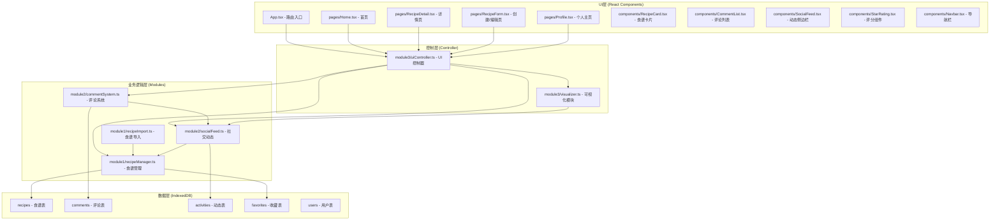
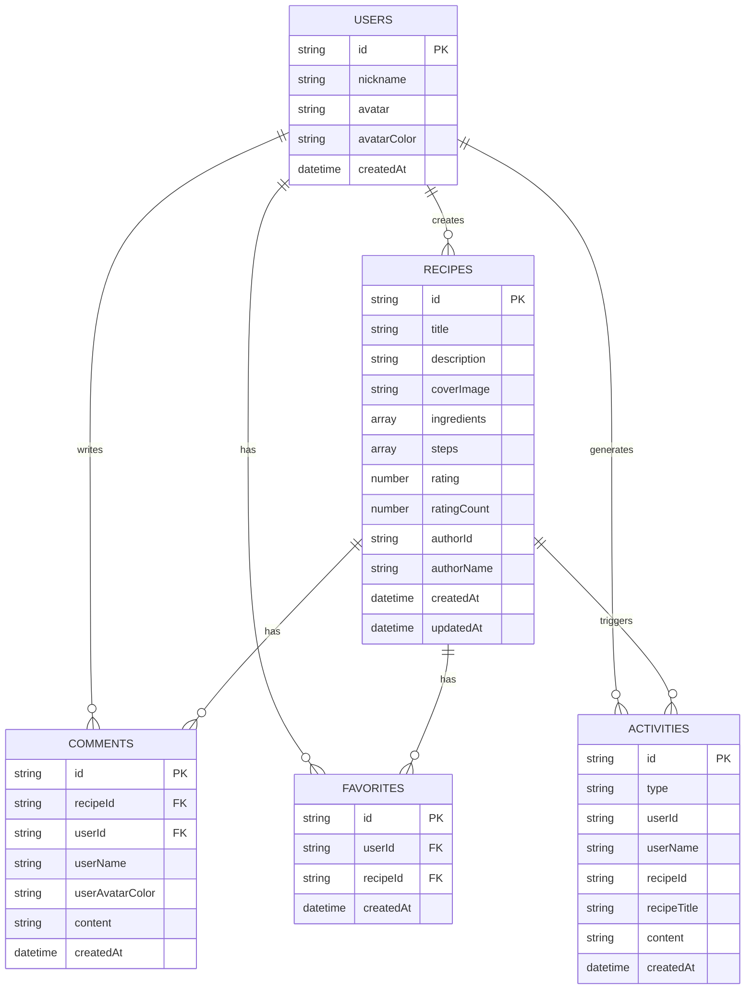

## 1. 架构设计



## 2. 技术描述

- **前端框架**：React 18 + TypeScript 5
- **构建工具**：Vite 5
- **路由管理**：React Router DOM 6
- **状态管理**：Zustand（轻量级状态管理）
- **数据库**：IndexedDB（前端持久化）
- **拖拽库**：react-beautiful-dnd
- **Markdown渲染**：react-markdown
- **日期处理**：date-fns
- **ID生成**：uuid
- **CSS方案**：原生CSS + CSS变量（无Tailwind，按用户要求）
- **图标**：lucide-react

## 3. 路由定义

| 路由 | 页面 | 用途 |
|------|------|------|
| / | Home | 首页，瀑布流食谱列表 + 社交动态侧边栏 |
| /recipe/:id | RecipeDetail | 食谱详情页，展示食谱内容、评论 |
| /create | RecipeForm | 创建新食谱 |
| /edit/:id | RecipeForm | 编辑已有食谱 |
| /profile | Profile | 个人主页，展示我的食谱和收藏 |
| /search | Home | 搜索结果页（复用首页组件） |

## 4. 数据模型

### 4.1 数据模型定义



### 4.2 IndexedDB Store 定义

```typescript
// recipes store
{ keyPath: 'id', indexes: ['authorId', 'createdAt', 'title'] }

// comments store  
{ keyPath: 'id', indexes: ['recipeId', 'userId', 'createdAt'] }

// activities store
{ keyPath: 'id', indexes: ['userId', 'createdAt', 'type'] }

// favorites store
{ keyPath: 'id', indexes: ['userId', 'recipeId', 'createdAt'] }

// users store
{ keyPath: 'id' }
```

## 5. 核心模块职责

### module1 - 食谱数据模块
| 文件 | 职责 |
|------|------|
| recipeManager.ts | 食谱CRUD、收藏管理、评分管理、IndexedDB交互 |
| recipeImport.ts | 解析JSON/Markdown文本，生成食谱对象 |

### module2 - 社交模块
| 文件 | 职责 |
|------|------|
| socialFeed.ts | 动态生成、动态列表获取、时间排序、筛选 |
| commentSystem.ts | 评论CRUD、与socialFeed联动更新动态 |

### module3 - UI控制模块
| 文件 | 职责 |
|------|------|
| uiController.ts | Zustand store，管理组件状态，协调各模块数据 |
| visualizer.ts | Canvas绘图，生成评分分布、收藏趋势图表 |

## 6. 性能优化策略

1. **图片懒加载**：使用 Intersection Observer 实现瀑布流图片懒加载
2. **防抖搜索**：300ms 防抖延迟，避免频繁触发搜索
3. **IndexedDB 索引优化**：为常用查询字段创建索引
4. **请求合并**：批量获取评论和收藏数据
5. **CSS 动画优化**：使用 transform 和 opacity 实现 GPU 加速动画
6. **虚拟滚动**：长列表使用虚拟滚动（如需要）
7. **Memo 优化**：React.memo 包裹列表项组件，避免不必要重渲染

## 7. 文件结构

```
├── package.json
├── index.html
├── vite.config.js
├── tsconfig.json
├── src/
│   ├── main.tsx
│   ├── App.tsx
│   ├── index.css
│   ├── types/
│   │   └── index.ts
│   ├── utils/
│   │   ├── db.ts          # IndexedDB封装
│   │   ├── hash.ts        # MD5哈希工具
│   │   └── debounce.ts    # 防抖工具
│   ├── module1/
│   │   ├── recipeManager.ts
│   │   └── recipeImport.ts
│   ├── module2/
│   │   ├── socialFeed.ts
│   │   └── commentSystem.ts
│   ├── module3/
│   │   ├── uiController.ts
│   │   └── visualizer.ts
│   ├── components/
│   │   ├── Navbar.tsx
│   │   ├── RecipeCard.tsx
│   │   ├── RecipeForm.tsx
│   │   ├── CommentList.tsx
│   │   ├── CommentItem.tsx
│   │   ├── SocialFeed.tsx
│   │   ├── ActivityItem.tsx
│   │   ├── StarRating.tsx
│   │   ├── FavoriteButton.tsx
│   │   ├── MasonryGrid.tsx
│   │   ├── Toast.tsx
│   │   └── EmptyState.tsx
│   └── pages/
│       ├── Home.tsx
│       ├── RecipeDetail.tsx
│       ├── RecipeCreate.tsx
│       └── Profile.tsx
```
