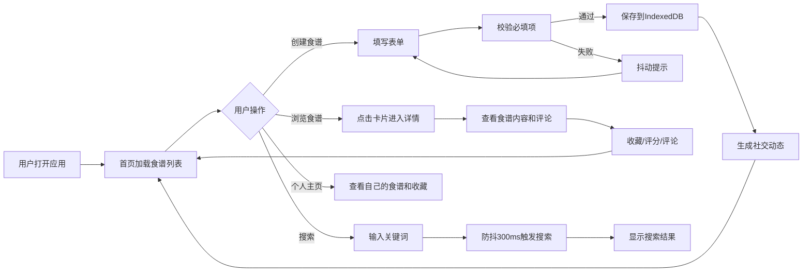

## 1. 产品概述
RecipeShare 是一个在线烹饪食谱管理与社交分享应用，用户可以创建、编辑、分享食谱，浏览他人食谱并进行收藏、评分和评论。所有数据通过 IndexedDB 在前端持久化存储，无需后端服务。

- 主要目的：为烹饪爱好者提供一个便捷的食谱管理和社交分享平台
- 目标用户：家庭厨师、烹饪爱好者、美食博主
- 市场价值：纯前端应用，数据本地存储，隐私安全，离线可用

## 2. 核心功能

### 2.1 用户角色
| 角色 | 注册方式 | 核心权限 |
|------|----------|----------|
| 普通用户 | 本地创建用户档案 | 创建/编辑/删除食谱、收藏、评分、评论、浏览所有内容 |

### 2.2 功能模块
1. **食谱管理模块**：食谱的创建、编辑、删除、查询，支持食材列表动态增删、步骤拖拽排序、封面图片上传
2. **社交动态模块**：用户动态展示（新建食谱、收藏、评论），时间排序和筛选
3. **评论系统模块**：评论的添加、删除、获取，与社交动态联动
4. **UI控制模块**：React组件状态管理，协调数据展示和用户交互
5. **可视化模块**：食谱统计图表（评分分布、收藏趋势）
6. **食谱导入模块**：支持JSON/Markdown格式的食谱文本解析导入

### 2.3 页面详情
| 页面名称 | 模块名称 | 功能描述 |
|---------|----------|----------|
| 首页 | 瀑布流食谱列表 | 展示所有食谱卡片，支持搜索、收藏标记，响应式布局 |
| 首页 | 社交动态侧边栏 | 展示最新用户动态，时间差显示，滑入动画 |
| 食谱详情页 | 食谱详情展示 | 毛玻璃背景，Markdown渲染步骤，评论列表 |
| 食谱创建/编辑页 | 食谱表单 | 动态食材列表、拖拽排序步骤、封面上传、表单校验 |
| 个人主页 | 用户档案 | Tab切换显示自己的食谱和收藏，自定义昵称头像 |
| 搜索结果页 | 搜索功能 | 防抖搜索，淡入动画更新，空状态插画 |

## 3. 核心流程

## 4. 用户界面设计

### 4.1 设计风格
- **主色调**：#FF6B35（橙红）、#F7931E（辅色）
- **背景色**：#FFF8F0（米白）
- **文字颜色**：标题#333，正文#666
- **圆角**：统一8px
- **阴影**：rgba(0,0,0,0.1)
- **字体**：显示字体使用 'Playfair Display', 正文字体使用 'Noto Sans SC'
- **动画**：卡片/按钮悬停上浮阴影加深（200ms ease-out），页面过渡fadeIn（300ms）

### 4.2 页面设计概述
| 页面名称 | 模块名称 | UI元素 |
|---------|----------|--------|
| 首页 | 导航栏 | 固定顶部，毛玻璃背景（blur(10px)），品牌Logo"RecipeShare"，搜索框 |
| 首页 | 瀑布流卡片 | 封面图/渐变色占位，标题，作者昵称，评分星标（半星精度），收藏数，左上角红心标记 |
| 首页 | 动态侧边栏 | 时间差显示，滑入动画，最多20条 |
| 详情页 | 毛玻璃背景 | 内容区域Markdown渲染步骤 |
| 详情页 | 评论列表 | 渐变色圆形头像，内容，时间戳，倒序排列，删除动画 |
| 创建页 | 表单 | 动态食材行（底部滑入），拖拽排序步骤（react-beautiful-dnd），封面缩略图，校验抖动 |
| 个人主页 | Tab切换 | 横向滑动动画（300ms），自定义头像昵称 |

### 4.3 响应式设计
- **桌面端（≥1024px）**：瀑布流3列 + 右侧动态侧边栏
- **平板端（768-1023px）**：瀑布流2列，动态侧边栏折叠成汉堡菜单
- **手机端（<768px）**：单列列表，导航栏简化

### 4.4 交互动效
- 收藏按钮：心形填充红色 + 心跳缩放动画（200ms）
- 评论删除：淡出+缩小动画（200ms）
- 新动态：从顶部滑入动画
- Tab切换：横向滑动过渡（300ms）
- 悬停效果：上浮 + 阴影加深（200ms ease-out）
- 搜索结果：淡入动画更新
- 表单校验失败：边框变红 + 抖动
- 星标评分：悬停黄色高亮 + 放大1.1倍

## 5. 性能要求
- 瀑布流首屏加载 ≤ 800ms（图片懒加载）
- 搜索响应延迟 ≤ 200ms
- 页面切换动画帧率稳定60FPS
- IndexedDB操作异步非阻塞
